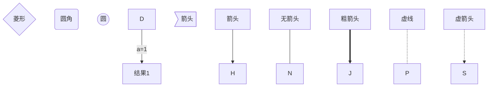
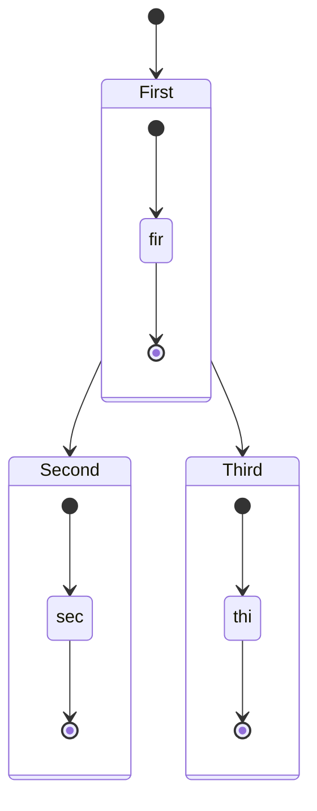
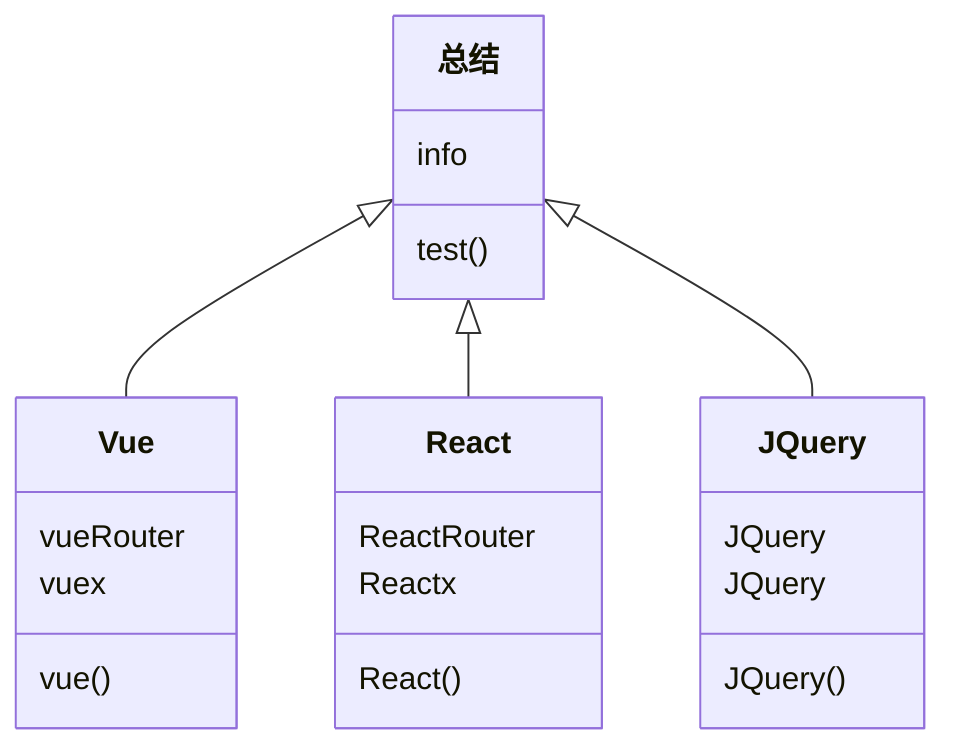
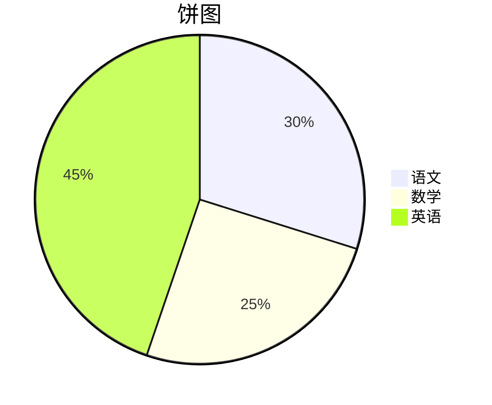
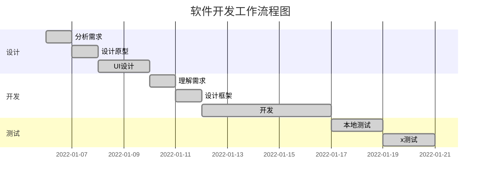
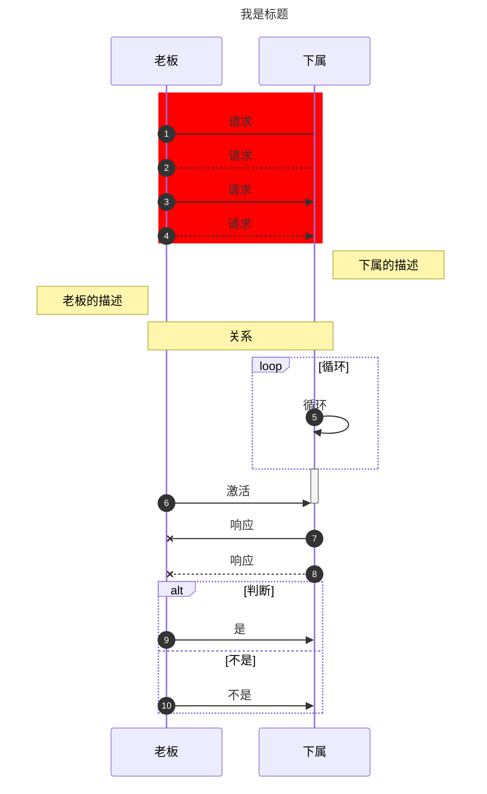

- **Typora快捷键**

| 快捷键                          | 作用                    | 快捷键                               | 作用                    |
| ------------------------------- | ----------------------- | ------------------------------------ | ----------------------- |
| **<kbd>Ctrl + F</kbd>**         | **搜索**                | **<kbd>Ctrl + H</kbd>**              | **替换**                |
| **<kbd>Ctrl + T</kbd>**         | **插入表格**            | **<kbd>Ctrl + Shift + K</kbd>**      | **插入代码块**          |
| **<kbd>Ctrl + B</kbd>**         | **加粗**                | **<kbd>Ctrl + I</kbd>**              | **倾斜**                |
| **<kbd>Ctrl + Shift + I</kbd>** | **插入图片**            | **<kbd>Ctrl + K</kbd>**              | **插入链接**            |
| **<kbd>Ctrl + /</kbd>**         | **源码 / 编辑模式切换** | **<kbd>Ctrl + Shift + L</kbd>**      | **侧边栏显示/隐藏切换** |
| **<kbd>Ctrl + Shift + ]</kbd>** | **插入无序列表**        | **<kbd>Ctrl + Shift + [</kbd>**      | **插入有序列表**        |
| **<kbd>Ctrl + F</kbd>**         | **插入标题**            | **<kbd>Ctrl + U</kbd>**              | **下划线**              |
| **<kbd>Ctrl + L</kbd>**         | **选中一整行**          | **<kbd>Ctrl + D</kbd>**              | **选中单词**            |
| **<kbd>Ctrl + Home</kbd>**      | **跳到头部**            | **<kbd>Ctrl + End</kbd>**            | **跳到底部**            |
| **<kbd>Ctrl + Enter</kbd>**     | **插入下面一行表格**    | **<kbd>Ctrl + Shift + Delete</kbd>** | **删除表格当前行**      |

# 标题 1

## 标题 2

### 标题 3

#### 标题 4

##### 标题 5

###### 标题 6

_斜体文本_
**粗体文斜本**
**_粗斜体文本_**
~~删除线~~
<u>带下划线文本</u>
==标记==
**H~2~O**
**2^n^**

- **支持的代码语言**

| APL        | asciiarmor     | ASP                 | assembly         | bash              |
| ---------- | -------------- | ------------------- | ---------------- | ----------------- |
| basic      | **C**          | **C++**             | **C#**           | **CSS**           |
| cassandra  | ceylon         | clike               | clojure          | cmake             |
| cobol      | coffeescript   | commonlisp          | **cpp**          | CQL               |
| crystal    | csharp         | cypher              | cython           | D                 |
| **dart**   | diff           | django              | dockerfile       | dtd               |
| dylan      | ejs            | elixir              | elm              | embeddedjs        |
| erb        | erlang         | F#                  | **flow(流程图)** | forth             |
| fortran    | fsharp         | gas                 | gfm              | glsl              |
| go         | gherkin        | groovy              | **html**         | **http**          |
| handlebars | haskell        | haxe                | htaccess         | **hxml**          |
| idl        | **ini**        | jade                | **java**         | **javascript/js** |
| jinja2     | **json**       | **jsp**             | **jsx**          | julia             |
| **kotlin** | latex          | **less**            | lisp             | livescipt         |
| lua        | makefile       | mariadb             | **markdown**     | mathematica       |
| matlab     | mbox           | **mermaid(流程图)** | mssql            | **mysql**         |
| **nginx**  | nim            | nsis                | objc             | **objective-c**   |
| ocaml      | octave         | oz                  | pascal           | perl              |
| perl6      | pgp            | **php**             | php+HTML         | plsql             |
| powershell | properties     | protobuf            | pseudocode       | pseudocode        |
| **python** | **react**      | reStructuredText    | rst              | ruby              |
| rust       | SAS            | **SQL**             | scala            | scheme            |
| **scss**   | sequence       | **shell/sh**        | smalltalk        | solidity          |
| SPARQL     | spreadsheet    | sqlite              | squirrel         | **stylus**        |
| swift      | tcl            | tex                 | tiddlywiki       | toml              |
| tsx        | **typescript** | turtle              | twig             | **vbscript/vb**   |
| velocity   | verilog        | vhdl                | **vue**          | visual basic      |
| web-idl    | wiki           | xaml                | **xml**          | xml-dtd           |
| xquery     | yacas          | **yaml**            |                  |                   |

- **流程图**

| graph TB     | 从上到下     |
| ------------ | ------------ |
| **graph BT** | **从下到上** |
| **graph LR** | **从左到右** |
| **graph RL** | **从右到左** |



- **状态图**



- **类图**



- **标准流程图**

```flow
st=>start: 开始框
op=>operation: 处理框
cond=>condition: 判断框(是或否?)
sub1=>subroutine: 子流程
io=>inputoutput: 输入输出框
e=>end: 结束框

st->op->cond
cond(yes)->io->e
cond(no)->sub1(right)->op
```

- **饼图**



- **甘特图**

    **任务状态**

    - **done**     已完成
    - **active**   正在进行
    - **crit**        关键任务
    - **默认为`active`(正在进行状态)**

    **任务描述**

    - **des**      项目名称
    - **after**   表示在该项目之后



- **时序图**

| 类型 | 描述               |
| ---- | ------------------ |
| ->   | 没有箭头的实线     |
| -->  | 没有箭头的虚线     |
| ->>  | 有箭头的实线       |
| -->> | 有箭头的虚线       |
| -x   | 末端有十字叉的实线 |
| --x  | 末端有十字叉的虚线 |



创建脚注格式类似这样 [^runoob]

[^runoob]:菜鸟教程

- 列表 1
    - 子列表
        - 子列表

* 列表 2

- 列表 3

1. 列表
2. 列表
3. 列表

- [x] **任务列表**
- [ ] **任务列表**

> 区块引用 1
>
> > 区块引用 2
> > `代码` 函数

 ```javascript
 $(document).ready(function () {
   	alert("RUNOOB");
 });
 ```

`带行号代码` 函数

```javascript
$(document).ready(function () {
	alert("RUNOOB");
});
```

行内代码  `alert('RUNOOB');`

这是一个链接 [菜鸟教程](https://www.runoob.com)
<https://www.runoob.com>


这个链接用 [^1] 作为网址变量 [RUNOOB][1].
然后在文档的结尾为变量赋值

[^1]: http://static.runoob.com/images/runoob-logo.png

| 左对齐 | 右对齐 | 居中对齐 |
| :----- | -----: | :------: |
| 单元格 | 单元格 |  单元格  |
| 单元格 | 单元格 |  单元格  |

- **音频**

<audio controls>
  <source src="http://www.chongfanmitu.com/chat/Sounds/test.mp3" >
</audio>

- **视频**

<video src="https://media.w3.org/2010/05/sintel/trailer.mp4" style="margin:0;"></video>
