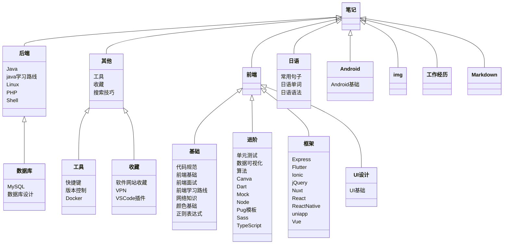

## 我的笔记

```mermaid
classDiagram
	  笔记 <|-- 后端
	  笔记 <|-- 其他
	  笔记 <|-- 前端
	  笔记 <|-- 日语
	  笔记 <|-- Android
	  笔记 <|-- img
	  笔记 <|-- 工作经历
	  笔记 <|-- Markdown
      class 后端{
          Java
          java学习路线
          Linux
          PHP
          Shell
      }
      后端 <|-- 数据库
      class 数据库{
          MySQL
          数据库设计
      }
      class 其他{
      	工具
      	收藏
        搜索技巧
      }
      其他 <|-- 工具
      其他 <|-- 收藏
      class 工具{
         快捷键
         版本控制
         Docker
      }
      class 收藏{
         软件网站收藏
         VPN
         VSCode插件
      }
      前端 <|-- 基础
      前端 <|-- 进阶
      前端 <|-- 框架
      前端 <|-- UI设计
      class 基础{
         代码规范
         前端基础
         前端面试
         前端学习路线
         网络知识
         颜色基础
         正则表达式
      }
      class 进阶{
         单元测试
         数据可视化
         算法
         Canva
         Dart
         Mock
         Node
         Pug模板
         Sass
         TypeScript
      }
      class 框架{
         Express
         Flutter
         Ionic
         jQuery
         Nuxt
         React
         ReactNative
         uniapp
         Vue
      }
      class UI设计{
         UI基础
      }
      class 日语{
         常用句子
         日语单词
         日语语法
      }
      class Android{
         Android基础
      }
```

