## 保洁

### 药剂使用

#### 二氧化氯消毒片

-   **半片药片溶于消毒喷枪喷瓶**

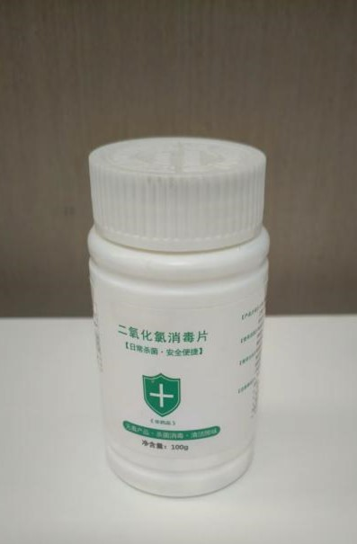

#### 全能清洁剂

-   **多场景除污、除垢、除油**
-   **1:30比例兑水稀释**

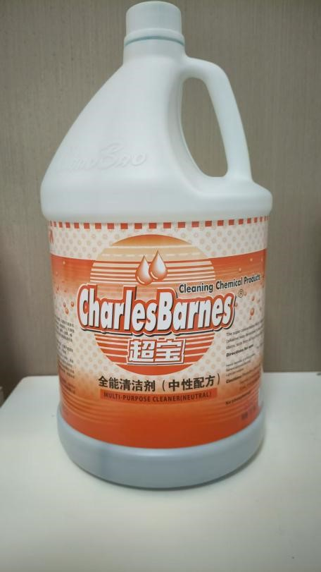

#### 洁厕灵

-   **一般水垢可按1:20-1:30兑水使用**
-   **重度水垢直接用原液喷涂**
-   **静置后刷洗**

#### 除胶剂

-   **开荒保洁时瓷砖、灶台、台面、玻璃及门窗表面胶渍**

-   **瓷砖、玻璃等表面可直接喷涂后用毛巾擦拭**

-   **门表面建议先喷在毛巾上再擦拭，避免腐蚀，**

-   **对于门窗建议采用快喷快擦的方式**

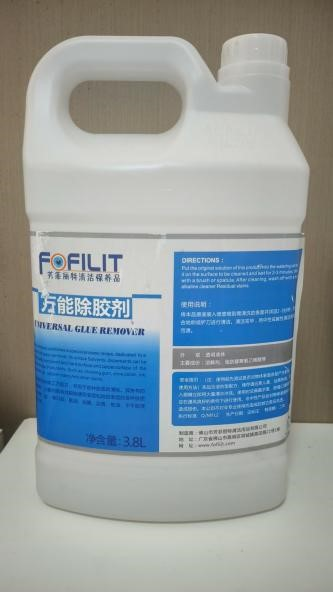

#### 去污膏

-   **厨房水龙头、浴室花洒等不锈钢五金件**
-   **配合白色纳米擦，轻轻打磨擦拭，顽固污渍一擦即净**

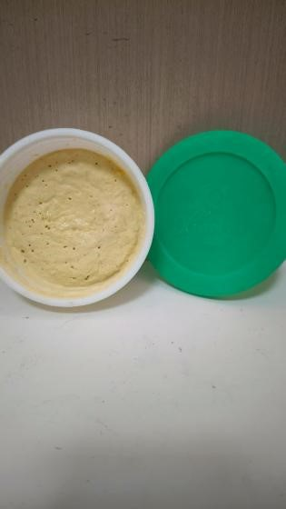

#### 水卫士除油剂

-   **厨房台面、橱柜等油污重灾区**
-   **直接喷涂于表面，搭配百洁布或毛巾轻轻擦拭**

>   **不锈钢 铝质材料不要用，防止腐蚀**

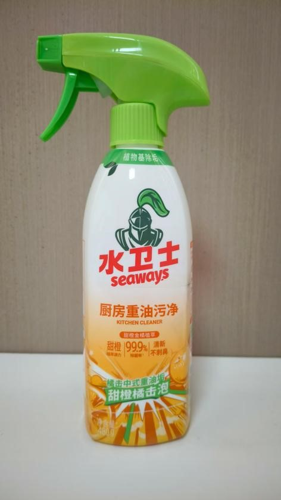

#### 水卫士浴室清洁剂

-   **卫生间及浴室五金件、浴室玻璃表面水垢**
-   **均匀喷涂后稍作静置，待水垢软化，用百洁布或毛巾擦净**

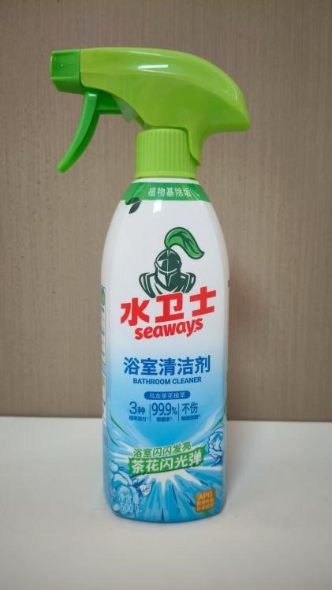

### 工具使用

#### 无纺布

-   **清洁脏污较重、有污染物位置，如油烟机、马桶**

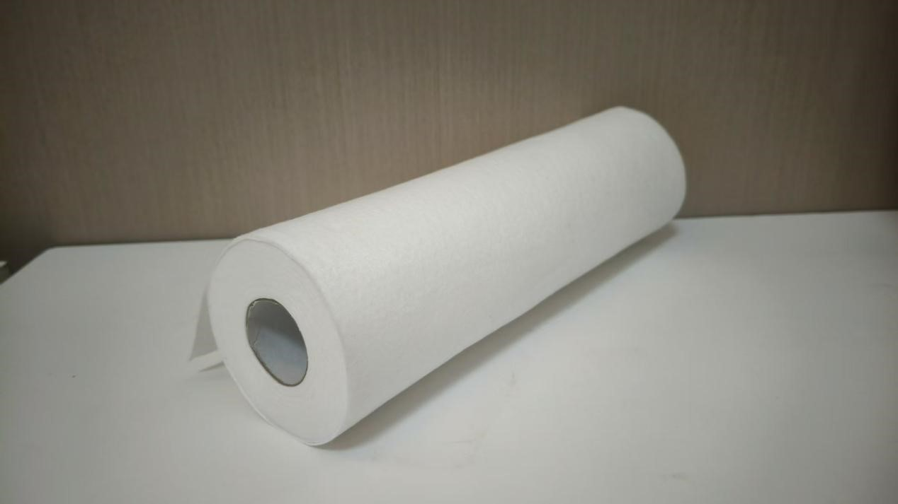

#### 九色布/五色布

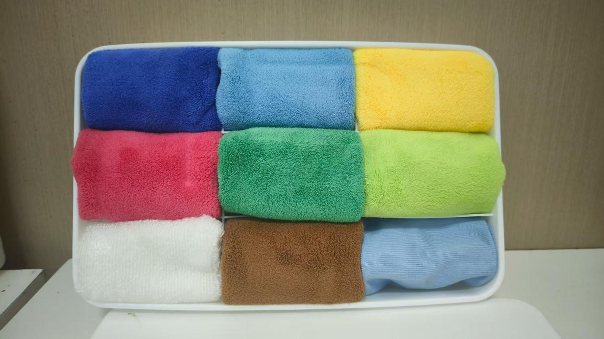

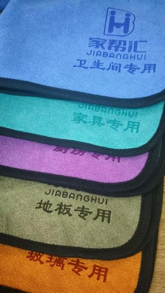

#### 静电除尘纸

-   **吸附灰尘不扬尘**

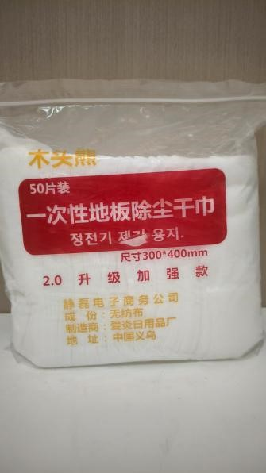

#### 涂水器

-   **用于玻璃、瓷砖面的清洁和上水**

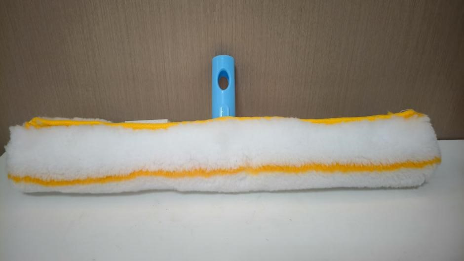

#### 纳米海绵

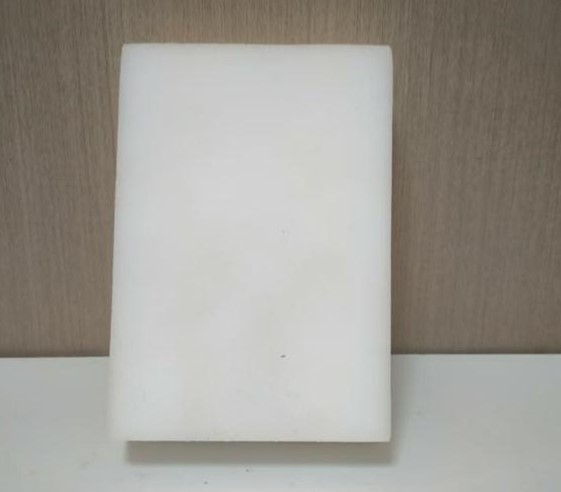

### 日常保洁

价格

工作内容

流程

### 擦玻璃

#### 价格

| 计费方式   | 价格         |
| ---------- | ------------ |
| 按建筑面积 | 2~3元/m^2^   |
| 按玻璃面积 | 10~15元/m^2^ |

| 建筑面积    | 参考价格  |
| ----------- | --------- |
| 80-100m^2^  | 160-300元 |
| 100-120m^2^ | 200-360元 |
| 120-150m^2^ | 240-450元 |
| 150-180m^2^ | 300-540元 |
| 180-200m^2^ | 360-600元 |

#### 所需工具和药剂

-   双面玻璃擦，2个备用清洁棉和胶条
-   除胶剂(去除玻璃上的胶印)
-   铲子(去除玻璃上的顽固污垢)
-   各种毛刷(刷洗纱窗和沟槽)
-   气压喷壶
-   洗洁精或全能清洁剂
-   至少2条毛巾，一条干的，一条湿的
-   至少一条干的超细纤维布
-   梯子(擦拭高处的玻璃)
-   水桶(清洗毛巾和玻璃清洁器)
-   手套和鞋套

#### 清洁流程

1.   观察玻璃是否有划痕
2.   挪走妨碍清洁的物品
3.   卸下纱窗，拿到卫生间去刷洗
4.   擦拭窗框，去除玻璃上的污垢和胶印
5.   用喷壶将窗户内外的玻璃表面喷上清洁液(对于污垢较重的情况，先用毛巾简单擦拭一遍)
6.   清洗玻璃擦表面上的灰尘和石子，以防止玻璃被划伤
7.   在玻璃擦清洁棉上涂上清洁液
8.   把磁力调节到最小，让玻璃清洁器吸附到玻璃上
9.   固定安全绳，预留足够的长度
10.   留下一小段在屋内，其余安全绳抛出窗外，关闭窗户并上锁(防止擦拭途中随意移动)
11.   移动玻璃擦，将清洁液涂抹均匀(尤其是四角和边缘)
12.   从上到下开始擦拭
13.   底部收尾后，打开窗户，取回外部玻璃擦
14.   先用干毛巾擦干残留泡沫，再用干超细纤维布擦拭水渍
15.   清理窗户沟槽
16.   清洁窗台和地面，物品归位

