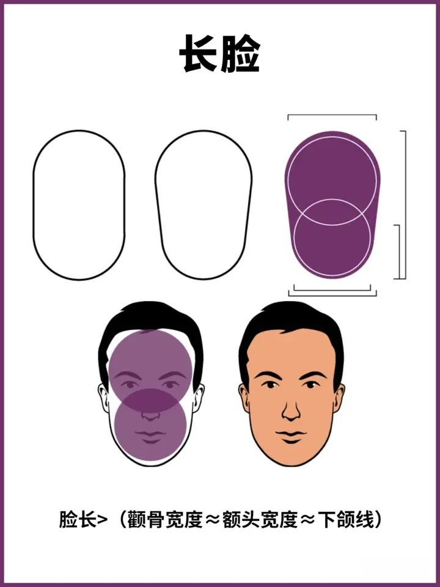
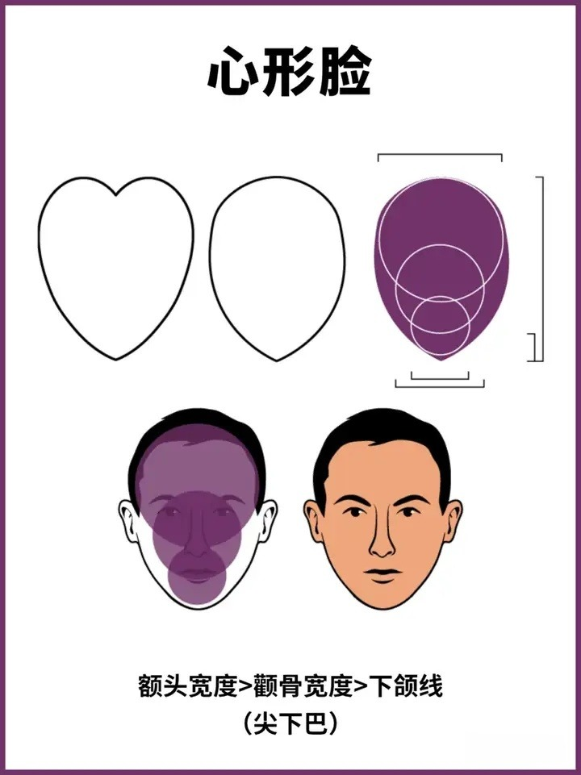
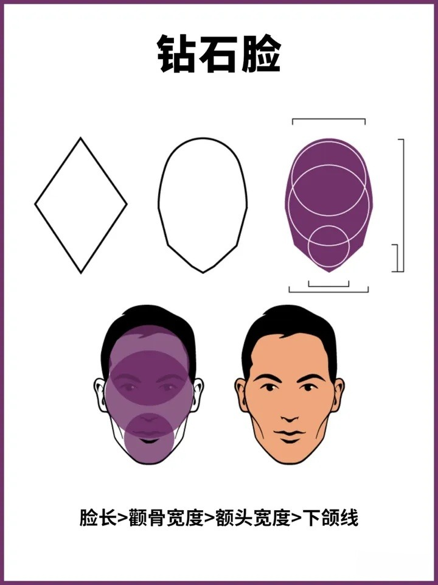
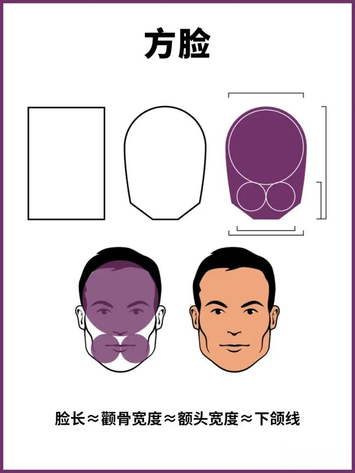
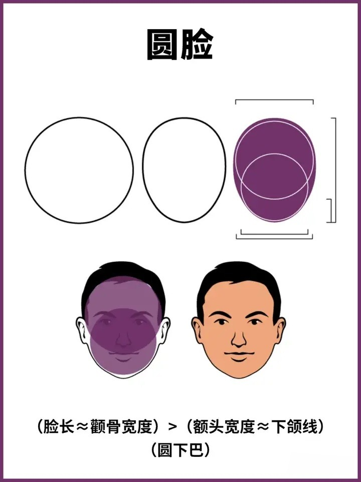
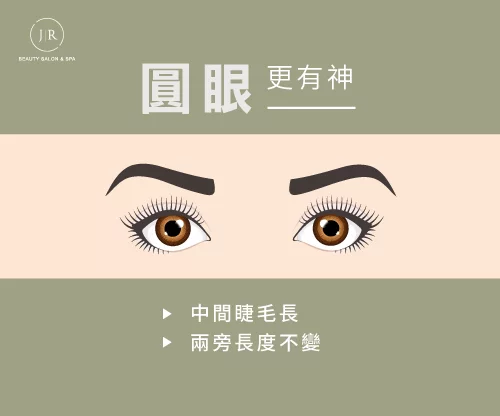

### 脸型

#### 判断

**脸长:** 从发际线顶端到下巴底端的距离

**额头宽度:** 两侧眉峰之间的距离

**颧骨:** 手指横停在眼睛前方, 往下移动. 直到碰到自己的脸, 此处为颧骨

**颧骨宽度:** 左右颧骨之间的距离

**下颌线:** 颚骨转角处到下巴底端的直线距离, 再乘2, 就是下颌线长度

#### 长脸

#### 心形脸

#### 鹅蛋脸

#### 钻石脸

#### 三角脸

#### 方脸

#### 圆脸

### 发型

#### 长度

##### 短发 (2~4cm)

##### 中发 (5~7cm)

##### 中长发 (7~10cm)

##### 长发 (10~15cm)

### 眼部

#### 圆眼

-   眼睛的外角和内角都相对较高，眼睛看起来比较圆润

#### 杏眼

- 眼睛的外角稍微向上翘，呈现出杏仁形的轮廓

#### 凤眼

- 眼睛外眼角稍微向上，内眼角较低，类似凤凰展翅的形状

#### 狭长眼

- 眼睛的长度比较长，外眼角和内眼角相对较低，呈现出椭圆形的形状

#### 圆形短眼

- 眼睛的外角和内角都相对较低，眼睛看起来比较短小

#### 下垂眼

- 眼睛的外角稍微向下倾斜，整体表现出一种悲伤或疲惫的样子

#### 窄长眼

- 眼睛的长度相对较长，但宽度较窄，呈现出一种长条形的形状

### 鼻子

### 嘴部

### 胡子

### 耳部

### 身材

