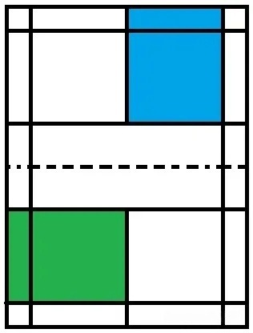
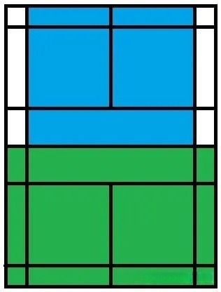

## 羽毛球

### 球场

- **球网高度: 1.55米**

### 规则

1. **21 分制，3局2胜**
2. **每回合，取胜的一方加 1 分**
3. **当双方均为 20 分时，领先对方 2 分的一方赢**
4. **当双方均为 29 分时，先取得 30 分的一方赢**
5. **一局比赛的获胜方在下一局发球**
6. **发球方得分为偶数时，发球方在右半场发球**
7. **发球方得分为奇数时，发球方在左半场发球**

#### 发球范围

- **蓝色区域为单打发球区域**
- **绿色区域为双打发球区域**

#### 击球范围

- **蓝色区域为单打击球区域**
- **绿色区域为双打击球区域**

### 装备

#### 品牌

| 尤尼克斯 | 李宁 | 阿迪达斯 | 威克多 | 亚瑟士 | 凯胜 | 亚狮龙 |
| -------- | ---- | -------- | ------ | ------ | ---- | ------ |

#### 羽毛球拍

| 参数     | 说明                             |
| -------- | -------------------------------- |
| 重量     | 裸拍重量, 不包含线, 数字越大越轻 |
| 长度     | 裸拍长度                         |
| 手柄粗细 | 数字越大越细                     |
| 平衡点   | 从手柄底托到重心的距离           |
| 材质     | 球拍材质(碳纤维, 合金, 木制)     |
| 磅数     | 线的松紧程度, 磅数越高线越紧     |
| 中杆软硬 | 中杆软硬度 S-F                   |

##### 重量

- **1U(95-100g), 2U(90-94g), 3U(85-89g), 4U(80-84g), 5U(75-80g)**

##### 手柄粗细

- **G3(89mm), G4(86mm), G5(83mm)**

##### 平衡点

- **290mm以下，平衡点低，拍头轻，适合防守控球**
- **290-300mm，平衡点适中，攻守兼备**
- **300mm以上，平衡点高，拍头重，适合进攻扣杀**

##### 磅数

- **低磅(20磅以下), 中低磅(20-23磅), 中磅(23-25磅), 中高磅(25-27磅), 高磅(28磅以上)**
- **磅数越高，对技术要求越高**

##### 中杆软硬

- **越硬，力量越强，越难控制，球速越快，对技术要求越高**
- **越软，越省力，越易控制，球速越慢**

