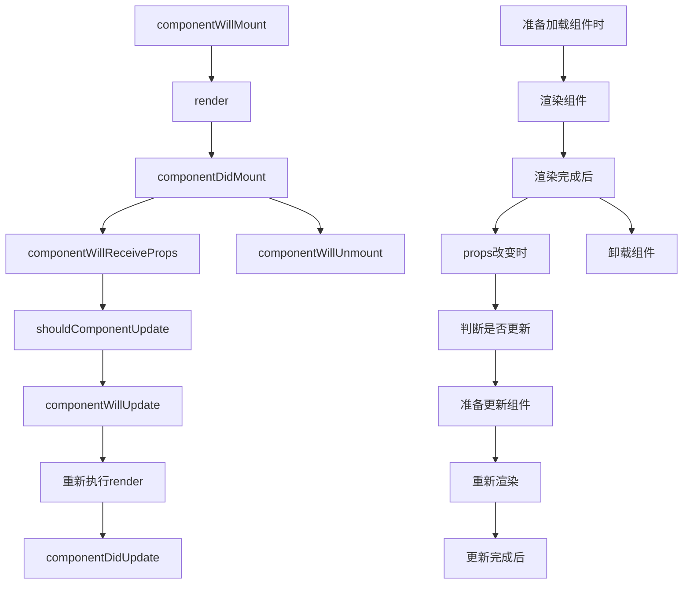

## React Native

**[React Native](https://reactnative.dev/) 是Facebook开发的跨平台移动应用开发框架**

### 初始化

```shell
npm install -g create-react-native-app    #安装脚手架
create-react-native-app 项目名    #创建项目
npm start   #运行项目

# Expo是一个用于开发 ReactNative 的平台(https://expo.dev/)
# 用 expo 创建 React Native 项目
npm install expo-cli -g   #安装脚手架
expo init 项目名    #创建项目
expo start   #运行项目
```

### 目录结构


| 名称         | 描述                                |
| :----------- | :---------------------------------- |
| **android**  | Android项目目录，包含了环境配置文件 |
| **ios**      | iOS项目目录，包含了XCode的环境      |
| **App.js**   | 页面人口文件                        |
| **index.js** | 入口文件                            |
| **app.json** | app的配置文件                       |

### 生命周期



```jsx
import React, { Component } from 'react';
import { View, Text, Button } from 'react-native';

export default class Test extends Component {
    constructor(props) {
        super(props)
        this.state = {
            mag: '原数据'
        }
    }

    componentWillMount() {
        console.log("加载组件前");
    }

    componentDidMount() {
        console.log("渲染完成后");
    }

    componentWillReceiveProps(nextProps) {
        console.log("props改变时");
    }

    shouldComponentUpdate(nextProps, nextState) {
        console.log("判断是否更新");
        return true;
    }

    componentWillUpdate() {
        console.log("准备更新组件");
    }

    componentDidUpdate() {
        console.log("更新完成后");
    }

    render() {
        console.log('渲染组件');
        return (
            <View>
                <Button title="更新数据" onPress={() => this.setState({ msg: "更新数据" })} />
                <Text>{ this.state.msg }</Text>
            </View>
        );
    }
    
    componentWillUnmount() {
        console.log("组件销毁前");
    }
}
```

### 初始化

**App.js**

```jsx
import React from 'react';
import { StyleSheet, Text, View } from 'react-native';

export default App = () => {
    return (
        <View>
        	<Text></Text>
        </View>
    );
}

//CSS样式
const styles = StyleSheet.create({

});
```

### 原生组件

#### 基础组件

```jsx
<View></View>  //视图组件
<Text>你好</Text>  //文字组件
<ScrollView></ScrollView>  //滚动组件
<TouchableHightlight //高亮触摸，用户点击时，组件会产生高亮效果
	onPress={() => {alert('点击事件')}}
	activeOpacity={0.7} //透明度
	underlayColor="#ff0000" //点击时的背景颜色
></TouchableHightlight>
<TouchableOpacity //透明触摸，用户点击时，组件会出现透明效果
   	onPress={() => {alert('点击事件')}}
   	activeOpacity={0.7} //透明度
    underlayColor="#ff0000" //点击时的背景颜色
></TouchableOpacity>
<TouchableWithoutFeedback //无反馈性触摸，用户点击时，组件不会出现任何视觉变化
   	onPress={() => {alert('点击事件')}}
></TouchableWithoutFeedback>
```

#### 图片组件

```jsx
<Image source={ require('./img/img.jpg') } /> //本地图片
<Image source={{ uri:'https://img.jpg' }} /> //网络图片
<ImageBackground source={{ uri:'https://img.jpg' }} resizeMode="cover"> //背景图片
</ImageBackground>
```

**resizeMode属性值**

| 属性值      | 作用                                                       |
| ----------- | ---------------------------------------------------------- |
| cover(默认) | 在显示比例不变的情况下填充整个显示区域, 可能部分会显示不了 |
| contain     | 比例不变, 显示整张图片                                     |
| stretch     | 不保持图片原来的宽,高比.填充整个显示区域                   |
| center      | contain模式基础上支持等比放大                              |

#### 表单组件

```jsx
<TextInput //输入框
    value={text} //输入值
    multiline={true} //是否多行输入
    numberOfLines={4} //多行输入行数
    secureTextEntry={true} //是否为密码
    editable={false} //是否可编辑
    maxLength={11} //输入长度
    enablesReturnKeyAutomatically={true} //没有文字时禁用确认按钮
    onChangeText={text => setText(text)} //文本变化回调函数
    onFocus={() => {alert('获得焦点')}}
    onBlur={() => {alert('失去焦点')}}
    defaultValue={text} //默认文本
/>
<Button //按钮
	title="文本"
    onPress={() => {alert('点击事件')}}
    color="#000000" //文本颜色
    disabled={false}
/>
<Switch //开关
    disabled={false}
	trackColor={{ false: "#767577", true: "#81b0ff" }} //开关轨道的自定义颜色
	thumbColor={isEnabled ? "#f5dd4b" : "#f4f3f4"} //前景开关手柄的颜色
	onValueChange={(v) => {}} //更改开关的值时调用
	value={isEnabled} //开关的值
/>
<Picker //选择器
    selectedValue={this.state.flag} //选中值
    onValueChange={(item, index) => {
        this.setState({ flag: itemValue })
    }}>
    <Picker.Item label="选项1" value="1" />
    <Picker.Item label="选项2" value="2" />
</Picker>
```

#### 提示组件

```jsx
<ActivityIndicator //加载组件
    animating={true} //是否显示
    color="00ff00" //颜色
    size="small" //大小
/>
<Modal //弹出框
	animationType="slide" //动画
	transparent={true} //是否将填补整个视图
	visible={false} //是否可见
	onRequestClose={() => {alert('点击返回按钮回调函数')}}
></Modal>
<RefreshControl //下拉刷新
	refreshing={refreshing}
	onRefresh={() => {alert('回调函数')}}
/>
<StatusBar //顶部状态栏
	animated={true} //动画
	backgroundColor="#61dafb" //状态栏背景颜色
	barStyle={statusBarStyle} //状态栏文本颜色
	showHideTransition="fade" //过渡动画
	hidden={false} //是否隐藏 
/>
```

#### 列表组件

```jsx
let list = [{
    title: "title1",
    data: ["data1", "data2", "data3"]
}, {
    title: "title2",
    data: ["data1", "data2", "data3"]
}, {
    title: "title2",
    data: ["data1", "data2", "data3"]
}];
const Item = ({ title }) => (
	<View>
		<Text>{title}</Text>
	</View>
);
<SectionList //分段列表
	sections={list} //列表数组
    renderItem={({ item }) => <Item title={item} />} //默认渲染器
/>
<FlatList
	data={data}
    renderItem={this.renderItem}
    initialNumToRender={3} //初始化渲染数量
    windowSize={3} //渲染区域高度
    removeClippedSubviews={Platform.OS === 'android'} //是否裁剪子视图
	maxToRenderPerBatch={10} //增量渲染最大数量
    updateCellsBatchingPeriod={50} //增量渲染时间间隔
	debug // 开启 debug 模式
/>
```

**`animationType`属性和`showHideTransition`属性**

- **`slide` 从底部滑入**
- **`fade` 淡入淡出**
- **`none` 没有动画**

#### 样式组件

```jsx
//初始化
const styles = StyleSheet.create({});
//合并样式,属性相同时，style2 覆盖 style1
const styles = StyleSheet.compose(style1, style2);
```

### 第三方组件

#### 路由

- **安装**

```sh
npm install @react-navigation/native --save
npm install @react-navigation/stack --save
npm install react-native-gesture-handler --save
npm install react-native-safe-area-context --save
```

- **配置路由表**

```jsx
/* /routes/index.js */
import React from 'react';
import { NavigationContainer } from '@react-navigation/native';
import { createStackNavigator } from '@react-navigation/stack';

//引入页面
import Index from "../pages/Index";

const Stack = createStackNavigator();

export default function Navigation() {
    return (
        <NavigationContainer>
            <Stack.Navigator initialRouteName="Index">
                <Stack.Screen 
                    name="Index"
                    component={Index}
                    options={{
                        title: "", //标题
    					header: {() => {}}, //设置一些导航的属性，隐藏顶部导航栏置为null
    					headerTitle: "", //导航栏标题
    					headerBackTitle: "", //跳转页面左侧返回箭头后面的文字
    					headerTruncatedBackTitle: "", //当上个页面标题不符合返回箭头后的文字时，默认改成"返回"
    					headerRight: "", //设置导航条右侧
    					headerLeft: "", //设置导航条左侧
    					headerStyle: "", //设置导航条的样式
    					headerTitleStyle: "", //设置导航栏文字样式
    					headerBackTitleStyle: "", //设置导航栏‘返回’文字样式
    					headerTintColor: "", //设置导航栏颜色
    					headerPressColorAndroid: "", //设置颜色纹理，安卓版本大于5.0
    					gesturesEnabled: "" //是否支持滑动返回手势
                    }}
                    />
            </Stack.Navigator>
        </NavigationContainer>
    )
}

/* App.js */
import { StyleSheet, View } from 'react-native';
import Navigation from './routes/index'

export default function App() {
    return (
        <View style={styles.container}>
            <Navigation />
        </View>
    );
}

const styles = StyleSheet.create({
    container: {
        flex: 1
    },
});
```

#### 跳转页面

```jsx
import React, { Component } from 'react';
import { StyleSheet, View, Text, TouchableHighlight } from 'react-native';

export default class Index extends Component {
    constructor(props) {
        super(props);
        this.state = {}
    }
    
    submit = () => this.props.navigation.navigate('Page');

    render() {
        const { navigate } = this.props.navigation;
        return (
            <View>
            	 <TouchableHighlight} onPress={this.submit}>
               		<Text>跳转Page页</Text>
            	</TouchableHighlight>
                <TouchableHighlight} onPress={() => navigate('Page')}>
               		<Text>跳转Page页</Text>
            	</TouchableHighlight>
                <TouchableHighlight} onPress={() => navigate.goBack()}>
               		<Text>返回上一页</Text>
            	</TouchableHighlight>
                <TouchableHighlight} onPress={() => navigate('Page'， { key: 'key' })}>
               		<Text>跳转页面传参</Text>
            	</TouchableHighlight>
            </View>
        );
    }
}

export default class Page extends Component {
    constructor(props) {
        super(props);
        this.state = {}
    }

    render() {
        const { params } = this.props.route.params; //获取参数
        return (
            <View>
            	<Text>{ params.key }</Text>
            </View>
        );
    }
}

const styles = StyleSheet.create({
    app: {
        flex: 1
    }
});
```

#### 选项卡

- **安装**

```sh
npm install react-native-scrollable-tab-view --save
```

- **使用**

```jsx
import React, { Component } from 'react'
import { StyleSheet, Text, View, Image } from 'react-native';
import ScrollableTabView from 'react-native-scrollable-tab-view'; //引入

export default class Home extends Component {
    constructor(props) {
        super();
        this.state = {
            Tabs: [],
        }
    }

    render() {
        return (
            <View style={styles.container}>
                <ScrollableTabView
                    tabBarBackgroundColor="#63B8FF" //背景色
                    tabBarActiveTextColor="#FFFFFF" //选中文字颜色
                    tabBarInactiveTextColor="#F5FFFA" //未选中文字颜色
                    tabBarUnderlineStyle={{}} //选中时下方横线样式
                    tabBarTextStyle={{}} //文字样式
                    initialPage={1} //初始下标
                    tabBarPosition='top' //位置
                    onChangeTab={(e) => { }} //切换回调函数
                    onScroll={(postion) => { }} //滑动回调函数
                    locked={true} //是否禁用滑动
                    scrollWithoutAnimation={false} //是否禁用动画
                >
                    <Text tabLabel='Tab1' />
                    <Text tabLabel='Tab2' />
                    <Text tabLabel='Tab3' />
                </ScrollableTabView>
            </View>
        );
    }
}

const styles = StyleSheet.create({
    container: {
        flex: 1,
        marginTop: 20
    }
});
```

#### 底部导航

- **安装**

```sh
npm install react-native-tab-navigator --save
```

- **使用**

```jsx
import React, { Component } from 'react'
import { StyleSheet, Text, View, Image } from 'react-native';
import TabNavigator from 'react-native-tab-navigator'
import Index1 from './index1';
import Index2 from './index2';
import Index3 from './index3';

export default class Tab extends Component {
    constructor(props) {
        super();
        this.state = {
            tabList: [{
                tabIndex: '1',
                title: '页面1',
                icon: require(''),
                selectedIcon: require(''),
                Component: Index1
            }, {
                tabIndex: '2',
                title: '页面2',
                icon: require(''),
                selectedIcon: require(''),
                Component: Index2
            }, {
                tabIndex: '3',
                title: '页面3',
                icon: require(''),
                selectedIcon: require(''),
                Component: Index3
            }],
            tabIndex: '1', //导航下标
        }
    }

    render() {
        return (
            <View style={styles.container}>
                <TabNavigator>
                    {
                        this.state.tabList.map((item, key) => {
                            return (
                                <TabNavigator.Item
                                    key={key}
                                    selected={this.state.tabIndex === item.tabIndex} //是否选中
                                    title={item.title} //标题
                                    //未选中图标
                                    renderIcon={() => <Image style={styles.icon} source={item.icon} />}
                                    //选中图标
                                    renderSelectedIcon={() => <Image style={styles.icon} source={item.selectedIcon} />} 
                                    onPress={() => { this.setState({ tabIndex: item.tabIndex }) }} //点击切换
                                >
                                    <item.Component />
                                </TabNavigator.Item>
                            )
                        })
                    }
                </TabNavigator>
            </View>
        );
    }
}

const styles = StyleSheet.create({
    container: {
        flex: 1
    }
});
```

#### 单选按钮

- **安装**

```shell
npm install react-native-flexi-radio-button --save
```

- **使用**

```jsx
import React, { Component } from 'react';
import { StyleSheet, Text, View } from 'react-native';
import { RadioGroup, RadioButton } from 'react-native-flexi-radio-button'

export default class Test extends Component {
    constructor() {
        super()
        this.state = {}
    }

    onSelect = (index, value) => {
        console.log(index); //单选下标
        console.log(value); //单选值
    }

    render() {
        return (
            <View>
                <RadioGroup onSelect={(index, value) => this.onSelect(index, value)} >
                    <RadioButton value={1} >
                        <Text>选项1</Text>
                    </RadioButton>
                    <RadioButton value={2}>
                        <Text>选项2</Text>
                    </RadioButton>
                    <RadioButton value={3}>
                        <Text>选项3</Text>
                    </RadioButton>
                </RadioGroup>
            </View >
        );
    }
}
```

#### 多选按钮

- **安装**

```shell
npm install react-native-check-box --save
```

- **使用**

```jsx
import React, { Component } from 'react';
import { View, Image } from 'react-native';
import CheckBox from 'react-native-check-box';

export default class Test extends Component {
    constructor() {
        super()
        this.state = {
            flag: false
        }
    }
    
    onChang = () => {
        this.setState({
            flag: !this.state.flag
        })
    }

    render() {
        return (
            <View>
                <CheckBox
                    onClick={this.onChang} //点击事件
                    isChecked={this.state.flag} //是否选中
                    leftText={'左侧文字'} 
                    leftTextStyle={{}} //左侧文字样式
                    rightText={'右侧文字'}
                    rightTextStyle={{}} //右侧文字样式
                    checkedImage={<Image source={ } />} //选中图像
                    unCheckedImage={<Image source={ } />} //未选择图像
                    disabled={false} //是否禁用
                    checkedCheckBoxColor="" //选中颜色
                    uncheckedCheckBoxColor="" //未选中颜色
                />
            </View >
        );
    }
}
```

#### 日期选择器

- **安装**

```shell
npm install @react-native-community/datetimepicker --save
```

- **使用**

```jsx
import React, { Component } from 'react';
import { Text, View, Button } from 'react-native';
import DateTimePicker from '@react-native-community/datetimepicker';

export default class Test extends Component {
    constructor() {
        super()
        this.state = {
            show: false, //是否显示弹窗
            mode: "date", //选择器类型 date:年月日选择，time:时分秒选择
            date: new Date()
        }
    }
	//是否补0
    MakeUp = (times) => {
        if (times < 10) {
            return '0' + times;
        } else {
            return times;
        }
    }
    //星期格式化
    weekFormat = (week) => {
        let weekList = ['日', '一', '二', '三', '四', '五', '六'];
        return '星期' + weekList[week];
    }
	//时间格式化
    FormatDate = (date) => {
        let year = date.getFullYear(); //年
        let month = this.MakeUp(date.getMonth() + 1); //月
        let day = this.MakeUp(date.getDate()); //日
        let week = this.weekFormat(date.getDay()); //星期
        let hour = this.MakeUp(date.getHours()); //小时
        let minute = this.MakeUp(date.getMinutes()); //分钟

        let str = year + '-' + month + '-' + day + ' ' + hour + ':' + minute + ' ' + week;
        return str;
    }

    render() {
        return (
            <View>
                <Button title="选择日期" onPress={() => { this.setState({ mode: "date", show: true }) }} />
                <Button title="选择时间" onPress={() => { this.setState({ mode: "time", show: true }) }} />
                {
                    this.state.show && (
                        <DateTimePicker
                            value={this.state.date} //选择值
                            mode={this.state.mode}
                            is24Hour={true} //是否使用24小时计时
                            onChange={(e, date) => {
                                //更新
                                this.setState({ show: false, date: date })
                            }}
                        />
                    )
                }
                {/* 显示格式化时间 */}
                <Text>{this.FormatDate(this.state.date)}</Text>
            </View>
        );
    }
}
```

#### 提示组件

- **安装**

```shell
npm install react-native-root-toast --save
```

- **使用**

```jsx
import React, { Component } from 'react';
import {  View, Button } from 'react-native';
import Toast from 'react-native-root-toast';

export default class Test extends Component {
    constructor() {
        super()
        this.state = {}
    }
    
    customToast() {
        return (
            <View>
                <Text>自定义提示框</Text>
            </View>
        );
    }

    Toast = () => {
        //API调用
        Toast.show('提示文本', {
            duration: 1500, //显示时长
            position: 0, //显示位置
            visible: false,
            shadow: false, //是否有阴影
            animation: true, //显示/隐藏是否使用动画过渡
            hideOnPress: true, // 是否通过点击事件对toast进行隐藏
            delay: 0, //显示延时
            textColor: "#ffffff", //文字颜色
            backgroundColor: "#333333", //背景颜色
            opacity: 1 //不透明度
        });
    }

    render() {
        return (
            <View>
                <Button title="点击提示" onPress={this.Toast} />
                <Button title="自定义提示" onPress={() => {
                	Toast.show(this.customToast(), {
					    duration: 1500, //显示时长
					    position: 0 //显示位置
					});
                }} />
            </View>
        );
    }
}
```

#### Icon组件

- **安装**

```shell
npm install react-native-vector-icons --save
```

- **[图标仓库](https://oblador.github.io/react-native-vector-icons/)**
- **使用**

```jsx
import React, { Component } from 'react';
import { View } from 'react-native';
import { Icon } from 'react-native-vector-icons'

export default class Test extends Component {
    render() {
        return (
            <View>
                <Icon 
                    name={''} //图标名称
                    size={30} //图标大小
                    style={{}} //图标其他样式
                 />
            </View>
        );
    }
}
```

### API封装

- **/api/request.js**

```js
let baseUrl = 'http://192.168.1.1:8080';  //请求地址

export function get(url, params) {
    let str = '';
    if (Object.keys(params).length > 0) {
        str = '?';
        for (let i in params) {
        	str += i + "=" + params[i] + "&";
        }
        str = str.substring(0, str.length - 1);
    }
    return new Promise((resolve, reject) => {
        fetch(baseUrl + url + str, {
            method: 'GET'
        }).then((res) => res.json())
            .then((data) => {
                resolve(data);
            }).catch((err) => {
                reject(err);
            }).done();
    });
}

export function post(url, params) {
    return new Promise((resolve, reject) => {
        fetch(baseUrl + url, {
            method: 'POST',
            headers: {
                "Content-Type": "application/json;charset=UTF-8"
            },
            body: JSON.stringify(params)
        }).then((res) => res.json())
            .then((data) => {
                resolve(data);
            }).catch((err) => {
                reject(err);
            }).done();
    });
}
```

- **/api/api.js**

```js
import { get, post } from './request.js'

const api = {
    函数名(params) {
        return post('/url', params);
    },
    函数名(params) {
        return get('/url', params);
    }
}

export default api;
```

- **使用**

```jsx
import React, { Component } from 'react';
import { View } from 'react-native';
import api from '../api/api'; //引入api

export default class Login extends Component {
    constructor(props) {
        super(props);
        this.state = {}
    }

    componentDidMount() {
        api.函数名({
            key: 'value'
        }).then(res => {
        	console.log(res);
        })
    }

    render() {
        return (
            <View></View>
        );
    }
}
```

### 数据缓存

#### 安装

```shell
npm install react-native-storage --save
```

#### 封装

```js
import Storage from 'react-native-storage';

var storage = new Storage({
    size: 1000, //最大容量
    defaultExpires: null, //数据过期时间, null 为永不过期
    enableCache: true,  //读写时在内存中缓存数据
});
export default $storage {
    //写入
    set(key, value, date) {
        storage.save({
            key: key, //key值
            data: value, //value值
            expires: date //过期时间
        });
    },
    //读取
    get(key, func) {
        storage.load({
            key: key,
            autoSync: true,
            syncInBackground: true,
            syncParams: {
                extraFetchOptions: {},
                someFlag: true,
            },
        }).then(res => {
            func(res);
        }).catch(err => {
            func(null);
        });
    },
    //删除
    del(key) {
        storage.remove({
            key: key
        });
    },
    //清空
    delAll() {
        storage.clearMap();
    }
}
```

#### 使用

```jsx
import React, { Component } from 'react';
import { View } from 'react-native';
import app from '../utils/global'; //引入全局

export default class Login extends Component {
    constructor(props) {
        super(props);
        this.state = {}
    }

    componentDidMount() {
        //添加数据
        app.$storage.set('key', { key: 'value' }, null);
        //获取数据
        app.$storage.get('key', (res) => {
            console.log(res);
        });
        //删除数据
        app.$storage.delAl('key');
        //清空数据
        app.$storage.delAll();
    }

    render() {
        return (
            <View></View>
        );
    }
}
```

### 第三方UI组件库

- **Teaset**    [文档链接](https://github.com/rilyu/teaset)
- **NativeBase**    [文档链接](https://nativebase.io/)
- **Ant Design Mobile RN**    [文档链接](https://rn.mobile.ant.design/index-cn)
- **React Native Elements**    [文档链接](https://reactnativeelements.com/)
- **React-Native-Maps**    [文档链接](https://github.com/react-native-maps/react-native-maps)
- **React Native icon**    [文档链接](https://github.com/oblador/react-native-vector-icons)
- **UI Kitten**    [文档链接](https://akveo.github.io/react-native-ui-kitten/)
- **react-native-material-kit**    [文档链接](https://github.com/xinthink/react-native-material-kit)

