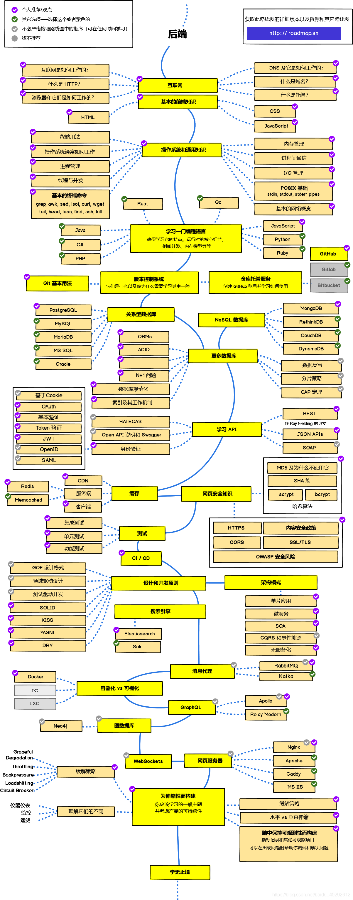

## Java学习路线

### 第一阶段

- 开发环境的搭建
  - 开发工具的安装和使用
    - **JDK**
    - **IDEA(中国常用)**
    - **Eclipse(日本常用)**
  - 环境变量的设置
  - 基础的电脑命令行命令
- **重要知识点(重要)**
  - **基本语法**
  - **继承**
  - **多态**
  - **泛型**
  - **集合**
  - **IO操作**
  - **异常处理**
  - **多线程和并发（了解）**
  - **注解**
  - **反射**
- 基础的数据结构和算法
- **Debug(重要)**
- 做点控制台小程序

### 第二阶段（入门）

- **前端基础知识(重要)**
  - **JavaScript**
  - **HTML**
  - **CSS**
- 计算机网络基础
  - 网络通信协议
  - IP地址
  - **常见的响应格式(重要)**
    - **JSON**
    - **XML**
  - **状态码**
- **数据库基础知识(重要)**
  - **关系型数据库(重要)**
    - **MySQL**
    - Oracle
  - 非关系型
    - MongoDB
- 服务器基础知识
  - **Linux基础操作(重要)**
  - nginx基础知识
  - **Java部署容器(重要)**
    - **tomcat(重点)**
    - jetty
- **JavaWeb基础知识(重要)**
  - servlet/jsp (jsp了解即可)
  - **JDBC**
    - **数据库连接**
    - **CRUD操作**
    - **数据源/连接池**
  - **Ajax通信**
    - restful风格接口
  - **服务端渲染和SPA单页面**
  - **session/cookie**
  - filter/listener
- 做点原生JavaWeb项目

### 第三阶段

- 为框架学习打基础

  - 复习反射（一定要理解）
  - 常用的设计模式
  - **maven(重要)**
  - **Git/SVN(重要)**

- **SSM(重要)**
  - **Spring**
  - **SpringMVC(重要)**
  - **MyBatis(重要)**
  
- 常见的页面模板

  - freemaker
  - **thymeleaf**

- **SpringBoot(重要)**

- 日志处理

  - **log4j**
  - logback

- 常见的缓存

  - **redis(重要)**
  - memcached

- 常见的权限框架和授权认证

  - shiro
  - spring security
  - **jwt**
  - oauth2
  - sso单点登录

- 常见的消息队列

  - rocketmq
  - rabbitmq
  - kafka
  
- 常见的搜索引擎

  - elk（同样可以做日志管理，重要）
    - elasticsearch
    - logstash
    - kibana
  - solr
  - lucene

- 容器和持续部署

  - docker
  - k8s
  - jenkins
  - sonar
  - shell

- 任务

  - quartz
  - elastic-job

- 多线程和并发进阶

  - 线程池
  - JUC
  - 锁

- JVM

  - 调优
  - 内存模型
  - 垃圾回收
  - 错误定位
  - 字节码
  
- NIO

  - netty

- 整合做点项目

### 第四阶段

- 热门的分布式方案
  - Dubbo zookeeper
  - spring cloud alibaba
  - springcloud全家桶
  - 通信方式
    - HTTP
    - Rpc
- 源码阅读
  - spring、springmvc、mybatis、netty
- nodejs、python（混合微服务）
- 数据库进阶
  - MySQL调优
  - 分布式事务
  - 分库分表
    - mycat
    - sharding-jdbc 
- 大数据相关的
  - hadoop、hbase、spark、fink、hive
