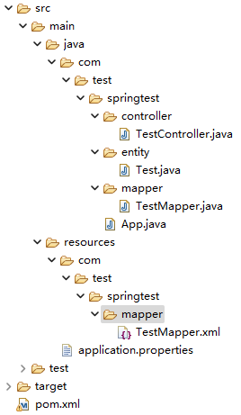

## SpringBoot+MyBatis

| 开发环境       | 版本      |
| -------------- | --------- |
| **JDK**        | **17**    |
| **Maven**      | **3.9.3** |
| **SpringBoot** | **3.1.2** |
| **MyBatis**    | **3.0.2** |

### 项目结构



| 目录/文件名                | 作用                |
| -------------------------- | ------------------- |
| **controller**             | **控制层**          |
| **entity**                 | **实体类层**        |
| **service**                | **业务层**          |
| **mapper**                 | **数据层**          |
| **App.java**               | **启动文件**        |
| **TestMapper.xml**         | **数据XML映射文件** |
| **application.properties** | **数据库配置文件**  |
| **test**                   | **测试目录**        |
| **pom.xml**                | **`maven` 配置**    |

### pom.xml

```xml
<?xml version="1.0" encoding="UTF-8"?>
<project xmlns="http://maven.apache.org/POM/4.0.0" xmlns:xsi="http://www.w3.org/2001/XMLSchema-instance"
         xsi:schemaLocation="http://maven.apache.org/POM/4.0.0 https://maven.apache.org/xsd/maven-4.0.0.xsd">
    <modelVersion>4.0.0</modelVersion>
    <parent>
        <groupId>org.springframework.boot</groupId>
        <artifactId>spring-boot-starter-parent</artifactId>
        <version>3.1.2</version>
        <relativePath/> <!-- lookup parent from repository -->
    </parent>
    <groupId>com.spring</groupId>
    <artifactId>test</artifactId>
    <version>0.0.1-SNAPSHOT</version>
    <name>test</name>
    <description>test</description>
    <properties>
        <java.version>17</java.version>
    </properties>
    <dependencies>
        <dependency>
            <groupId>org.springframework.boot</groupId>
            <artifactId>spring-boot-starter-web</artifactId>
        </dependency>
        <dependency>
            <groupId>org.springframework.boot</groupId>
            <artifactId>spring-boot-devtools</artifactId>
            <scope>runtime</scope>
            <optional>true</optional>
        </dependency>
        <dependency>
            <groupId>org.springframework.boot</groupId>
            <artifactId>spring-boot-starter-test</artifactId>
            <scope>test</scope>
        </dependency>
        <dependency>
            <groupId>org.mybatis.spring.boot</groupId>
            <artifactId>mybatis-spring-boot-starter</artifactId>
            <version>3.0.2</version>
        </dependency>
        <dependency>
            <groupId>com.mysql</groupId>
            <artifactId>mysql-connector-j</artifactId>
            <scope>runtime</scope>
        </dependency>
    </dependencies>
    <build>
        <plugins>
            <plugin>
                <groupId>org.springframework.boot</groupId>
                <artifactId>spring-boot-maven-plugin</artifactId>
            </plugin>
        </plugins>
    </build>
</project>
```

### App

```java
package com.spring.test;

import org.mybatis.spring.annotation.MapperScan;
import org.springframework.boot.SpringApplication;
import org.springframework.boot.autoconfigure.SpringBootApplication;
import org.springframework.context.annotation.ComponentScan;

@SpringBootApplication
@ComponentScan(basePackages = "com.spring.test")
@MapperScan("com.spring.test.mapper")
public class App {
    public static void main(String[] args) {
        SpringApplication.run(App.class, args);
    }
}
```

### Controller

```java
package com.test.springtest.controller;

import java.util.List;

import org.springframework.beans.factory.annotation.Autowired;
import org.springframework.web.bind.annotation.GetMapping;
import org.springframework.web.bind.annotation.RequestMapping;
import org.springframework.web.bind.annotation.RestController;

import com.test.springtest.entity.Test;
import com.test.springtest.service.TestService;

@RestController
@RequestMapping("/test")
public class TestController {
	@Autowired
	private TestService testService;

	@GetMapping("/getInfo")
	public List<Test> getInfo(int id) {
		List<Test> list = testService.getInfo(id);
		return list;
	}
}
```

### Entity

```java
package com.test.springtest.entity;

public class Test {
	private int id;
	private String type;

	public int getId() {
		return id;
	}

	public void setId(int id) {
		this.id = id;
	}

	public String getType() {
		return type;
	}

	public void setType(String type) {
		this.type = type;
	}
}
```

### Service

```java
package com.test.springtest.service;

import java.util.List;

import org.apache.ibatis.annotations.Param;
import org.springframework.beans.factory.annotation.Autowired;
import org.springframework.stereotype.Service;

import com.test.springtest.entity.Test;
import com.test.springtest.mapper.TestMapper;

@Service
public class TestService {
	@Autowired
	TestMapper testMapper;

	public List<Word> getInfo(int id) {
		List<Word> list = testMapper.getInfo(id);
		return list;
	}
}
```

### Mapper

```java
package com.test.springtest.mapper;

import com.test.springtest.entity.Test;

import java.util.List;

public interface TestMapper { 
	List<Test> getInfo(@Param("id") int id);
}
```

### application.properties

```properties
mybatis.mapper-locations=classpath:mapper/*.xml
mybatis.type-aliases-package=com.spring.test.entity
spring.datasource.driver-class-name=com.mysql.cj.jdbc.Driver
spring.datasource.url=jdbc:mysql://localhost:3306/my_project?serverTimezone=UTC&useUnicode=true&characterEncoding=utf-8
spring.datasource.username=root
spring.datasource.password=000000
```

### TestMapper.xml

```xml
<?xml version="1.0" encoding="UTF-8"?>
<!DOCTYPE mapper PUBLIC "-//mybatis.org//DTD Mapper 3.0//EN" "http://mybatis.org/dtd/mybatis-3-mapper.dtd">
<mapper namespace="com.test.springtest.mapper.TestMapper">
	<resultMap id="test" type="Test">
		<id column="id" property="id" javaType="int" />
		<result column="type" property="type" javaType="String" />
	</resultMap>
    <!-- 全局字段 -->
    <sql id="list">
		id, w_name, w_kana, w_mean
	</sql>
	<select id="queryAllUser" resultType="Test">
        <!-- 传参 -->
        SELECT <include refid="list" /> FROM m_type WHERE id=#{id}
    </select>
</mapper>
```

- **默认接口地址: `http://localhost:8080/test/getInfo`**

### 接口传参

#### 路径传参

```java
package com.test.springtest.controller;

import org.springframework.beans.factory.annotation.Autowired;
import org.springframework.web.bind.annotation.GetMapping;
import org.springframework.web.bind.annotation.PathVariable;
import org.springframework.web.bind.annotation.RequestMapping;
import org.springframework.web.bind.annotation.RequestParam;
import org.springframework.web.bind.annotation.RestController;

@RestController
@RequestMapping("/word")
public class TestController {
    // /test?id=10
	@GetMapping("/test")
	public int Test(@RequestParam int id) {
		return id;
	}
    // /test/10
    @GetMapping("/test/{id}")
	public int Test(@PathVariable int id) {
		return id;
	}
}
```

#### `JSON` 传参

```java
package com.test.springtest.controller;

import org.springframework.beans.factory.annotation.Autowired;
import org.springframework.web.bind.annotation.PostMapping;
import org.springframework.web.bind.annotation.RequestBody;
import org.springframework.web.bind.annotation.RestController;

@RestController
@RequestMapping("/word")
public class TestController {
	@PostMapping("/test")
	public Object Test(@RequestBody Object id) {
		return id;
	}
}
```

#### `form-data` 传参

```java
package com.test.springtest.controller;

import org.springframework.beans.factory.annotation.Autowired;
import org.springframework.web.bind.annotation.PostMapping;
import org.springframework.web.bind.annotation.RequestMapping;
import org.springframework.web.bind.annotation.RequestParam;
import org.springframework.web.bind.annotation.RestController;

@RestController
@RequestMapping("/word")
public class TestController {
	@PostMapping("/test")
	public int Test(@RequestPart int id) {
		return id;
	}
}
```

### 文件上传

#### Controller

```java
package com.test.springtest.controller;

import java.io.IOException;

import org.springframework.beans.factory.annotation.Autowired;
import org.springframework.web.bind.annotation.PostMapping;
import org.springframework.web.bind.annotation.RequestMapping;
import org.springframework.web.bind.annotation.RequestPart;
import org.springframework.web.bind.annotation.ResponseBody;
import org.springframework.web.bind.annotation.RestController;
import org.springframework.web.multipart.MultipartFile;

import com.test.springtest.service.service;

@RestController
@RequestMapping("/test")
public class Controller {
    @Autowired
	private Service Service;
    
	@ResponseBody
	@PostMapping("/uploadFile")
	public String uploadFile(@RequestPart MultipartFile fileName) throws IOException {
		return Service.uploadFile(fileName);
	}
}

```

#### Service

```java
package com.test.springtest.service;

import java.io.File;
import java.io.IOException;

import org.springframework.web.multipart.MultipartFile;

@Service
public class Service {
	/**
	 * 文件上传
	 * @return
	 */
	public String uploadFile(MultipartFile fileName) throws IOException{
        return fileName.getOriginalFilename();
	}
}
```

### 日志 (log4j)

#### log4j.xml

```xml
<?xml version="1.0" encoding="UTF-8"?>
<Configuration status="WARN" monitorInterval="30">
	<Properties>
		<Property name="LOG_PATTERN">%d{yyyy-MM-dd HH:mm:ss} %p %m%n</Property>
		<Property name="APP_LOG_ROOT">E:/javaProject/springtest/src/main/resources/log</Property> <!-- 文件路径 -->
	</Properties>
	<Appenders>
		<Console name="Console" target="SYSTEM_OUT" follow="true">
			<PatternLayout pattern="${LOG_PATTERN}" />
		</Console>
		<RollingFile name="appLog" fileName="${APP_LOG_ROOT}/application.log" filePattern="${APP_LOG_ROOT}/application-%d{yyyy-MM-dd}-%i.log">
			<PatternLayout pattern="${LOG_PATTERN}" />
			<Policies>
				<SizeBasedTriggeringPolicy size="19500KB" />
			</Policies>
			<DefaultRolloverStrategy max="1" />
		</RollingFile>
	</Appenders>
	<Loggers>
		<Logger name="com.laoxu.springboot" additivity="false">
			<AppenderRef ref="appLog" />
			<AppenderRef ref="Console" />
		</Logger>
		<Root level="debug">
			<AppenderRef ref="Console" />
		</Root>
	</Loggers>
</Configuration>
```

#### Controller

```java
package com.test.springtest.controller;

import org.springframework.beans.factory.annotation.Autowired;
import org.springframework.web.bind.annotation.PostMapping;
import org.springframework.web.bind.annotation.RestController;
import org.springframework.web.multipart.MultipartFile;
import org.apache.logging.log4j.LogManager;
import org.apache.logging.log4j.Logger;

import com.test.springtest.service.service;

@RestController
public class Controller {
    private static Logger log = LogManager.getLogger();
    
    @Autowired
	private Service Service;

	@PostMapping("/test")
	public String Test() {
        log.info("日志输出");
		return Service.Test();
	}
}
```

