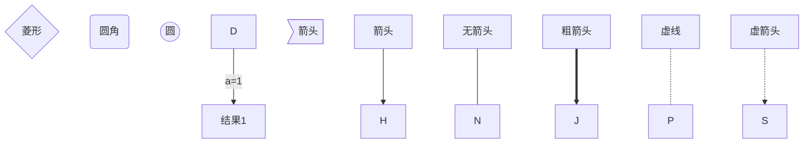
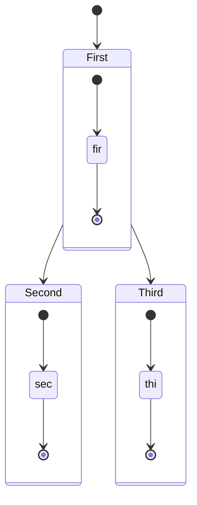
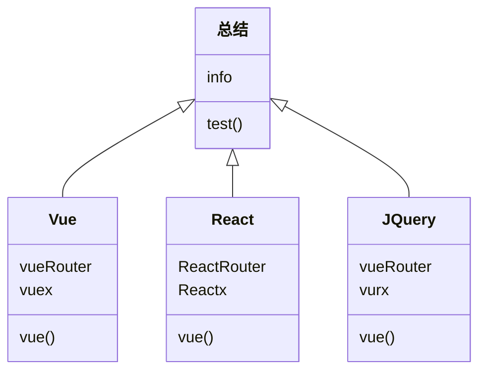
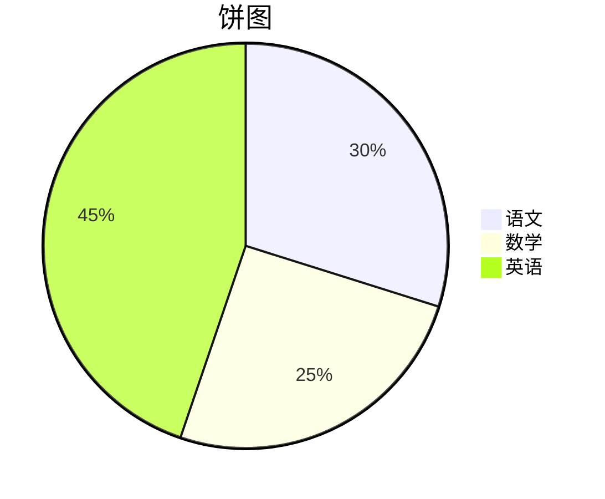
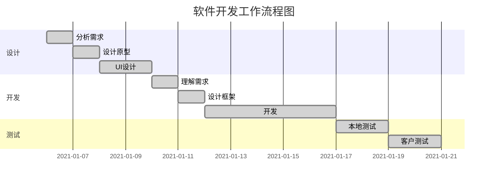

# 标题 1

## 标题 2

### 标题 3

#### 标题 4

##### 标题 5

###### 标题 6

_斜体文本_
**粗体文斜本**
**_粗斜体文本_**
~~删除线~~
<u>带下划线文本</u>
==标记==
**H~2~O**
**2^n^**

- **流程图**

| graph TB     | 从上到下     |
| ------------ | ------------ |
| **graph BT** | **从下到上** |
| **graph LR** | **从左到右** |
| **graph RL** | **从右到左** |



- **状态图**



- **类图**



- **标准流程图**

```flow
st=>start: 开始框
op=>operation: 处理框
cond=>condition: 判断框(是或否?)
sub1=>subroutine: 子流程
io=>inputoutput: 输入输出框
e=>end: 结束框

st->op->cond
cond(yes)->io->e
cond(no)->sub1(right)->op
```

- **饼图**



- **甘特图**

    **任务状态**

    - **done**     已完成
    - **active**   正在进行
    - **crit**        关键任务
    - **默认为`active`(正在进行状态)**

    **任务描述**

    - **des**      项目名称
    - **after**   表示在该项目之后



创建脚注格式类似这样 [^runoob]。

[^runoob]: 菜鸟教程

- 列表 1
    - 子列表
        - 子列表

* 列表 2

- 列表 3

1. 列表
2. 列表
3. 列表

- [ ] **任务列表**

> 区块引用 1
>
> > 区块引用 2
> > `代码` 函数

 ```javascript
 $(document).ready(function () {
   	alert("RUNOOB");
 });
 ```

`带行号代码` 函数

```javascript
$(document).ready(function () {
	alert("RUNOOB");
});
```

行内代码  `alert('RUNOOB');`

这是一个链接 [菜鸟教程](https://www.runoob.com)
<https://www.runoob.com>

---


这个链接用 [^1] 作为网址变量 [RUNOOB][1].
然后在文档的结尾为变量赋值

[^1]: http://static.runoob.com/images/runoob-logo.png

---

| 左对齐 | 右对齐 | 居中对齐 |
| :----- | -----: | :------: |
| 单元格 | 单元格 |  单元格  |
| 单元格 | 单元格 |  单元格  |

---

使用 <kbd>Ctrl</kbd>+<kbd>Alt</kbd>+<kbd>Delete</kbd>重启电脑

<audio controls>
  <source src="http://www.chongfanmitu.com/chat/Sounds/test.mp3" >
</audio>

<video src="https://media.w3.org/2010/05/sintel/trailer.mp4" style="margin:0"></video>
