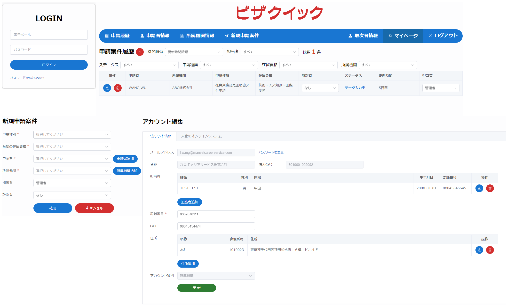
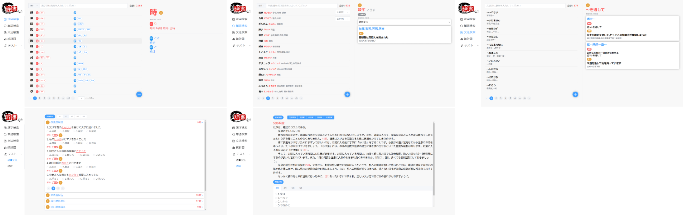

## 個人情報

| 名前             | オウリゲン                    |
| ---------------- | ----------------------------- |
| **生年月日**     | **2000年12月5日**             |
| **性别**         | **男**                        |
| **役職**         | **フロントエンドエンジニア**  |
| **日本語レベル** | **N2**                        |
| **教育**         | **大专 (三年制専門学校相当)** |

### スキル

**◉: 経験一年以上　　　　　　　　◯: 経験有り　　　　　　　　△: 知識有り**

| 言語/フレームワーク |       | 言語/フレームワーク |       | 言語/フレームワーク |       |
| ------------------- | ----- | ------------------- | ----- | ------------------- | ----- |
| HTML                | **◉** | CSS                 | **◉** | JavaScript          | **◉** |
| Vue                 | **◉** | JQuery              | **◉** | React               | **◉** |
| uniapp              | **◉** | WebSocket           | **◉** | WeChatミニアプリ    | **◉** |
| ElementUI           | **◉** | Echarts             | **◉** | Flutter             | **△** |
| MyBatis             | **◯** | C/C++               |       | Spring              |       |
| Go                  |       | ReactNative         | **△** | SpringBoot          | **◯** |
| Dart                | **△** | Shell               |       | Struts              |       |
| VB.NET              |       | Java                | **◯** | Salesforce          |       |
| PHP                 |       | Antd                | **◯** | Antv                | **△** |
| Node                | **◉** | Express             | **◉** | TypeScript          | **◯** |
| Sass                | **△** | SQL                 | **◯** | Angular             | **◯** |
| JSP                 |       | C#.NET              |       | Sequelize           | **◉** |

| システム/データベース |       | システム/データベース |       | システム/データベース |       |
| --------------------- | ----- | --------------------- | ----- | --------------------- | ----- |
| Windows               | **◉** | Android               | **◉** | Linux                 | **△** |
| MySQL                 | **◉** | MongoDB               | **△** | SQLServer             |       |
| Access                |       | Oracle                |       | MacOS                 | **◯** |

| 開発ツール |       | 開発ツール |       | 開発ツール       |       |
| ---------- | ----- | ---------- | ----- | ---------------- | ----- |
| Eclipse    | **◯** | VSCode     | **◉** | WeChat開発ツール | **◉** |
| Postman    | **◉** | Navicat    | **◉** | Chrome           | **◉** |
| Git        | **◯** | SVN        | **◉** | FireFox          | **◯** |
| Excel      | **◯** | Typora     | **◉** | WebStorm         | **◉** |

| **基本設計**   | **◯** |
| -------------- | ----- |
| **機能設計**   | **◯** |
| **詳細設計**   | **◯** |
| **開発**       | **◉** |
| **単体テスト** | **◉** |
| **結合テスト** | **◉** |
| **運用テスト** | **◉** |
| **保守**       | **◯** |

### 趣味

- **バドミントン**
- **プログラミング**
- **政治**
- **歴史**
- **旅行**

### プロジェクト経験

#### 心理評価ゲーム

**スキル:  Vue2 + Electron**

**仕事内容:**  

1. **ページを作成**
2. **ゲームを作成**

**写真:**

#### 中考体育App

**スキル:  uniapp + Vant**

**仕事内容:**  

1. **ページを作成**
2. **フロントエンドとバックエンドの連携**

 **写真** 

  

#### 実験データ表示プラットフォーム（大画面）

**スキル:  Vue2 + WebSocket + Echarts**

**仕事内容**  

1. **ページを作成**
2. **フロントエンドとバックエンドの連携**
2. **WebSocketに接続する**

**写真**:

#### VR関連Webサイト

**スキル:  Vue2 + ElementUI + Vuex**

**仕事内容:**  

1. **ページを作成**
2. **フロントエンドとバックエンドの連携**
3. **ルーティングを構成する**

**写真**

#### 物流情報管理APP

**スキル:  uniapp**

**仕事内容:**  

1. **ページを作成**
2. **フロントエンドとバックエンドの連携**
2. **ルーティングを構成する**

**写真**:

#### 物流監視システム(大画面)

**スキル:  Vue2 + Echarts + WebSocket**

**仕事内容:**  

1. **ページを作成**
2. **フロントエンドとバックエンドの連携**
2. **Websocketに接続する**
2. **ページの適応**

**写真**:

#### 淮北通明鉱業カード機器ページ

**スキル：JQuery**

**仕事内容:**  

1. **ページを作成**

**写真：**

#### 鑫达カード(ミニアプリ)

**スキル:  WeChatミニアプリ + colorUI**

**仕事内容:**

1. **ページを作成**
3. **フロントエンドとバックエンドの連携**

**写真:**

#### 商品管理アプリ

**スキル:  uniapp**

**仕事内容:**

1. **ページを作成**
3. **フロントエンドとバックエンドの連携**

#### 農業貿易(22インチテレビ)

**スキル:  uniapp**

**仕事内容:**

1. **ページを作成**
2. **フロントエンドとバックエンドの連携**

#### 農業貿易(4K縦画面)

**スキル:  uniapp**

**仕事内容:**

1. **ページを作成**
2. **フロントエンドとバックエンドの連携**

#### 注文データ表示画面(65インチテレビ)

**スキル:  uniapp + Echarts**

**仕事内容:**

1. **ページを作成**
2. **フロントエンドとバックエンドの連携**
2. **Websocketに接続する**

#### 農業商品販売ミニアプリ

**スキル:  WeChatミニアプリ + Vant**

**仕事内容:**

1. **ページを作成**
2. **フロントエンドとバックエンドの連携**

#### 計量管理アプリ + ミニアプリ

**スキル:  uniapp / WeChatミニアプリ**

**仕事内容:**

1. **ページを作成**
2. **フロントエンドとバックエンドの連携**

#### 金馬運動 (ミニアプリ)

**スキル:  WeChatミニアプリ + Vant + Echarts**

**仕事内容:**

1. **ページを作成**
2. **フロントエンドとバックエンドの連携**
2. **ブルートゥース体重計を接続する**

####  生鲜情報管理アプリ

**スキル:  uniapp**

**仕事内容:**

1. **ページを作成**
2. **フロントエンドとバックエンドの連携**
3. **カスタム設定インターフェースアドレス**

#### 農業貿易H5ページ

**スキル:  uniapp**

**仕事内容:**

1. **ページを作成**
2. **フロントエンドとバックエンドの連携**

#### 富士薬品 (保守)

**スキル:  Angular + Java**

**仕事内容:**

1. **アプリの不具合を対応する**
2. **新機能を開発する**

#### オンラインビザ申請システム

**スキル:  Vue3 + Express + Sequeliza + MySQL**

**仕事内容:**

1. **画面の設計と作成**
2. **APIの設計と作成**
3. **フロントエンドとバックエンドの連携**
4. **データベーステーブルの設計**
5. **PDF申請書の生成**
6. **出入国在留管理庁のAPIを連携する**
7. **単体テスト**
8. **結合テスト**
9. **サーバーをデプロイメント**
10. **仕様書とAPIドキュメントを書く**

#### 日本語学習Webサイト

**スキル:  Vue3 + Express + Sequelize + MySQL**

**内容:**

1. **画面の設計と作成**
2. **APIの設計と作成**
3. **フロントエンドとバックエンドの連携**
4. **データベーステーブルの設計**
5. **単体テスト**

