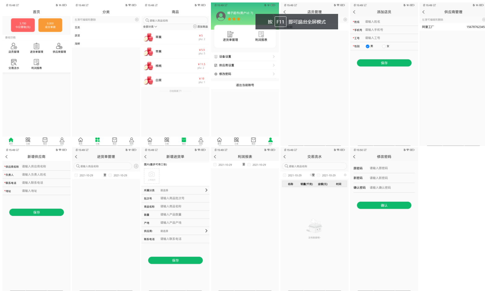

## 個人情報

| 名前             | オウリゲン                               |
| ---------------- | ---------------------------------------- |
| **年齢**         | **22**                                   |
| **性别**         | **男**                                   |
| **役職**         | **フロントエンドエンジニア**             |
| **日本語レベル** | **N3相当**                               |
| **メール**       | **wangliyuan580@gmail.com**              |
| **教育**         | **专科 (2021年7月卒業, 専門学校に相当)** |

### 実務経験

- **2020年10月から2021年7月までは実習期間を属します**

| 会社名                                       | 開始時間           | 辞任時間           | 仕事時間           | 役職                         |
| -------------------------------------------- | ------------------ | ------------------ | ------------------ | ---------------------------- |
| **济南东进情報技術株式会社**                 | **2020年10月21日** | **2021年07月31日** | **9か月10日**      | **フロントエンドエンジニア** |
| **山东联诚中企スマートテクノロジー株式会社** | **2021年08月30日** | **2022年04月15日** | **7か月16日**      | **フロントエンドエンジニア** |
|                                              |                    |                    | **1年4ヶ月と20日** |                              |

### スキル

#### 熟知(80%)

- **HTML**
- **CSS**
- **JavaScript**
- **Vue**
- **Vuex**
- **uniapp**
- **JQuery**
- **WebScoket**
- **WeChatアプレット**
- **Axios**
- **ElementUI(UIフレームワーク)**
- **Echarts(チャート)**
- **Vant(UIフレームワーク)**
- **Git / SVN**

#### 一般(50%)

- **React**
- **React Native**
- **Flutter**
- **Sass**
- **Nuxt.js**
- **Antd(UIフレームワー)**
- **Antv(チャート)**
- **Express**

#### 了解(20%)

- **TypeScript**
- **MySQL**
- **MongoDB**
- **Jest**
- **Electron**
- **Python**
- **Photoshop**
- **D3.js**

### 趣味

- **バドミントン**
- **プログラミング**
- **政治**
- **歴史**
- **旅行**

## 济南东进情報技術株式会社

### 基本情報

|**住所**| 山東省済南市歴下区斉魯ソフトウェアパーク |
| ---- | ---- |
|**開始時間**| **2020年10月21日** |
|**辞任時間**| **2021年07月31日** |
|**仕事時間**| **9か月10日** |
|**役職**| **フロントエンドエンジニア** |
|**給料(税前)**| **2000CNY/月(インターン期間), 4500CNY/月(卒業後)** |

### プロジェクト経験

#### 心理評価ゲーム

**技術:  Vue + Electron**

**仕事内容:**  

1. **ページを作成**
2. **ゲームを書く**

**写真:**

#### 高校入試系App

**技術:  uniapp + Vant**

**仕事内容:**  

1. **ページを作成**
2. **ドッキングAPI**

 **写真** 

  

#### 実験データ表示プラットフォーム（大画面）

**技術:  Vue + WebSocket + Echarts**

**仕事内容**  

1. **ページを作成**
2. **ドッキングAPI**
2. **连接Websocket**

**写真**:

#### VRパーティービルディングクラウドプラットホーム

**技術:  Vue + ElementUI + Vuex**

**Webサイトアドレス:  https://www.backv.com.cn/dist/#/**

**仕事内容:**  

1. **ページを作成**
2. **ドッキングAPI**
3. **ルーティングを構成する**

**写真**

## 山东联诚中企スマートテクノロジー株式会社

### 基本情報

|**住所**| 山東省済南市歴城区東8区エンタープライズマンション |
| ---- | ---- |
|**開始時間**| **2021年08月30日** |
|**辞任時間**| **2022年04月15日** |
|**仕事時間**| **7か月16日** |
|**役職**| **フロントエンドエンジニア** |
|**給料(税前)**| **5000CNY/月** |

### プロジェクト経験

#### トンミンマイニングマーチャントプラットフォームAPP

**技術:  uniapp**

**仕事内容:**  

1. **ページを作成**
2. **ドッキングAPI**
2. **ルーティングを構成する**

**写真**:

#### パレット物流モニタリングシステム（大画面）

**技術:  Vue/React + echarts + WebSocket**

**仕事内容:**  

1. **ページを作成**
2. **ドッキングAPI**
2. **Websocketに接続する**

**写真**:

#### 淮北通明鉱業カード機器の送受信

**技術：JQuery**

**仕事内容:**  

1. **ページを作成**

**写真：**

#### 鑫达カード(アプレット)

**技術:  WeChatアプレット + colorUI**

**仕事内容:**

1. **ページを作成**
3. **ドッキングAPI**

**写真:**

#### 知恵農業貿易App

**技術:  uniapp**

**仕事内容:**

1. **ページを作成**
3. **ドッキングAPI**

#### 知恵農業貿易(22インチテレビ)

**技術:  uniapp / ReactNative**

**仕事内容:**

1. **ページを作成**
2. **ドッキングAPI**

#### 知恵農業貿易(4K縦画面)

**技術:  uniapp / ReactNative**

**仕事内容:**

1. **ページを作成**
2. **ドッキングAPI**

#### 知恵農業貿易(65インチテレビ)

**技術:  uniapp + echarts**

**仕事内容:**

1. **ページを作成**
2. **ドッキングAPI**
2. **Websocketに接続する**

#### 知恵農業貿易オンラインストア (アプレット)

**技術:  微信アプレット + Vant**

**仕事内容:**

1. **ページを作成**
2. **ドッキングAPI**

#### クラウドデータの計量App + アプレット

**技術:  uniapp / ReactNative / 微信アプレット**

**仕事内容:**

1. **ページを作成**
2. **ドッキングAPI**

#### 黄金の馬の動き (アプレット)

**技術:  微信アプレット + Vant + echarts**

**仕事内容:**

1. **ページを作成**
2. **ドッキングAPI**
2. **ブルートゥースデバイスを接続する**

####  生鲜ハウスキーパーApp

**技術:  uniapp / Flutter**

**仕事内容:**

1. **ページを作成**
2. **ドッキングAPI**
3. **カスタム設定インターフェースアドレス**

#### 農業貿易H5ページ

**技術:  uniapp**

**仕事内容:**

1. **ページを作成**
2. **ドッキングAPI**

## 自分のプロジェクト

### 基本情報

| 住所         | 日本埼玉県         |
| ------------ | ------------------ |
| **開始時間** | **2022年04月16日** |
| **役職**     | **なし**           |

### プロジェクト

#### 日本語学習Webサイト

**技術: Vue + Express + MySQL**

**内容:**

1. **ページを作成**
2. **ドッキングAPI**
3. **APIを書く**
4. **データベース設計**

