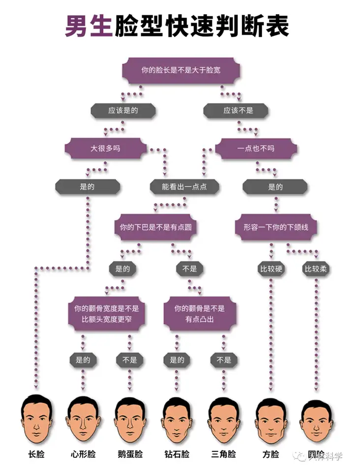
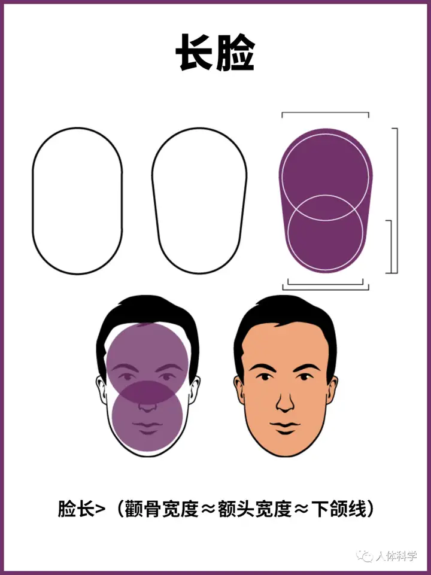
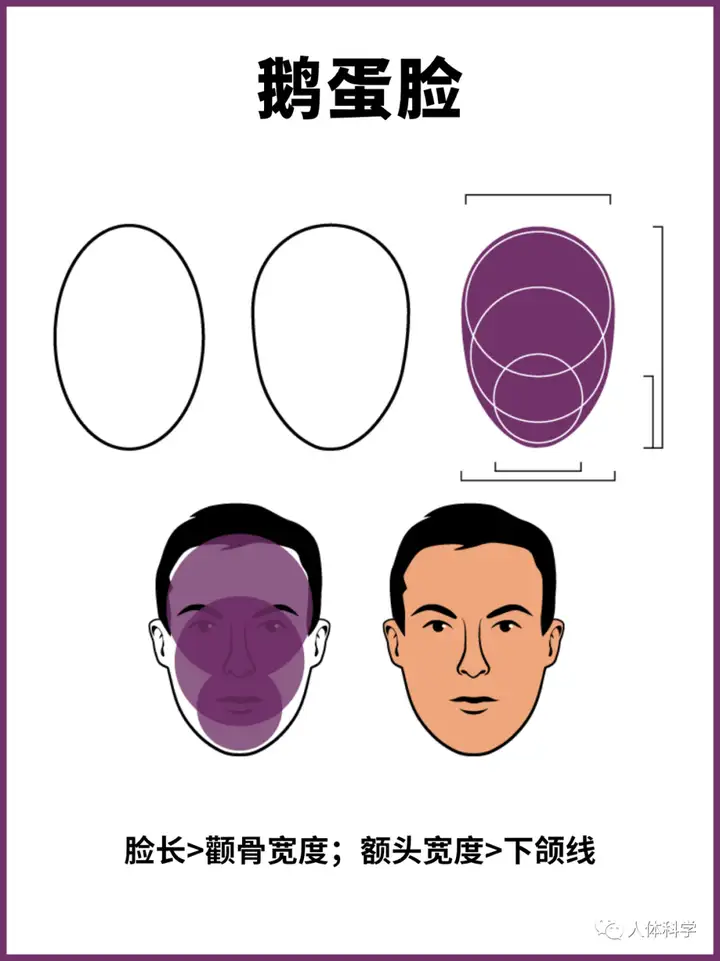
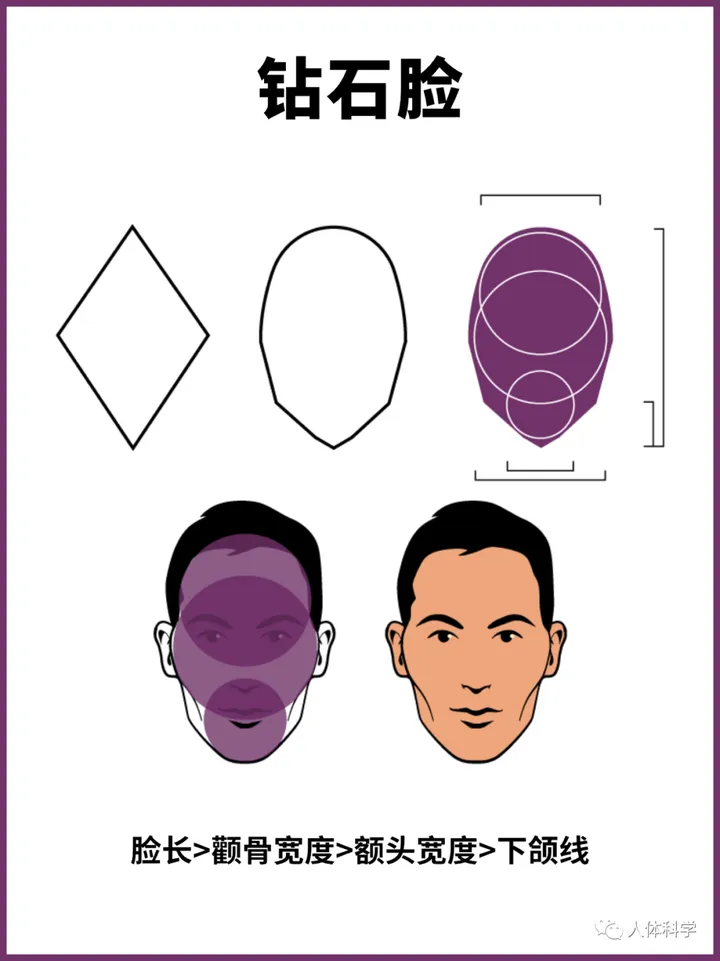
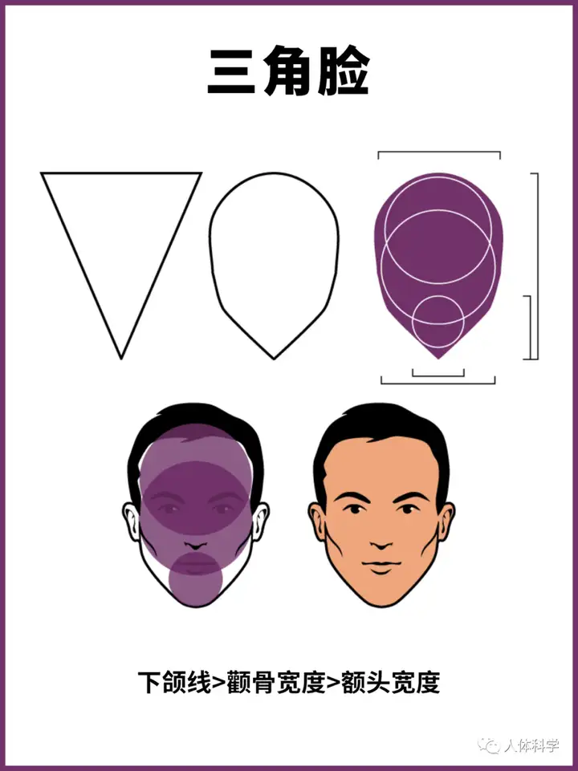
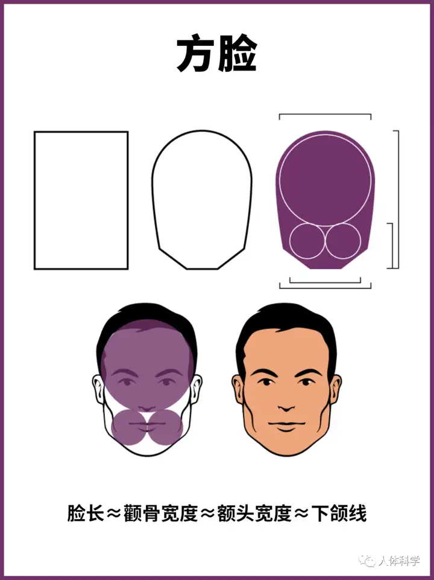
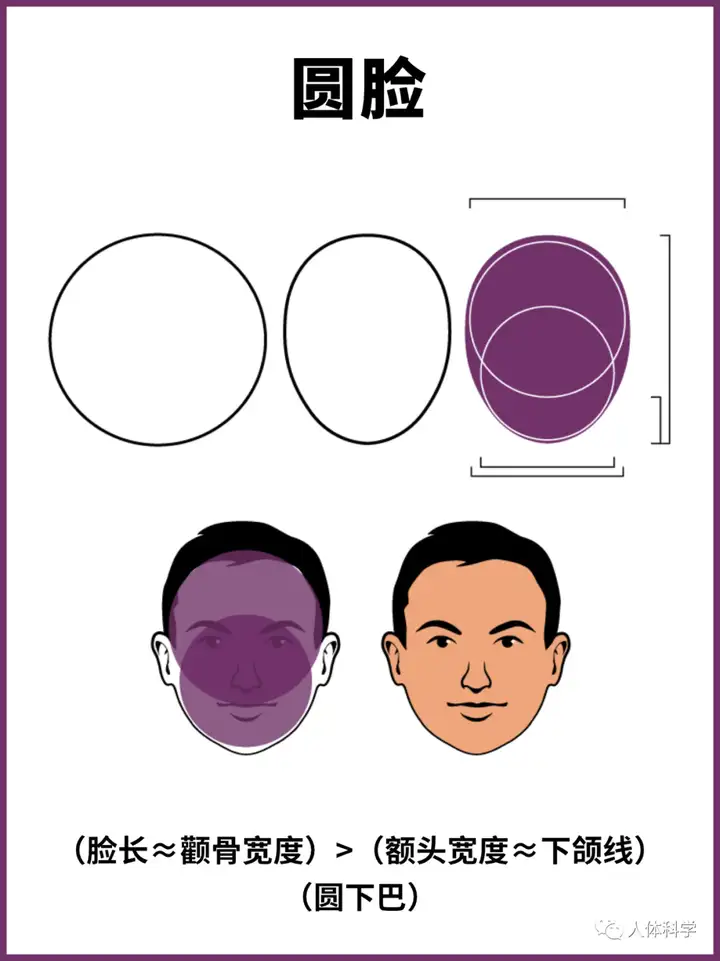

### 脸型

#### 判断

**脸长:** 从发际线顶端到下巴底端的距离

**额头宽度:** 两侧眉峰之间的距离

**颧骨:** 手指横停在眼睛前方, 往下移动. 直到碰到自己的脸, 此处为颧骨

**颧骨宽度:** 左右颧骨之间的距离

**下颌线:** 颚骨转角处到下巴底端的直线距离, 再乘2, 就是下颌线长度

#### 长脸

#### 心形脸

#### 鹅蛋脸

#### 钻石脸

#### 三角脸

#### 方脸

#### 圆脸

### 发型

#### 长度

##### 短发 (2~4cm)

##### 中发 (5~7cm)

##### 中长发 (7~10cm)

##### 长发 (10~15cm)

### 眼部

#### 眼型

### 鼻子

### 嘴部

### 胡子

### 耳部

### 身材

