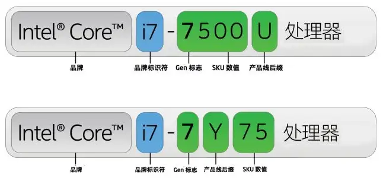
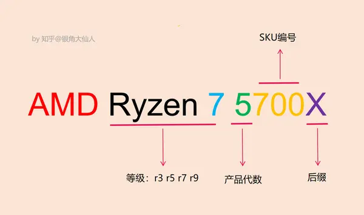

## 电脑

### CPU

#### Intel

1. **凌动 (Atom)**
2. **赛扬 (Celeron)**
3. **奔腾 (Pentium)**
4. **酷睿 (Core)**
5. **至强 (Xeon)**

**性能: 至强 > 酷睿 > 奔腾 > 赛扬 > 凌动**

##### 命名规则

#### AMD

##### 命名规则

### 显卡

#### AMD

#### NVIDIA

### 内存

#### 品牌

| 西部数据 | 金士顿 | 美商海盗船 | 三星 | 影驰 | 威刚 | 联想 | 芝奇 |
| -------- | ------ | ---------- | ---- | ---- | ---- | ---- | ---- |

#### 参数

| 参数          | 说明                                           |
| ------------- | ---------------------------------------------- |
| 容量          | 4G, 8G, 16G, 32G, 64G                          |
| 频率(MHz)     | 2400, 2666, 3200, 3600, 4000, 6000, 7000, 7200 |
| 内存频速(DDR) | DDR2, DDR3, DDR4, DDR5                         |

### 硬盘

#### 品牌

| 西部数据 | 希捷 | 东芝 | 三星 | 金士顿 | 联想 | 闪迪 | 英睿达 |
| -------- | ---- | ---- | ---- | ------ | ---- | ---- | ------ |

#### 参数

| 参数 | 说明                             |
| ---- | -------------------------------- |
| 容量 | 256GB, 500GB, 1TB, 2TB, 4TB, 8TB |
| 接口 | mSATA, SATA. PCIe, M.2           |
| 类别 | SSD, HDD                         |
| 用途 | 红盘, 绿盘, 黑盘, 蓝盘, 紫盘     |

### 主板

#### 品牌

| 华硕 | 微星 | 七彩虹 | 技嘉 | 铭瑄 | 华擎 | 影驰 |      |
| ---- | ---- | ------ | ---- | ---- | ---- | ---- | ---- |

### 机箱

### 电源

### 显示器

#### 品牌

| 三星 | LG   | AOC  | 微星 | 飞利浦 | 戴尔 | 华硕 | 联想 |
| ---- | ---- | ---- | ---- | ------ | ---- | ---- | ---- |

### 鼠标

### 键盘

