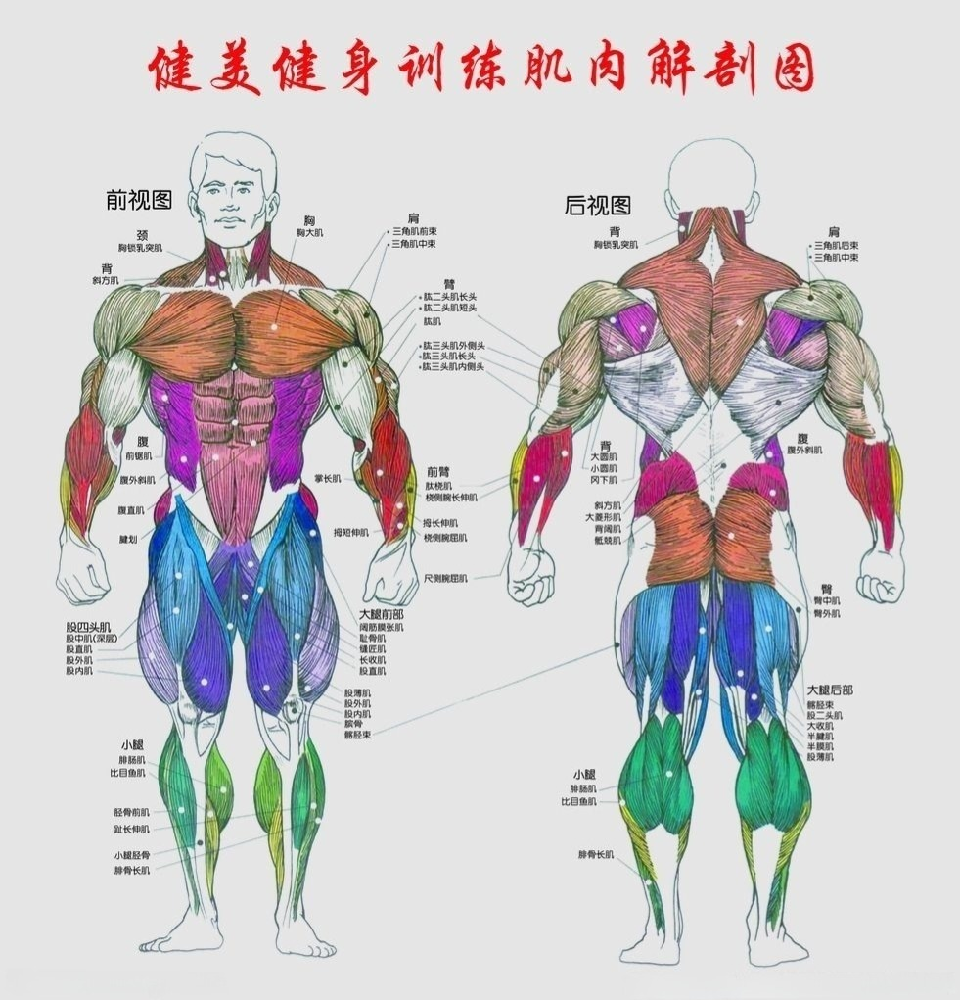
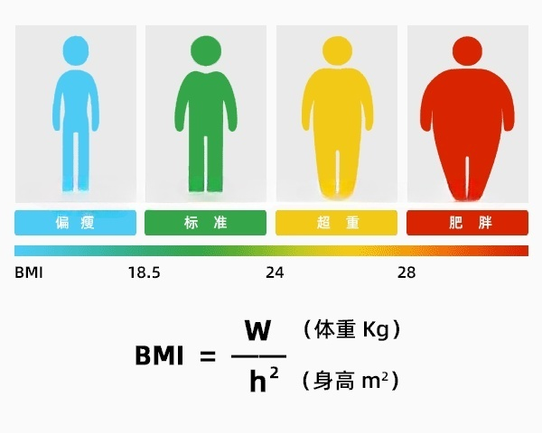

## 健身

### 体重指数BMI

#### 对照表

| 身高(cm) | 标准体重(kg) |
| ---- | ---- |
| **150** | **41.6 ~ 54.0** |
| **151** | **42.2 ~ 54.7** |
| **152** | **42.7 ~ 55.4** |
| **153** | **43.3 ~ 56.2** |
| **154** | **43.9 ~ 56.9** |
| **155** | **44.4 ~ 57.7** |
| **156** | **45.0 ~ 58.4** |
| **157** | **45.6 ~ 59.2** |
| **158** | **46.2 ~ 59.9** |
| **159** | **46.8 ~ 60.7** |
| **160** | **47.4 ~ 61.4** |
| **161** | **48.0 ~ 62.2** |
| **162** | **48.6 ~ 63.0** |
| **163** | **49.2 ~ 63.8** |
| **164** | **49.8 ~ 64.6** |
| **165** | **50.4 ~ 65.3** |
| **166** | **51.0 ~ 66.1** |
| **167** | **51.6 ~ 66.9** |
| **168** | **52.2 ~ 67.7** |
| **169** | **52.8 ~ 68.5** |
| **170** | **53.5 ~ 69.4** |
| **171** | **54.1 ~ 70.2** |
| **172** | **54.7 ~ 71.0** |
| **173** | **55.4 ~ 71.8** |
| **174** | **56.0 ~ 72.7** |
| **175** | **56.7 ~ 73.5** |
| **176** | **57.3 ~ 74.3** |
| **177** | **58.0 ~ 75.2** |
| **178** | **58.6 ~ 76.0** |
| **179** | **59.3 ~ 76.9** |
| **180** | **59.9 ~ 77.8** |
| **181** | **60.6 ~ 78.6** |
| **182** | **61.3 ~ 79.5** |
| **183** | **62.0 ~ 80.4** |
| **184** | **62.6 ~ 81.3** |
| **185** | **63.3 ~ 82.1** |
| **186** | **64.0 ~ 83.0** |
| **187** | **64.7 ~ 83.9** |
| **188** | **65.4 ~ 84.8** |
| **189** | **66.1 ~ 85.7** |
| **190** | **66.8 ~ 86.6** |
| **191** | **67.5 ~ 87.6** |
| **192** | **68.2 ~ 88.5** |
| **193** | **68.9 ~ 89.4** |
| **194** | **69.6 ~ 90.3** |
| **195** | **70.3 ~ 91.3** |
| **196** | **71.1 ~ 92.2** |
| **197** | **71.8 ~ 93.1** |
| **198** | **72.5 ~ 94.1** |
| **199** | **73.3 ~ 95.0** |
| **200** | **74.0 ~ 96.0** |
| **201** | **74.7 ~ 97.0** |
| **202** | **75.5 ~ 97.9** |
| **203** | **76.2 ~ 98.9** |
| **204** | **77.0 ~ 99.9** |
| **205** | **77.7 ~ 100.9** |
| **206** | **78.5 ~ 101.8** |
| **207** | **79.3 ~ 102.8** |
| **208** | **80.0 ~ 103.8** |
| **209** | **80.8 ~ 104.8** |
| **210** | **81.6 ~ 105.8** |