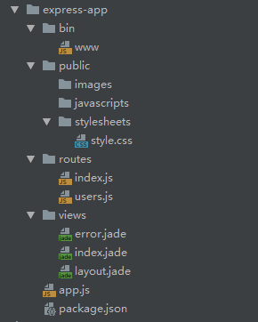

## Express框架

- **基于 [Node.js](https://nodejs.org/en/) 平台，快速、开放、极简的 Web 开发框架**

### 创建项目

- **安装依赖包**

	```shell
	npm install -g express  //全局安装
	npm install --save express
	```

- **创建项目**

	```shell
	express 项目名称
	npm install  //安装依赖
	```

- **目录结构**

	

	| 文件名           | 功能                                                         |
	| ---------------- | ------------------------------------------------------------ |
	| **bin/www**      | 应用的启动文件,包含引用要启动的应用、设置应用监听的端口和启动http服务等 |
	| **public**       | 应用的静态资源文件目录                                       |
	| **routes**       | 应用的路由文件                                               |
	| **views**        | 应用的视图文件                                               |
	| **app.js**       | 应用的初始化文件                                             |
	| **package.json** | 应用的配置文件                                               |

- **启动项目**

	```shell
	npm run start
	```

	**默认访问地址为`http://localhost:3000/`**

### 网络请求

#### GET请求

```js
var express = require('express');
var app = express();

app.get('/url', (req, res) => {
    let data = req.query; //请求参数
	res.send(); //响应参数
});

module.exports = app;
```

#### POST请求

- **`www-form-urlencoded` 格式**

```js
const express = require('express');
const bodyParser = require('body-parser');
const app = express();

app.use(bodyParser.urlencoded({ //解析 www-form-urlencoded 格式
	txtended: false
}));

app.post("/url", (req, res, next) => {
    let data = req.body; //请求参数
	res.send(); //响应参数
});

module.exports = app;
```

- **`form-data` 格式**

```shell
npm install connect-multiparty
```

```js
const express = require('express');
const app = express();
const multipart = require('connect-multiparty');
const multipartMiddleware = multipart(); //文件上传

app.post('/url', multipartMiddleware, (req, res) => {});

module.exports = app;
```

- **`application/json` 格式**

```js
var express = require('express');
var bodyParser = require('body-parser');
var app = express();

app.use(bodyParser.json()); //解析 JOSN 格式

app.post('/url', (req, res) => {});

module.exports = app;
```

### 数据库操作

- **数据库连接配置(dbConfig.js)**

```js
let mysql = {
	host: 'localhost',
	user: 'root',
	password: 'password',
	database: '数据库名'
};

module.exports = mysql;
```

- **请求响应状态码封装(jsonMsg.js)**

```js
var jsonMsg = function(res, result, err) {
	if (typeof result === "undefined") {
		res.json({
			code: "300",
			msg: "操作失败:" + err,
		});
	} else if (result === "add") {
		res.json({
			code: "200",
			msg: "添加成功",
		});
	} else if (result === "delete") {
		res.json({
			code: "200",
			msg: "删除成功",
		});
	} else if (result === "update") {
		res.json({
			code: "200",
			msg: "更改成功",
		});
	} else if (result.result != "undefined" && result.result === "select") {
	res.json({
		code: "200",
		msg: "查找成功",
		data: result.data,
	});
} else if (result.result != "undefined" && result.result === "selectall") {
		res.json({
			code: "200",
			msg: "全部查找成功",
			data: result.data,
		});
	} else {
		res.json(result);
	}
};

module.exports = jsonMsg;
```

- **SQL语句封装(sql.js)**

```js
//对操作不同表sql语句的封装
let user = {
	insert: "INSERT INTO user(name) VALUES(?)", //添加指定数据
	update: "UPDATE user SET name=? WHERE id=?", //修改指定数据
	delete: "DELETE FROM user WHERE id=?", //删除指定数据
	queryById: "SELECT * FROM user WHERE id=?", //查找指定数据
	queryAll: "SELECT * FROM user" //查找全部数据
};

module.exports = {
	user
};
```

- **数据库操作封装(db.js)**

```js
//mysql连接池配置文件
const mysql = require("mysql");
const $dbConfig = require("./dbConfig.js");
const sql = require("./sql.js"); //sql语句封装
const pool = mysql.createPool($dbConfig); //使用连接池
const json = require("./jsonMsg.js");

//数据库增、删、改、查封装
/**
 * @param  {str} table 数据库表的名称
 * @param  {obj} req 插入的数据
 * @param  {obj} res 接口函数中的res对象
 * @param  {obj} next 接口函数中的next对象
 */

//新增一条数据
let dbAdd = (table, req, res, next) => {
	pool.getConnection((err, connection) => {
		let paramValue = paramList(req);
		connection.query(sql[table].insert, [...paramValue], (err, result) => {
			if (result) {
				result = "add";
			}
			// 以json形式把操作结果返回给前台页面
			json(res, result, err);
			// 释放连接
			connection.release();
		});
	});
};

//删除一条数据
let dbDelete = (table, req, res, next) => {
	let paramValue = paramList(req);
	pool.getConnection((err, connection) => {
		connection.query(sql[table].delete, [...paramValue], (err, result) => {
			if (result.affectedRows > 0) {
				result = "delete";
			} else {
				result = undefined;
			}
			json(res, result, err);
			connection.release();
		});
	});
};

//修改一条数据
let dbUpdate = (table, req, res, next) => {
	let paramValue = paramList(req);
	pool.getConnection((err, connection) => {
		connection.query(sql[table].update, [...paramValue], (err, result) => {
			if (result.affectedRows > 0) {
				result = "update";
			} else {
				result = undefined;
			}
			json(res, result, err);
			connection.release();
		});
	});
};

//查找一条数据
let dbQueryById = (table, req, res, next) => {
	let paramValue = paramList(req);
	pool.getConnection((err, connection) => {
		connection.query(sql[table].queryById, [...paramValue], (err, result) => {
			if (result != "") {
				var _result = result;
				result = {
					result: "select",
					data: _result,
				};
			} else {
				result = undefined;
			}
			json(res, result, err);
			connection.release();
		});
	});
};

//查找全部数据
let dbQueryAll = (table, res, next) => {
	pool.getConnection((err, connection) => {
		connection.query(sql[table].queryAll, (err, result) => {
			if (result != "") {
				var _result = result;
				result = {
					result: "selectall",
					data: _result,
				};
			} else {
				result = undefined;
			}
			json(res, result, err);
			connection.release();
		});
	});
};

/**
 * @description 遍历数据的值
 * @param {obj} obj 包含参数的对象
 * */
let paramList = (obj) => {
	let paramArr = [];
	for (let key in obj) {
		if (obj[key]) {
			paramArr.push(obj[key]);
		}
	}
	return paramArr;
};

module.exports = {
	dbAdd,
	dbDelete,
	dbUpdate,
	dbQueryById,
	dbQueryAll
};
```

- **app.js**

```js
const express = require('express'); //导入框架
const db = require('./db.js');  //SQL操作函数
const app = express();
app.use(express.json());

//请求访问接口
app.get/post("/路由名", (req, res, next) => {
    let data = req.body; //前端参数(obj)
	db.函数名("数据库名", data, res, next);
});

module.exports = app;
```

​	
