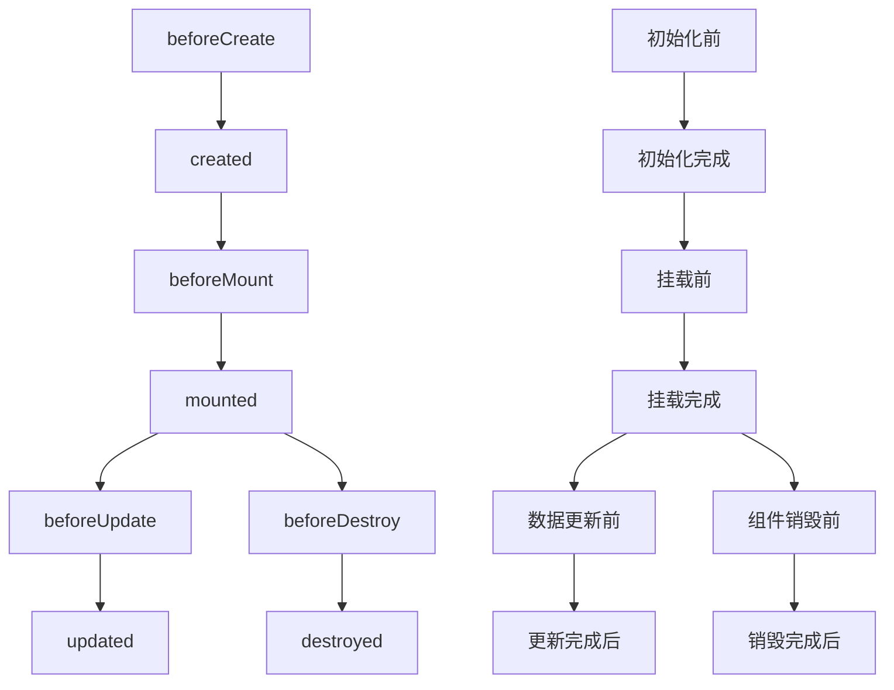

### 目录

[TOC]

### Vue 的引用

```html
<script src="https://cdn.jsdelivr.net/npm/vue/dist/vue.js"></script>
```

### 搭建 Vue 项目

```shell
vue init webpack 项目名
```

### Vue 生命周期

#### 生命周期函数


```mermaid
graph TD;
    beforeCreate-->
    created-->
    beforeMount-->
    mounted-->
    beforeUpdate-->
    updated
    mounted-->
    beforeDestroy-->
    destroyed;
    初始化前-->
    初始化完成-->
    挂载前-->
    挂载完成-->
    数据更新前-->
    更新完成后
    挂载完成-->
    组件销毁前-->
    销毁完成后;
```

#### Vue 项目目录结构


| 名称             | 作用                           |
| ---------------- | ------------------------------ |
| **build**        | **存放项目构建脚本**           |
| **config**       | **存放项目的一些基本配置信息** |
| **node_modules** | **存放项目的所有依赖**         |
| **src**          | **项目的源码**                 |
| **static**       | **静态资源**                   |
| **index.html**   | **项目的首页，入口页**         |
| **package.json** | **定义项目的所有依赖**         |

### Vue 构造器

```html
<div id="id">
	<h1>{{name}}</h1> <!--你好-->
	<h1>{{age}}</h1> <!--20-->
	<h1>{{name()}}</h1> <!--Hello Vue-->
	<h1>{{str.name}}</h1> <!--Vue-->
	<h1>{{str.age}}</h1> <!--10-->
</div>
```

```javascript
var vue = new Vue({
	el: "#id", //选择器
	data: {
		//定义属性
		name: "你好",
		age: 20,
		str: {
			//定义对象
			name: "Vue",
			age: 10,
		}
	},
	methods: {
		//定义函数
		name: () {
			return "Hello Vue";
		},
	},
});
```

[返回顶部](#目录)

### Vue 指令

#### **v-text 和 v-html**

> **文本渲染**

```html
<div id="app">
	<div v-html="msg"></div>
	<div v-text="msg"></div>
</div>
<script>
	new Vue({
		el: '#app',
		data: {
			msg: '<h1>菜鸟教程</h1>'
		}
	})
</script>
```

#### v-bind

> **属性绑定**

```html
<div v-bind:属性名=“” ></div>
<div :属性名=“” ></di>
```

#### v-model

> #### **双向数据绑定**

```html
<div id="app">
	<p>{{ msg }}</p>
	<input v-model="msg">
</div>
<script>
	new Vue({
		el: '#app',
		data: {
			msg: 'Runoob!'
		}
	})
</script>
```

[返回顶部](#目录)

#### **v-for**

> **循环语句**

```html
<div id="app">
	<ul>
		<li v-for="item in sites">
			<span>{{ item.name }}</span>
		</li>
	</ul>
</div>
<script>
	new Vue({
		el: '#app',
		data: {
			sites: [{
				name: 'Runoob'
			}, {
				name: 'Google'
			}, {
				name: 'Taobao'
			}]
		}
	})
</script>
```

#### **v-if 和 v-else**

> **条件语句**

```html
<div id="app">
	<div v-if="flag">
	  flag 为 true
	</div>
	<div v-else>
	  flag 为 false
	</div>
    
	<div v-show="flag">
	  flag 为 true
	</div>
	<div v-show="!flag">
	  flag 为 false
	</div>
</div>
```

#### **v-if 和 v-show 的区别**

- **v-if = "false" 从页面中移除该元素**
- **v-show = "false" 隐藏该元素(不移除)**

#### **v-on**

> **事件绑定**

```html
<div v-on:事件名=“” ></div>
<div @事件名=“” ></di>
```

> ###### 事件修饰符

- **`.stop`			阻止冒泡**
- **`.prevent`      阻止默认事件**
- **`.capture`      阻止捕获**
- **`.self`            只监听触发该元素的事件**
- **`.once`            只触发一次**
- **`.left`            左键事件**
- **`.right`          右键事件**
- **`.middle`        中间滚轮事件**

[返回顶部](#目录)

### Vue事件

- **鼠标事件**

| 事件名          | 作用         |
| --------------- | ------------ |
| **@click**      | **单击**     |
| **@mousedown**  | **按下**     |
| **@mouseup**    | **抬起**     |
| **@dblclick**   | **双击**     |
| **@mousemove**  | **移动**     |
| **@mouseleave** | **离开**     |
| **@mouseout**   | **移出**     |
| **@mouseenter** | **进入**     |
| **@blur**       | **失去焦点** |
| **@focus**      | **获取焦点** |

### `transition` 过渡

```vue
<transition>
	<div v-if="flag" class="box"></div>
</transition>
```

| CSS类名            | 作用                              |
| :----------------- | --------------------------------- |
| **v-enter**        | **元素显示/插入前的效果**         |
| **v-active-enter** | **元素显示/插入的过渡时间和函数** |
| **v-enter-to**     | **元素显示/插入后的效果**         |
| **v-leave**        | **元素隐藏/移除前的效果**         |
| **v-active-leave** | **元素隐藏/移除的过渡时间和函数** |
| **v-leave-to**     | **元素隐藏/移除后的效果**         |

### 监听属性

- **侦听器 `watch`**

```html
<template>
	<div>
		千米 :<input type="text" v-model="km">
		米 :<input type="text" v-model="m">
	</div>
</template>
<script>
    export default {
		data() {
			return {
				km: 0,
				m: 0
			}
		},
        //侦听器
		watch: {
			km: (val) => {
				this.km = val;
				this.m = this.km * 1000
			},
			m: (val)  {
				this.km = val / 1000;
				this.m = val;
			}
		}
	}
</script>
```

- **`$on` 和 `$emit`**

```html
<template>
	<div>
		<button @click="isClick">子传父</button>
	</div>
</template>
<script>
	export default {
		data() {
			return {
				value: "value"
			}
		},
        mounted() {
            //监听自定义事件
      		this.$on('isClick', (val) => {
        		console.log(val);
      		});
    	},
		methods: {
			isClick() {
                //触发实例上的事件
				this.$emit('isClick', this.value);
			}
		}
	}
</script>
```

[返回顶部](#目录)

### 组件

#### 全局组件

```js
import index from './component/index.vue'
Vue.component(index);
```

#### 局部组件

```js
import index from './component/index.vue'
export default {
    components: {
        index
    }
}
```

[返回顶部](#目录)

#### 组件之间传值

##### 子组件 调用 父组件的方法

```js
this.$parent.方法名();
```

##### 子传父

- **子组件**

```html
<template>
	<div>
		<button @click="submit">子传父</button>
	</div>
</template>
<script>
	export default {
		data() {
			return {
				value: "value"
			}
		},
		methods: {
			submit() {
				//通过 $emit 向父组件传 value 值
				this.$emit('Parent', this.value);
			}
		}
	}
</script>
```

- **父组件**

```html
<template>
	<div>
		<!-- 通过 自定义事件 接收子组件的 value 值 -->
		<子组件 @Parent="getValue" />
	</div>
</template>
<script>
	import 子组件 from '/子组件'
	export default {
		data() {
			return {
				value: ""
			}
		},
		components: {
			子组件
		},
		methods: {
			//自定义事件名
			getValue(value) {
				this.value = value;
			}
		}
	}
</script>
```

##### 父组件 调用 子组件的方法

```html
<子组件 ref="name" ></子组件>
this.$refs.name.方法名();
```

[返回顶部](#目录)

##### 父传子

- **父组件**

```html
<template>
	<div>
		<!-- 通过 自定义属性 向子组件传值 -->
		<子组件 :child="childValue" />
	</div>
</template>
<script>
	import 子组件 from '/子组件'
	export default {
		data() {
			return {
				childValue: "value"
			}
		},
		components: {
			子组件
		}
	}
</script>
```

- **子组件**

```html
<template>
	<div>
		<span>{{ child }}</span>
	</div>
</template>
<script>
	export default {
		//通过 props 接收父组件的值
		props: ['child']
	}
</script>
```

##### 兄弟组件传值

- **父组件**

```html
<template>
	<div id="app">
		<A />
		<B />
	</div>
</template>
<script>
	import A from './a.vue'
	import B from './b.vue'
	export default {
		components: {
			A,
			B
		}
	}
</script>
```

- **A 组件**

```html
<template>
	<div id="app">
		<button @click="aValue">A按钮</button>
	</div>
</template>
<script>
	import eventVue from './event.js'
	export default {
		data() {
			return {
				msgA: "组件A"
			}
		},
		methods: {
			aValue() {
				//$emit 方法会触发一个事件
				this.$emit("myFun", this.msgA);
			}
		}
	}
</script>
```

- **B 组件**

```html
<template>
	<div id="app">
		<div>{{ msgB }}</div>
	</div>
</template>
<script>
	import eventVue from './event.js'
	export default {
		data() {
			return {
				msgB: "组件B"
			}
		},
		created() {
			this.bValue();
		},
		methods: {
			bValue() {
				//$on 接收A组件传的值
				this.$on("myFun", (msg) => {
					this.msgB = msg
				})
			}
		}
	}
</script>
```

- **`event.js`**

```js
import Vue from 'vue'

export default new Vue
```

[返回顶部](#目录)

### v-for 动态绑定 input 输入值

```vue
<template>
	<view>
		<view v-for="(item, index) in list" :key="index">
			<view>{{item.name}}</view>
			<input type="text" v-model="item.value" />
		</view>
	</view>
</template>
<script>
	export default {
		data() {
			return {
				list: [{
					name: '0001',
					value: ''
				}, {
					name: '0002',
					value: ''
				}, {
					name: '0003',
					value: ''
				}]
			}
		}
	}
</script>
```

### 数据缓存

**`sessionStorage` : 浏览器关闭时自动删除**

**`localStorage`: 永久保存,手动删除**

- **写入缓存**

```js
localStorage.setItem('key值', value);
sessionStorage.setItem('key值', value);
```

- **输出缓存**

```js
localStorage.getItem('key值');
sessionStorage.getItem('key值');
```

- **删除缓存**

```js
localStorage.removeItem('key值');
localStorage.clear(); //清空所有缓存
sessionStorage.removeItem('key值');
sessionStorage.clear(); //清空所有缓存
```

### js-cookie

- **下载依赖包**

 ```shell
 npm install js-cookie --save
 ```

- **导入依赖包**

```js
import cookie from 'js-cookie'
//定义全局方法
Vue.prototype.$cookie = cookie;
```

- **写入`cookie`**

```js
this.$cookie.set('key', value);
this.$cookie.set('key', value, {
    expires: date,	//有效期,单位:天
    path: '/src',	//路径
    domain: '域名'   //指定域名
});
```

- **获取`cookie`**

```js
this.$cookie.get('key');
```

- **删除`cookie`**

```js
this.$cookie.remove('key');
```

[返回顶部](#目录)

### vue-router

- **安装依赖包**

```shell
npm install vue-router -S
```

- **routes/index.js**

```js
import Vue from 'vue'
import Router from 'vue-router'
Vue.use(Router);
//页面路径
const routes = [{
	path: '/', //首页
	name: 'index',
	component: require("../components/index.vue")
}]
const router = new Router({
	mode: 'hash', //默认hash模式,hash模式有#;history模式，没有#符号;
	routes: routes
});
//路由守卫
router.beforeEach((to, from, next) => {
	// to	  下一页面
	// from	  当前页面
	next();
})
export default router;
```

- **main.js**

```js
import routes from './routes/index.js' //路由
new Vue({
    routes,
    render: h => h(App),
}).$mount('#app')
```

- **App.vue**

```vue
<template>
    <div id="app">
        <router-view></router-view>
    </div>
</template>
<script>
    export default {
        name: "app",
    };
</script>
```

### 路由跳转传值

- **声明式导航**

```vue
<router-link :to="{name:'home'}">
<router-link :to="{path:'/home'}">
```

- **`query` 传参(参数显示在url上)**
```js
this.$router.push({
	path: '/home',
	query: {
        val: 1
    }
})
//获取参数
this.$route.query.val;
```

- **`params`传参(参数不显示在url上)**
```js
this.$router.push({
	name: 'home',
	params: {
		id: 1
	}
})
//获取参数
this.$route.params.id;
```

- **this.$router.replace()  关闭当前页面跳转**

### Vuex 状态管理工具

1. **安装 vuex 依赖包**

```shell
npm install vuex --save
```

2. **导入 vuex 包**

```javascript
import Vuex from 'vuex'
Vue.use(Vuex);
```

3. **创建 store 对象**

```javascript
const store = new Vuex.Store({});
```

#### State

- 定义了应用状态的数据结构，可以在这里设置默认的初始状态

#### Getter

- 允许组件从 Store 中获取数据

#### Mutation

- 是唯一更改 store 中状态的方法，必须是同步函数。

#### Action

- 用于提交 mutation，不是直接变更状态，可以包含任意异步操作。

#### Module

- 可以将 store 分割成模块

> **State仓库**

```javascript
const store = new Vuex.Store({
    state:{
        conut: 0
    },
    //getters 是 store 的计算属性
    getters:{
    	newCount:state => state.count += 2
   	},
    //修改仓库状态
    mutations:{
        number(state，value){
            state.count += value;
        }
    }
})
```
> **组件**

```html
<div id='app'>
	<h1>{{ $store.state.count }}</h1>
</div>
```

```javascript
export default {
    computed: {
        //获取 newCount
		newCount(){
			return this.$store.getters.newCount;
		}
  	}，
    methods: {
		getVal() {
     		//通过 commit 提交一个名为 number 的 value
     		this.$store.commit("number", value);
   		}
 	}
}; 
```

> **mapState**

### 网络请求

#### 配置跨域代理

- **vue.config.js**

```js
module.exports = {
	publicPath: './',
	devServer: {
		host: 'localhost', //本地IP
		port: 8080, //端口号
		https: false, //是否启用 https
		hotOnly: false,
		proxy: { //配置跨域
			'/api': {
				target: "http://xxx.xxx.xxx.xxx", //接口地址
				changeOrigin: true, //是否跨域
				secure: false,
				pathRewrite: { //重写路径
					"^/api": ""
				}
			}
		}
	}
}
```

- **axios 引用**

```html
<script src="https://unpkg.com/axios/dist/axios.min.js"></script>
```

> **请求方法**

```javascript
axios({
  	method: '请求方式',
  	url: '请求地址',
    headers: {},//请求头
  	data: {
  	  	key: value,  //请求参数
  	}
}).then(function (res) {}) //请求成功
.catch(function (error) {}); //请求失败
```

#### 封装网络请求API

- **request.js**

```javascript
import axios from 'axios'

// 请求超时时间
axios.defaults.timeout = 15000;
// 请求头
axios.defaults.headers.post['Content-Type'] = 'application/x-www-form-urlencoded;charset=UTF-8';
// 请求拦截器
axios.interceptors.request.use(
	config => {
		// 每次发送请求之前判断是否存在token
		const token = slocalStorage.getItem('token');
		if (token) { // 判断是否存在token
			config.headers.Token = token;
		}
		return config;
	},
	error => {
		return Promise.error(error);
	});
// 响应拦截器
axios.interceptors.response.use(
	response => {
		if (response.status === 200) {
			return Promise.resolve(response);
		} else {
			return Promise.reject(response);
		}
	},
	// 服务器状态码不是200的情况
	error => {
		if (error.response.status) {
			console.log(error)
		}
		return Promise.reject(error.response);
	}
);
// 封装get请求
export function get(url, params) {
	return new Promise((resolve, reject) => {
		axios.get(url, {
			params: params
		}).then(res => {
			resolve(res.data);
		}).catch(err => {
			reject(err.data)
		})
	});
}
// 封装post请求
export function post(url, params) {
	return new Promise((resolve, reject) => {
		axios.post(url, params)
			.then(res => {
				resolve(res.data);
			}).catch(err => {
				reject(err.data)
			})
	});
}
export default axios
```

- **api.js**

```javascript
import {get, post} from './request.js'

const api = {
	函数名(params){
		return get('/api/请求地址', params);
	},
    函数名(params){
		return post('/api/请求地址', params);
	}
}
export default api
```

- **main.js**

```javascript
import api from './api.js'
Vue.prototype.$api = api;
```

- **调用API**

```javascript
let params = { //参数对象
    key: 'value'
};
this.$api.函数名(params).then(res => {});
```

[返回顶部](#目录)

### 移动端适配

- **安装依赖包**

```shell
npm install lib-flexible -S
npm install postcss-px2rem -S
```

- **main.js**

```js
import 'lib-flexible'
```

- **配置`postcss-px2rem`**

    **`vue.config.js`**

```js
module.exports = {
    publicPath: './',
	css: {
		loaderOptions: {
			css: {},
			postcss: {
				plugins: [
					require('postcss-px2rem')({
						remUnit: 37.5
					})
				]
			}
		}
	}
}
```
