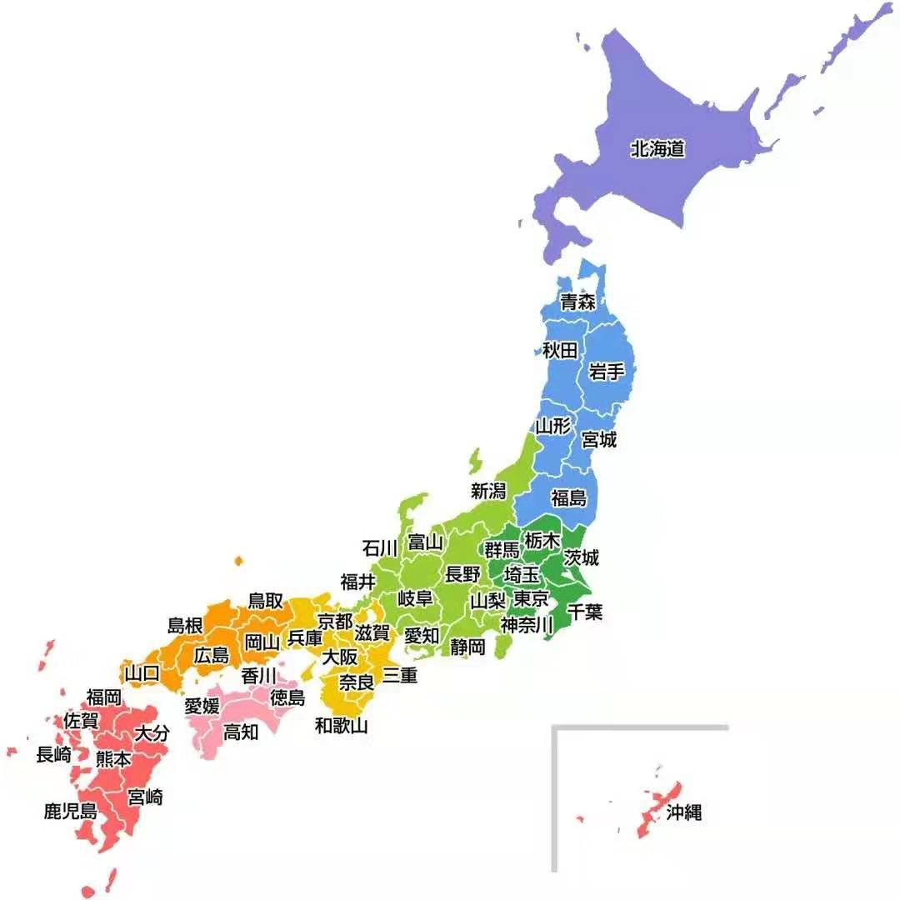

## 日语学习

### 五十音图

- **清音**

|       |   a    |   i    |   u    |   e    |   o    |
| :---: | :----: | :----: | :----: | :----: | :----: |
|       | **あ** | **い** | **う** | **え** | **お** |
|       | **ァ** | **イ** | **ウ** | **エ** | **オ** |
| **k** |   か   | **き** | **く** | **け** | **こ** |
|       | **カ** | **キ** | **ク** | **ケ** | **コ** |
| **s** | **さ** | **し** | **す** | **せ** | **そ** |
|       | **サ** | **シ** | **ス** | **セ** | **ソ** |
| **t** | **た** | **ち** | **つ** | **て** | **と** |
|       | **タ** | **チ** | **ツ** | **テ** | **ト** |
| **n** | **な** | **に** | **ぬ** | **ね** | **の** |
|       | **ナ** | **ニ** | **ネ** | **ヌ** | **ノ** |
| **h** | **は** | **ひ** | **ふ** | **へ** | **ほ** |
|       | **ハ** | **ヒ** | **フ** | **ヘ** | **ホ** |
| **m** | **ま** | **み** | **む** | **め** | **も** |
|       | **マ** | **ミ** | **ム** | **メ** | **モ** |
| **y** | **や** |        | **ゆ** |        | **よ** |
|       | **ヤ** |        | **ユ** |        | **ヨ** |
| **r** | **ら** | **り** | **る** | **れ** | **ろ** |
|       | **ラ** | **リ** | **ル** | **レ** | **ロ** |
| **w** | **わ** |        |        |        | **を** |
|       | **ワ** |        |        |        | **ヲ** |
|       | **ん** |        |        |        |        |
|       | **ン** |        |        |        |        |

- **浊音**

|       | **a**  | **i**  | **u**  | **e**  | **o**  |
| :---: | :----: | :----: | :----: | :----: | :----: |
| **g** | **が** | **ぎ** | **ぐ** | **げ** | **ご** |
|       | **ガ** | **ギ** | **グ** | **ゲ** | **ゴ** |
| **z** | **ざ** | **じ** | **ず** | **ぜ** | **ぞ** |
|       | **ザ** | **ジ** | **ズ** | **ゼ** | **ゾ** |
| **d** | **だ** | **ぢ** | **づ** | **で** | **ど** |
|       | **ダ** | **ヂ** | **ヅ** | **デ** | **ド** |
| **b** | **ば** | **び** | **ぶ** | **べ** | **ぼ** |
|       | **バ** | **ビ** | **ブ** | **ベ** | **ボ** |
| **p** | **ぱ** | **ぴ** | **ぷ** | **ぺ** | **ぽ** |
|       | **パ** | **ピ** | **プ** | **ペ** | **ポ** |

- **拗音**

|   きゃ(kya)   |   きゅ(kyu)   |   きょ(kyo)   |
| :-----------: | :-----------: | :-----------: |
|   **キャ**    |   **キュ**    |   **キョ**    |
| **しゃ(sha)** | **しゅ(shu)** | **しょ(sho)** |
|   **シャ**    |   **シュ**    |   **ショ**    |
| **ちゃ(cha)** | **ちゅ(chu)** | **ちょ(cho)** |
|   **チャ**    |   **チュ**    |   **チョ**    |
| **にゃ(nya)** | **にゅ(nyu)** | **にょ(nyo)** |
|   **ニャ**    |   **ニュ**    |   **ニョ**    |
| **ひゃ(hya)** | **ひゅ(hyu)** | **ひょ(hyo)** |
|   **ヒャ**    |   **ヒュ**    |   **ヒョ**    |
| **みゃ(mya)** | **みゅ(myu)** | **みょ(myo)** |
|   **ミャ**    |   **ミュ**    |   **ミョ**    |
| **りゃ(rya)** | **りゅ(ryu)** | **りょ(ryo)** |
|   **リャ**    |   **リュ**    |   **リョ**    |
| **ぎゃ(gya)** | **ぎゅ(gyu)** | **ぎょ(gyo)** |
|   **ギャ**    |   **ギュ**    |   **ギョ**    |
| **じゃ(ja)**  | **じゅ(ju)**  | **じょ(jo)**  |
|   **ジャ**    |   **ジュ**    |   **ジョ**    |
| **びゃ(bya)** | **びゅ(byu)** | **びょ(byo)** |
|   **ビャ**    |   **ビュ**    |   **ビョ**    |
| **ぴゃ(pya)** | **ぴゅ(pyu)** | **ぴょ(pyo)** |
|   **ピャ**    |   **ピュ**    |   **ピョ**    |

### 技巧

| 中文发音                          | 日语发音 | 例子                                                   |
| --------------------------------- | -------- | ------------------------------------------------------ |
| 发音为 `ang`, `eng`, `ing`, `ong` | 带长音   | 空気(**くう**き), 英語(**えい**ご), 台風(たい**ふう**) |
| 发音为 `en`, `an`, `in`, `un`     | 带 `ん`  | 原因(げんいん), 漫画(まんが), 漢字(かんじ)             |
| 发音为 `iu`, `ao`, `ou`           | 长音     | 留学(りゅうがく), 料理(りょうり), 救命(きゅうめい)     |

### 数字

| 数字       | 假名                     | 数字            | 假名             |
| ---------- | ------------------------ | --------------- | ---------------- |
| **0**      | **れい／ぜろ**           | **7**           | **しち／なな**   |
| **1**      | **いち**                 | **8**           | **はち**         |
| **2**      | **に**                   | **9**           | **きゅう**       |
| **3**      | **さん**                 | **10**          | **じゅう**       |
| **4**      | **し／よん**             | **100（百）**   | **ひゃく**       |
| **5**      | **ご**                   | **1000（千）**  | **せん**         |
| **6**      | **ろく**                 | **10000（萬）** | **まん**         |
| **1.6**    | **いてんろく**           | **0.3**         | **れいてんさん** |
| **13%**    | **じゅうさんパーセント** | **3/5**         | **ごぶんのさん** |
| **萬**     | **じゅうまん**           | **百萬**        | **ひゃくまん**   |
| **千萬**   | **せんまん**             | **億**          | **おく**         |
| **点**     | **てん**                 | **百分比**      | **パーセント**   |
| **分**     | **ぶんの**               | **整数**        | **せいす**       |
| **小数**   | **しょうす**             | **分数**        |                  |
| **百分数** | **パーセンテージ**       | **正数**        | **せいすう**     |
| **负数**   | **ふすう**               | **数字**        | **デジタル**     |
| **分子**   | **ぶんし**               | **分母**        | **ぶんぼ**       |

- **星期：ようび**

| 中文       | 日文       | 片假名         |
| ---------- | ---------- | -------------- |
| **星期日** | **日曜日** | **にちようび** |
| **星期一** | **月曜日** | **げつようび** |
| **星期二** | **火曜日** | **かようび**   |
| **星期三** | **水曜日** | **すいようび** |
| **星期四** | **木曜日** | **もくようび** |
| **星期五** | **金曜日** | **きんようび** |
| **星期六** | **土曜日** | **どようび**   |

- **年：ねん**

| 中文     | 日文     | 片假名         |
| -------- | -------- | -------------- |
| **1年**  | **一年** | **いちねん**   |
| **2年**  | **二年** | **にねん**     |
| **3年**  | **三年** | **さんねん**   |
| **4年**  | **四年** | **よねん**     |
| **5年**  | **五年** | **ごねん**     |
| **6年**  | **六年** | **ろくねん**   |
| **7年**  | **七年** | **しちねん**   |
| **8年**  | **八年** | **はちねん**   |
| **9年**  | **九年** | **くねん**     |
| **10年** | **十年** | **じゅうねん** |

### 月份

- **月：がつ**

| 月份     | 片假名       | 月份       | 片假名             |
| -------- | ------------ | ---------- | ------------------ |
| **一月** | **いちがつ** | **七月**   | **しちがつ**       |
| **二月** | **にがつ**   | **八月**   | **はちがつ**       |
| **三月** | **さんがつ** | **九月**   | **くがつ**         |
| **四月** | **しがつ**   | **十月**   | **じゅうがつ**     |
| **五月** | **ごがつ**   | **十一月** | **じゅういちがつ** |
| **六月** | **ろくがつ** | **十二月** | **じゅうにがつ**   |

### 日期

- **日：ひ**

| 日期     | 平假名                 | 日期 | 平假名 |
| -------- | ---------------------- | ---- | ---- |
| **1日**  | **ついたち**           |  **16日**    | **じゅうろくにち**  |
| **2日**  | **ふつか**             | **17日**     |**じゅうしちにち**  |
| **3日**  | **みっか**             | **18日**     |**じゅうはちにち**  |
| **4日**  | **よつか**             | **19日**     |**じゅうくにち**     |
| **5日**  | **いつか**             | **20日**     |**はつか**         |
| **6日**  | **むいか**             | **21日**     |**にじゅういちにち**  |
| **7日**  | **なのか**             | **22日**     |**にじゅうににち**    |
| **8日**  | **ようか**             | **23日**     |**にじゅうさんにち**  |
| **9日**  | **ここのか**           | **24日**     | **にじゅうよつか**   |
| **10日** | **とおか**             | **25日**     |**にじゅうごにち**   |
| **11日** | **じゅういちにち**     |  **26日**     | **にじゅうろくにち**|
| **12日** | **じゅうににち**       |  **27日**     | **にじゅうしちにち**|
| **13日** | **じゅうさんにち**     |  **28日**      | **にじゅうはちにち**|
| **14日** | **じゅうよつか**       |  **29日**     | **にじゅうくにち** |
| **15日** | **じゅうごにち**       |  **30日**     | **さんじゅうにち**  |
|		   |      					|  **31日** |**さんじゅういちにち** |

### 时间

- **時：じ**
- **分：ぷん**
- **秒：びょう**

| 1時      | いちじ         |  1分    |いつぷん  |
| -------- | -------------- | ---- | ---- |
| **2時**  | **にじ**       |**2分**      |  **にぷん**         |
| **3時**  | **さんじ**     | **3分**     |   **さんぷん**       |
| **4時**  | **よじ**       |**4分**      |  **よんぷん**        |
| **5時**  | **ごじ**       |**5分**      |  **ごふん**         |
| **6時**  | **ろくじ**     | **6分**     |   **ろくぷん**       |
| **7時**  | **しちじ**     | **7分**     |   **ななぷん**       |
| **8時**  | **はちじ**     | **8分**     |   **はちぷん**       |
| **9時**  | **くじ**       |**9分**      |  **きゆうふん**       |
| **10時** | **じゆうじ**   |  **10分**   |    **じゆつぷん／じつぷん**|
| **11時** | **じゆいちじ** | **半** | **はん** |
| **12時** | **じゆうにじ** |      |      |

### 各个时间点

| 中文         | 日语                     | 中文         | 日语             |
| ------------ | ------------------------ | ------------ | ---------------- |
| **前年**     | **ぜんねん／おととし**   | **每天**     | **まいにち**     |
| **去年**     | **きょねん／さくねん**   | **每天早上** | **まいあさ**     |
| **今年**     | **ことし**               | **每天晚上** | **まいばん**     |
| **明年**     | **みょうねん／らいねん** | **每天中午** | **まいにちひる** |
| **后年**     | **こうねん／さらいねん** | **每年**     | **まいとし**     |
| **上上个月** | **せんせんげつ**         | **每个月**   | **まいつき**     |
| **上个月**   | **せんげつ**             | **每个小时** | **まいじ**       |
| **这个月**   | **こんげつ**             | **每分钟**   | **まいふん**     |
| **下个月**   | **らいげつ**             | **每秒**     | **まいびょ**     |
| **下下个月** | **らいげつ**             | **每星期**   | **まいしゅう**   |
| **上上周**   | **せんせんしゅう**       | **昨天**     | **きのう**       |
| **上周**     | **せんしゅう**           | **今天**     | **きょう**       |
| **本周**     | **こんしゅう**           | **明天**     | **あした**       |
| **下周**     | **らいしゅう**           | **后天**     | **あさって**     |
| **下下周**   | **さらいしゅう**         | **周末**     | **しゅうまつ**   |
| **前天**     | **おととい**             | **月底**     | **げつまつ**     |
| **年底**     | **ねんまつ**             |              |                  |

### 一天内各个时间点

| 中文          | 平假名       | 日语         |
| ------------- | ------------ | ------------ |
| **日出**      | **ひので**   | **日の出**   |
| **早上**      | **あさ**     | **朝**       |
| **上午**      | **ごぜん**   | **午前**     |
| **中午,白天** | **ひる**     | **昼**       |
| **下午**      | **ごご**     | **午後**     |
| **傍晚**      | **ゆうがた** | **夕方**     |
| **黄昏**      | **ゆうぐれ** | **夕暮れ**   |
| **日落**      | **ひのいり** | **日の入り** |
| **晚上**      | **ばん**     | **晩**       |
| **夜晚**      | **よる**     | **夜**       |
| **午夜**      | **まよなか** | **真夜中**   |
| **通宵**      | **よどおし** | **夜通し**   |
| **黎明**      | **よあけ**   | **夜明け**   |

### 季节和天气

| 中文         | 平假名                       | 中文       | 平假名                      |
| ------------ | ---------------------------- | ---------- | --------------------------- |
| **春**       | **はる**                     | **温度**   | **おんど**                  |
| **夏**       | **なつ**                     | **湿度**   | **しつど**                  |
| **秋**       | **あき**                     | **灾害**   | **災害（さいがい）**        |
| **冬**       | **ふゆ**                     | **火灾**   | **火災（かさい）**          |
| **凉爽**     | **冷たい**                   | **气候**   | **気候（きこ）**            |
| **晴**       | **晴れ（はれ）**             | **阴**     | **曇り（くもり）**          |
| **雨**       | **あめ**                     | **雪**     | **ゆき**                    |
| **冰雹**     | **雹（ひょう）**             | **闪电**   | **ライトニング(Lightning)** |
| **雾**       | **霧（きり）**               | **霜**     | **しも**                    |
| **打雷**     | **サンダー**                 | **暴风雪** | **吹雪（ふぶき）**          |
| **暴风雨**   | **暴風雨（ぼうふうう）**     | **台风**   | **台風（たいふ）**          |
| **地震**     | **じしん**                   | **海啸**   | **津波（つなみ）**          |
| **火山爆发** | **火山噴火（かざんふんか）** | **泥石流** | **土石流（だせきりゅ）**    |
| **雪崩**     | **なだれ**                   | **洪水**   | **洪水（こずい）**          |
| **干旱**     | **かんばつ**                 | **沙尘暴** | **砂嵐（すなあらし）**      |

### 天文地理

| 中文       | 日语                 | 中文         | 日语                             |
| ---------- | -------------------- | ------------ | -------------------------------- |
| **天空**   | **そら**             | **宇宙**     | **うちゅ**                       |
| **世界**   | **せかい**           | **地图**     | **地図（ちず）**                 |
| **太阳**   | **たいよ**           | **地球**     | **ちきゅ**                       |
| **银河系** | **ミルキーウェイ**   | **太阳系**   | **たいよぇい**                   |
| **行星**   | **惑星（わくせい）** | **恒星**     | こうせい                         |
| **卫星**   | **衛星（えいせい）** | **陨石**     | **いんせき**                     |
| **彗星**   | **すいせい**         | **大气层**   | **たいき**                       |
| **地壳**   |                      | **地幔**     |                                  |
| **地核**   |                      | **岩石**     | **がんせき**                     |
| **山**     | **やま**             | **河流**     | **川（かわ）**                   |
| **海**     | **かいよ**           | **丘陵**     | **ヒルズ**                       |
| **盆地**   | **ぼんち**           | **山峰**     | **さんちょ**                     |
| **岛屿**   | **島々（しまじま）** | **大陆**     | **ほんど**                       |
| **沙子**   | **すな**             | **土壤**     | **どじょ**                       |
| **沙漠**   | **さばく**           | **热带雨林** | **ねったいうりん**               |
| **极地**   |                      | **高原**     | **こげん**                       |
| **平原**   |                      | **峡谷**     |                                  |
| **亚洲**   | **アジア**           | **欧洲**     | **ヨーロッパ**                   |
| **非洲**   | **アフリカ**         | **美洲**     |                                  |
| **大洋洲** | **オセアニア**       | **南极洲**   | **南極大陸(なんきょくたいりく)** |
| **大西洋** | **たいせいよ**       | **太平洋**   | **たいへいよ**                   |
| **印度洋** | **インド洋**         | **北冰洋**   | **北極海（ほっきょくうみ）**     |

### 称呼

#### 第一人称 我

| 中文   | 日语           | 中文     | 日语       |
| ------ | -------------- | -------- | ---------- |
| **私** | **わたし**     | **私**   | **あたし** |
| **僕** | **ぼく**       | **俺**   | **おれ**   |
|        | **わし**       |          | **わらわ** |
|        | **うち**       |          | **われ**   |
|        | **しょうせい** |          | **ぐせい** |
| **私** | **わたくし**   | **我们** | **私たち** |

#### 第二人称 你

| 中文     | 日语       | 中文     | 日语       |
| -------- | ---------- | -------- | ---------- |
| **君**   | **きみ**   | **お前** | **おまえ** |
| **貴様** | **きさま** |          | **てめえ** |
|          | **あなた** |          | **あんた** |
|          | **おめし** |          | **なんじ** |
| **你们** | **君たち** |          |            |

#### 第三人称

| 中文          | 日语                             | 中文          | 日语                             |
| ------------- | -------------------------------- | ------------- | -------------------------------- |
| **他**        | **(彼) かれ**                    | **她**        | **彼女 (かのじょ)**              |
| **他们**      | **彼ら**                         | **朋友**      | **友達（ともだち）**             |
| **爸爸**      | **お父さん（おとうさん）/ ちち** | **爷爷/姥爷** | **おじいさん**                   |
| **奶奶/姥姥** | **おばあさん**                   | **女儿**      | **娘（むすめ）**                 |
| **儿子**      | **息子（むすこ）**               | **伯母/阿姨** | **おばさん**                     |
| **孙子**      | **まご**                         | **孙女**      | **まごむすめ**                   |
| **叔叔**      | **おじさん**                     | **伯父/舅舅** | **おじ**                         |
| **邻居**      | **近所の人（きんじょのひと）**   | **哥哥**      | **お兄さん（おにいさん）**       |
| **弟弟**      | **おとうと**                     | **姐姐**      | **お姉さん（おねえさん）**       |
| **妹妹**      | **いもうと**                     | **兄弟**      | **きょだい**                     |
| **姐妹**      | **しまい**                       | **同学**      | **どきゅせい**                   |
| **同事**      | **どりょ**                       | **妈妈**      | **お母さん（おかあさん）/ はは** |

### 疾病

| 中文       | 日语                         | 中文       | 日语                     |
| ---------- | ---------------------------- | ---------- | ------------------------ |
| **高血压** | **こけつあつ**               | **糖尿病** | **とにょびょ**           |
| **高血糖** | **こけっと**                 | **骨折**   | **こっせつ**             |
| **心脏病** | **心臓病（しんぞびょ）**     | **感冒**   | **風邪**                 |
| **发炎**   |                              | **头痛**   | **頭痛（ずつう）がする** |
| **头晕**   | **めまい**                   | **肚子疼** | **お腹がいたい**         |
| **拉肚子** | **下痢（げり）をしている**   | **发烧**   | **熱がある**             |
| **恶心**   |                              | **腰痛**   |                          |
| **胸痛**   | **胸が苦しい**               | **胸闷**   | **胸がムカムカする**     |
| **想吐**   | **吐（は）き気（け）がする** | **喉咙痛** | **喉が痛い**             |
| **哮喘**   | **喘息（ぜんそく）**         | **耳鸣**   | **耳鳴り**               |
| **扭伤**   |                              | **痉挛**   | **痙攣（けいれん）**     |
| **牙痛**   | **歯が痛い**                 | **感觉**   | **きもち**               |

### 单位

#### 长度(長さ)

| 日语             | 中文     | 日语               | 中文     |
| ---------------- | -------- | ------------------ | -------- |
| **ナノ**         | **纳米** | **ミクロン**       | **微米** |
| **ミリ**         | **毫米** | **センチメートル** | **厘米** |
| **デシメートル** | **分米** | **メートル**       | **米**   |
| **キロメートル** | **千米** | **リン**           | **里**   |
| **キロメートル** | **公里** | **フィート**       | **英尺** |
| **インチ**       | **英寸** | **マイル**         | **英里** |
| **カイリ**       | **海里** |                    |          |

#### 面积(面積 めんせき)

| 日语                 | 中文         | 日语                   | 中文         |
| -------------------- | ------------ | ---------------------- | ------------ |
| **平方(へいほ)ミリ** | **平方毫米** | **平方センチメートル** | **平方厘米** |
| **平方メートル**     | **平方米**   | **ムー**               | **亩**       |
| **ヘクタール**       | **公顷**     | **平方キロメートル**   | 平方千米     |

#### 质量(重量 じゅうりょう)

| 日语           | 中文     | 日语       | 中文   |
| -------------- | -------- | ---------- | ------ |
| **ミリグラム** | **毫克** | **グラム** | **克** |
| **キログラム** | **千克** | **トン**   | **吨** |
| **ポンド**     | **磅**   | **タム**   | **担** |
| **キン**       | **斤**   |            |        |

#### 体积(体積)

| 日语                         | 中文         | 日语                 | 中文         |
| ---------------------------- | ------------ | -------------------- | ------------ |
| **立方(りっぽ)ミリメートル** | **立方毫米** | **立方デシメートル** | **立方分米** |
| **立方メートル**             | **立方米**   | **リットル**         | **升**       |
| **ミリリットル**             | **毫升**     |                      |              |

#### 计算机

| 日语       | 中文 | 日语       | 中文 |
| ---------- | ---- | ---------- | ---- |
| ビット     | 比特 | ピクセル   | 像素 |
| バイト     | 字节 | メガバイト | MB   |
| ギガバイト | GB   | テラバイト | TB   |

#### 数学

| 日语        | 中文 | 日语 | 中文 |
| ----------- | ---- | ---- | ---- |
| たす        | 加   | ひく | 减   |
| かける      | 乘   | わる | 除   |
| は,イコール | 等于 |      |      |

### 方向 (ほうこう)

- **位置：いち**

| 中文       | 读音         | 中文     | 读音       |
| ---------- | ---------------- | -------- | -------------- |
| **上**     | **上（うえ）**         | **东**     | **東（ひがし）**               |
| **下**     | **下（した）**     | **南**     | **南（みなみ）**               |
| **正下方** | **真下（ました）**       | **西**     | **西（にし）**                 |
| **正上方** | **真上（まうえ）**       | **北** | **北（きた）**                 |
| **左**     | **左（ひだり）**       | **纵**     | **竪 / 縦（たて）**            |
| **右**     | **右（みぎ）**         | **旁边**   | **横（よこ）**                 |
| **外**   | **外（そと）**         | **旁边**   | **隣（となり）**               |
| **内**   | **内（うち）**         | **中间**   | **間（あいだ）**              |
| **前**   | **前（まえ）**         | **斜对面** | **斜め向かい（ななめむかい）** |
| **后**   | **後ろ（うしろ）**       | **对面**   | **反対側（はんたいそく）**     |
| **正中间** | **真ん中** | **斜前方** | **斜め前** |
| **周围** | **周り（まわり）** | **斜后方** | **斜め後ろ** |

### 食物（たべもの）

| 汉字       | 读音                   | 汉字       | 读音                            |
| ---------- | ---------------------- | ---------- | ------------------------------- |
| **水果**   | **果物（くだもの）**   | **蔬菜**   | **野菜(やさい)**                |
| **草莓**   | **イチゴ**             | **香蕉**   | **バナナ**                      |
| **苹果**   | **リンゴ**             | **菠萝**   | **パイナップル**                |
| **梨子**   | **梨（なし）**         | **芒果**   | **マンゴー**                    |
| **桃子**   | **桃（もも）**         | **樱桃**   | **サクランボ**                  |
| **杏**     | **あんず**             | **榴莲**   | **ドリアン**                    |
| **枣子**   | **なつめ**             | **荔枝**   | **ライチー（レイシー）**        |
| **橘子**   | **みかん**             | **椰子**   | **やし**                        |
| **橙子**   | **オレンジ**           | **哈密瓜** | **メロン**                      |
| **柠檬**   | **レモン**             | **番茄**   | **トマト**                      |
| **柿子**   | **かき**               | **核桃**   | **胡桃（くるみ）**              |
| **葡萄**   | **ブドウ**             | **火龍果** | **ドラゴンフルーツ**            |
| **石榴**   | **ざくろ**             | **白菜**   | **はくさい**                    |
| **西瓜**   | **すいか**             | **油菜**   | **あぶらな**                    |
| **甜瓜**   | **メロン**             | **菠菜**   | **ほうれんそう**                |
| **卷心菜** | **キャベツ**           | **莴苣**   | **レタス**                      |
| **芹菜**   | **芹(せり)**           | **茄子**   | **なす.なすび**                 |
| **菜花**   | **カリフラワー**       | **萝卜**   | **大根(だいこん)**              |
| **韭菜**   | **韮 (にら)**          | **胡萝卜** | **人参(にんじん)**              |
| **豆芽**   | **もやし**             | **南瓜**   | **唐茄子(とうなす) / カボチャ** |
| **黄瓜**   | **胡瓜(きゅうり)**     | **青椒**   | **ピーマン**                    |
| **丝瓜**   | **糸瓜(へちま)**       | **土豆**   | **じゃが芋 (いも) / ポテト**    |
| **辣椒**   | **唐辛子(とうがらし)** | **地瓜**   | **薩摩芋 (さつまいも)**         |
| **葱**     | **ねぎ**               | **大蒜**   | **にんにく**                    |
| **食物**   | **食べ物（たべもの）** | **香菜**   | **パセリ**                      |
| **水稻**   | **水稲(すいとう)**     | **玉米**   | **トウモロコシ**                |
| **大豆**   | **大豆(だいず)**       | **味道**   | **味の素**                      |

### 交通工具（こつきかん）

| 汉字       | **读音**                 | **汉字**     | **读音**                 |
| ---------- | ------------------------ | ------------ | ------------------------ |
| **救护车** | **きゅうきゅうしゃ**     | **铁路**     | **鉄道（てつど）**       |
| **自行车** | **自転車（じでんしゃ）** | **公共汽车** | **バス**                 |
| **摩托车** | **オートバイ**           | **出租车**   | **タクシー**             |
| **汽车**   | **自動車（じどうしゃ）** | **警车**     | **パトカー/警察車**      |
| **吉普车** | **ジープ**               | **消防车**   | **しょうぼうしゃ**       |
| **拖拉机** | **トラクター**           | **新干线**   | **しんかんせん**         |
| **卡车**   | **トラック**             | **潜水艇**   | **せんすいかん**         |
| **客车**   | **バス**                 | **橡皮船**   | **ゴムボート**           |
| **地铁**   | **地下鉄（ちかてつ）**   | **飞机**     | **飛行機（ひこうき）**   |
| **火车**   | **列車（らっしゃ）**     | **宇宙飞船** | **宇宙船（うちゅせん）** |
| **船**     | **船（ふね）**           | **直升飞机** | **ヘリコプター**         |

### 动物

| 汉字       | 读音                 | 汉字     | 读音           |
| ---------- | -------------------- | -------- | -------------- |
| **老虎**   | **タイガー**         | **狮子** | **ライオン**   |
| **鸟**     | **鳥（とり）**       | **猴子** | **モンキー**   |
| **猎豹**   | **チーター**         | **犀牛** | **サイ**       |
| **鹰**     | **鷲（ワシ）**       | **马**   | **うま**       |
| **大猩猩** | **ゴリラ**           | **鲨鱼** | **鮫（さめ）** |
| **鲸鱼**   | **クジラ**           | **猪**   | **豚（ブタ）** |
| **牛**     | **ウシ**             | **羊**   | **ひつじ**     |
| **鸡**     | **鶏（にわとり）**   | **鸭子** | **ダック**     |
| **驴**     | **ロバ**             | **狗**   | **犬（いぬ）** |
| **猫**     | **ねこ**             | **老鼠** | **ねずみ**     |
| **兔子**   | **ウサギ**           | **蛇**   | **ヘビ**       |
| **蜘蛛**   | **クモ**             | **蜻蜓** | **トンボ**     |
| **独角仙** | **カブトムシ**       | **蚂蚁** | **蟻（アリ）** |
| **蚂蚱**   | **イナゴ**           | **蚯蚓** | **ミミズ**     |
| **蜈蚣**   | **ムカデ**           | **袋鼠** | **カンガルー** |
| **河马**   | **カバ**             | **熊猫** | **パンダ**     |
| **天鹅**   | **白鳥（はくちょ）** | **孔雀** | **くじゃく**   |
| **乌鸦**   | **カラス**           | **燕子** | **ツバメ**     |
| **长颈鹿** | **キリン**           | **鸽子** | **鳩（はと）** |
| **企鹅**   | **ペンギン**         | **熊**   | **くま**       |
| **青蛙**   | **蛙（かえる）**     | **鲤鱼** | **鯉（こい）** |
| **乌龟**   | **カメ**             | **海豹** |                |
| **松鼠**   | **リス**             | **狐狸** | **キツネ**     |
| **狸猫**   | **じゃ子猫**         | **大象** | **ぞ**         |
| **树袋熊** | **コアラ**           | **蝴蝶** | **ちょう**     |
| **蝉**     | **セミ**             | **贝壳** | **シェル**     |
| **蟑螂**   | **ゴキブリ**         | **苍蝇** | **ハエ**       |

### 植物微生物

| 汉字       | 读音             | 汉字       | 读音             |
| ---------- | ---------------- | ---------- | ---------------- |
| **树**     | **ツリー**       | **草**     | **くさ**         |
| **木**     | **き**           | **花**     | **はな**         |
| **樱花**   | **桜（さくら）** | **兰花**   | **らん**         |
| **菊花**   | **きく**         | **梅花**   |                  |
| **荷花**   | **はす**         | **松树**   | **まつ**         |
| **苔藓**   | **コケ**         | **玫瑰**   | **薔薇（ばら）** |
| **月季**   |                  | **百合**   | **ゆり**         |
| **蒲公英** | **タンポポ**     | **种子**   | **しゅし**       |
| **银杏**   | **イチョウ**     | **灌木**   | **ていぼく**     |
| **竹子**   | **たけ**         | **仙人掌** | **サボテン**     |
| **珊瑚**   | **サンゴ**       | **海带**   | **こんぶ**       |
| **蘑菇**   | **キノコ**       | **细菌**   | **さいきん**     |
| **病毒**   | **ウイルス**     |            |                  |

### 职业（しょくぎょ）

| 中文       | 日文                       | 中文         | 日文                       |
| ---------- | -------------------------- | ------------ | -------------------------- |
| **医生**   | **医者  (いしゃ)**         | **护士**     | **看護師（かんごし）**     |
| **警察**   | **警察官（けいさつかん）** | **老师**     | **教師（きょうし）**       |
| **消防员** | **消防士（しょうぼうし）** | **工程师**   | **エンジニア**             |
| **司机**   | **運転者（うんてんしゃ）** | **服务员**   | **ウエイター**             |
| **厨师**   | **料理師**                 | **农民**     | **農民（のうみん）**       |
| **工人**   | **ワーカー**               | **政治家**   | **政治家（せいじか）**     |
| **商人**   | **ビジネスマン**           | **企业家**   | **きぎょか**               |
| **程序员** | **プログラマ**ー           | **学生**     | **学生（がくせい）**       |
| **教授**   | **教授  (きょうじゅ)**     | **作家**     | **小説家（しょうせつか）** |
| **运动员** | **選手　(せんしゅ)**       | **技术人员** | **技術者（ぎじゅつしゃ）** |
| **律师**   | **弁護士（べんごし）**     | **记者**     | **ジャーナリスト**         |
| **演员**   | **俳優（はいゆう）**       | **飞行员**   | **パイロット**             |
| **设计师** | **設計者(せっけいしゃ)**   | **画家**     | **画家（がか）**           |
| **社员**   | **社員（しゃいん）**       | **店员**     | **店員（てんいん）**       |

### 颜色（いろ）

| 中文     | 日文                 | 中文     | 日文               |
| -------- | -------------------- | -------- | ------------------ |
| **黑色** | **くろ**             | **白色** | **しろ**           |
| **红色** | **赤（あか）**       | **蓝色** | **青（あお）**     |
| **绿色** | **みどり**           | **紫色** | **むらさき**       |
| **黄色** | **きいろ**           | **橙色** | **オレンジ**       |
| **粉红** | **ピンク**           | **灰色** | **ハイ**           |
| **深蓝** | **のこん**           | **浅绿** | **ライトグリーン** |
| **无色** | **無色（むしょく）** | **透明** | **とめい**         |
| **阴暗** | **闇（やみ）**       |          |                    |

### 室内

- **客厅（リビングルーム）**

| 沙**发**   | **ソファー**           | **桌子**   | **テーブル**             |
| ---------- | ---------------------- | ---------- | ------------------------ |
| **门**     | **ドア**               |            |                          |
| **电视**   | **テレビ**             | **遥控器** | **リモコン**             |
| **音响**   | **スビーカー**         | **玄关**   | **ポーチ**               |
| **鞋柜**   | **靴箱（くつばこ）**   | **空调**   | **クーラー／エアコン**   |
| **插座**   | **コンセント**         | **垃圾桶** | **ゴミ箱（ばこ）**       |
| **钟表**   | **時計（とけい）**     | **温度计** | **温度計（おんどけい）** |
| **窗户**   | **窓（まど）**         | **椅子**   | **椅子（いす）**         |
| **吸尘器** | **掃除機（そうじき）** | **茶杯**   | **カップ**               |
| **茶壶**   | **ティーポット**       | **灯**     | **光（ひかり）**         |
| **装饰画** | **装飾画(そしょくが)** | **阳台**   | **バルコニー**           |
| **开关**   | **スイッチ**           | **挂钩**   | **つなぐ**               |

- **卧室（しんしつ）**

| 床       | ベッド           | 床单       | ベッドシーツ             |
| -------- | ---------------- | ---------- | ------------------------ |
| **枕头** | **枕（まくら）** | **被子**   | **キルト**               |
| **衣柜** | **ワードローブ** | **电风扇** | **扇風機（せんぷうき）** |
| **窗帘** | **カーテン**     | **地图**   | **地図（ちず）**         |
| **拖鞋** | **スリッパ**     | **储物柜** | **ロッカー**             |

- **厨房（だいどころ）**

| 锅         | ポット                                     | 油烟机     | れレンジふード                   |
| ---------- | ------------------------------------------ | ---------- | -------------------------------- |
| **冰箱**   | **冷蔵庫（れいぞうこ）**                   | **电磁炉** | **電磁調理器（でんじちょりき）** |
| **洗碗池** | **流し(ながし)**                           | **水龙头** | **蛇口（じゃぐち）**             |
| **勺子**   | **スプーン**                               | **筷子**   | **箸（はし）**                   |
| **菜刀**   | **ナイフ**                                 | **碗**     | **ボウル**                       |
| **盆子**   | **たらい**                                 | **抽屉**   | **引き出し**                     |
| **洗洁精** | **食器洗い洗剤（しょっきあらいせんざい）** | **抹布**   | **ぼろきれ**                     |
| **电水壶** | **でんきぼっと**                           | **洗碗机** | **しょっきあらいき**             |
| **微波炉** | **電子（でんし）レンジ**                   | **烤箱**   | **オーブン**                     |
| **盘子**   | **お皿（さら）**                           | **酱油**   | **しょゆ**                       |
| **醋**     | **お酢（おす）**                           | **盐**     | **塩（しお）**                   |
| **味精**   |                                            | **糖**     | **さとう**                       |
| **淀粉**   | **スターチ**                               | **大米**   | **ご飯（ごはん）**               |
| **面粉**   | **小麦粉（こむぎこ）**                     | **电饭锅** | **炊飯器（すいはんき）**         |

- **卫生间  (トイレ)**

| 洗漱池     | シンク                     | 镜子       | 鏡（かがみ）               |
| ---------- | -------------------------- | ---------- | -------------------------- |
| **马桶**   | **便器（べんき）**         | **脸盆**   | **洗面台（せんめんだい）** |
| **吹风机** | **ドライヤ―**              | **牙刷**   | **ハブラシ**               |
| **牙膏**   | **歯磨き粉（はみがきこ）** | **毛巾**   | **タオル**                 |
| **刮胡刀** | **剃刀（カミソリ）**       | **拖把**   | **モップ**                 |
| **扫把**   | **箒（ほうき）**           | **洗面奶** |                            |
| **肥皂**   | **石鹼（せっけん）**       | **洗衣粉** | **粉（こな）石鹼**         |
| **香皂**   | **化粧（けしょう）石鹼**   | **卫生纸** | **トイレットペーパー**     |
| **桶**     | **バケツ**                 | **洗衣机** | **洗濯機（せんたくき）**   |
| **衣架**   | **ハンガー**               |            |                            |

- **书房**

| 书桌         | 机（つくえ）             | 书柜           | 本棚（ほんだな）           |
| ------------ | ------------------------ | -------------- | -------------------------- |
| **书**       | **本（ほん）**           | **电脑**       | **コンピュータ**           |
| **鼠标**     | **マウス**               | **键盘**       | **キーボード**             |
| **显示器**   | **モニター**             | **台灯**       | **スタンド**               |
| **笔**       | **ペン**                 | **笔记本电脑** | **ノートパソコン**         |
| **电脑主机** | **コンピューターホスト** | **耳机**       | **イヤホン**               |
| **电话**     | **電話（でんわ）**       | **手机**       | **携帯（けいたい）電話**   |
| **传真机**   | **ファックス**           | **充电器**     | **充電器（じゅうでんき）** |
| **计算器**   | **電卓（でんたく）**     |                |                            |

- **浴室**

| 浴缸       | バスタブ       | 淋浴       | シャワー                   |
| ---------- | -------------- | ---------- | -------------------------- |
| **洗发水** | **シャンプー** | **沐浴露** | **シャワージェル**         |
| **浴巾**   | **バスタオル** | **热水器** | **給湯器（きゅうとうき）** |

### 室外

| 院子 | 中庭(なかにわ) | 車站 | 駅 (えき) |
|--------|--------|--------|--------|
| **地鐵站** | **地下鉄の駅** | **廣告牌** | **ビルボード** |
| **十字路口** | **交差点(こさてん)** | **人行橫道** | **横断歩道(おだんほど)** |
| **信號燈** | **信号灯(しんごうと)** | **街道** | **街(まち)** |
| **超市** | **スーパー** | **百貨商店** | **デパート** |
| **便利店** | **コンビニ** | **餐館** | **飲食店(いんしょくてん)** |
| **拉麵店** | **ラーメン屋(や)** | **游戲廳** | **ゲームホール** |
| **理髮店** | **理髮店(りはつてん)** | **公路** | **道路(どろ)** |
| **高速公路** | **高速道路(こぞくどろ)** | **隧道** | **トンネル** |
| **港口** | **港(みなと)** | **醫院** | **病院(びょいん)** |
| **警察局** | **警察署(へいさつしょ)** | **銀行** | **銀行(ぎんこ)** |
| **郵局** | **郵便局(よびんきょく)** | **學校** | **学校(がっこ)** |
| **大學** | **大学(だいがく)** | **火車站** | **鉄道駅(てつどえき)** |
| **圖書館** | **図書館(としょかん)** | **機場** | **空港(くこ)** |
| **博物館** | **博物館(はくぶつかん)** | **健身房** | **ジム** |
| **體育場** | **スタジアム** | **酒店** | **ホテル** |
| **民宿** | **ホームステイ** | **網吧** | **インターネットカフェ** |
| **咖啡館** | **コーヒーショップ** |  |	|

### 运动（スポーツ）

| 中文       | 日语                 | 中文       | 日语                       |
| ---------- | -------------------- | ---------- | -------------------------- |
| **跑步**   | **ランニング**       | **马拉松** | **マラソン**               |
| **游泳**   | **泳ぐ**             | **乒乓球** | **卓球（たっきゅ）**       |
| **篮球**   | **バスケットボール** | **足球**   | **フットボール**           |
| **羽毛球** | **バドミントン**     | **网球**   | **テニス**                 |
| **骑马**   | **じょば**           | **射箭**   | **アーチェリー**           |
| **射击**   | **シューティング**   | **跳远**   | **ロングジャンプ**         |
| **高尔夫** | **ゴルフ**           | **棒球**   | **やきゅ**                 |
| **橄榄球** | **フットボール**     | **健身**   | **フィットネス**           |
| **空手道** | **からて**           | **跆拳道** | **テコンドー**             |
| **拳击**   | **ボクシング**       | **柔道**   | **じゅど**                 |
| **摔跤**   | **レスリング**       | **相扑**   | **すもう**                 |
| **爬山**   | 山に登る             | **滑雪**   | **スキー**                 |
| **滑冰**   | **スケート**         | **骑车**   | **自転車に乗る**           |
| **游戏**   | **ゲーム**           | **扑克牌** | **トランプ**               |
| **麻将**   | **まじゃん**         | **象棋**   | **チェス**                 |
| **比赛**   | **コンテスト**       | **运动会** | **運動会（うんどうかい）** |

### 身体

| **头**   | **頭（あたま）**         | **头发** | **髪の毛（かみのけ）** |
| -------- | ------------------------ | -------- | ---------------------- |
| **眼睛** | **目（め）**             | **鼻子** | **鼻（はな）**         |
| **嘴**   | **口（くち）**           | **下巴** | **顎（あご）**         |
| **牙齿** | **歯（は）**             | **口腔** |                        |
| **舌头** | **舌（した）**           | **脸**   | **顔（かお）**         |
| **耳朵** | **耳（みみ）**           | **胳膊** | **腕（うで）**         |
| **手**   | **手（て）**             | **手指** | **指（ゆび）**         |
| **指甲** | **ネイル**               | **胸部** | **胸（むね）**         |
| **肚脐** | **臍（へそ）**           | **腰**   | **腰（こし）**         |
| **后背** | **背中（せなか）**       | **肩膀** | **肩（かた）**         |
| **指纹** | **指紋（しもん）**       | **屁股** | **尻（しり）**         |
| **腿**   |                          | **脚**   | **脚（あし）**         |
| **脚趾** | **足の指（あしのゆび）** | **身体** | **体（からだ）**       |
| **四肢** | **手足（てあし）**       | **膝盖** | **膝（ひざ）**         |
| **关节** | **ジョイント**           | **脖子** | **首（くび）**         |
| **骨头** | **骨（ほね）**           | **心脏** | **心臓（しんぞう）**   |
| **肝脏** | **肝（きも）**           | **肾脏** | **腎臓（じんぞう）**   |
| **肠子** | **腸（ちょう）**         | **肺**   | **肺（はい）**         |
| **胃**   | **胃（い）**             | **喉咙** | **喉（のど）**         |
| **膀胱** | **膀胱（ぼうこう）**     | **皮肤** | **肌（はだ）**         |
| **血管** | **けっか**               | **血液** | **血液（けつえき）**   |
| **细胞** | **細胞（さいぼ）**       | **器官** | **器官（きかん）**     |
| **脑**   | **脳（のう）**           |          |                        |

### 国家

| 国家           | 日语                 | 国家         | 日语               |
| -------------- | -------------------- | ------------ | ------------------ |
| **日本**       | **にほん**           | **韩国**     | **かんこく**       |
| **中国**       | **ちゅうごく**       | **台湾**     | **たいわん**       |
| **越南**       | **ベトナム**         | **泰国**     | **タイ**           |
| **缅甸**       | **ミャンマー**       | **马来西亚** | **マレーシア**     |
| **印度尼西亚** | **インドネシア**     | **新加坡**   | **シンガポール**   |
| **印度**       | **インド**           | **俄罗斯**   | **ロシア**         |
| **朝鲜**       | **きたちょせん**     | **美国**     | **アメリカ**       |
| **加拿大**     | **カナダ**           | **墨西哥**   | **メキシコ**       |
| **英国**       | **イギリス**         | **德国**     | **ドイツ**         |
| **荷兰**       | **オランダ**         | **菲律宾**   | **フィリピン**     |
| **法国**       | **フランス**         | **意大利**   | **イタリア**       |
| **立陶宛**     | **リトアニア**       | **挪威**     | **ノルウェー**     |
| **瑞典**       | **スウェーデン**     | **西班牙**   | **スペイン**       |
| **葡萄牙**     | **ポルトガル**       | **澳大利亚** | **オーストラリア** |
| **新西兰**     | **ニュージーランド** | **奥地利**   | **オーストリア**   |
| **瑞士**       | **スイス**           | **匈牙利**   | **ハンガリー**     |
| **丹麦**       | **デンマーク**       | **阿富汗**   | **アフガニスタン** |
| **巴西**       | **ブラジル**         | **叙利亚**   | **シリア**         |

### 日本行政劃分

-  **日本全国划分为1都（东京都）、1道（北海道）、2府（大阪府、京都府）、43个县**

| 東京都 | とうきょう | 北海道   | ほっかいどう |
| ------ | ---- | -------- | ---- |
| **大阪府** | **おおさか** | **京都府** | **きょうと** |
| **青森县** | **あおもりけん** | **岩手县** | **いわてけんけん** |
| **宫城县** | **みやぎけん** | **秋田县** | **あきたけん** |
| **山形县** | **やまがたけん** | **福岛县** | **ふくしまけん** |
| **茨城县** | **いばらきけん** | **栃木县** | **とちぎけん** |
| **群马县** | **ぐんまけん** | **崎玉县** | **さいたまけん** |
| **千叶县** | **ちばけん** | **神奈川县** | **かながわけん** |
| **新泻县** | **にいがたけん** | **富山县** | **とやまけん** |
| **石川县** | **いしかわけん** | **福井县** | **ふくいけん** |
| **山梨县** | **やまなしけん** | **长野县** | **ながのけん** |
| **岐阜县** | **ぎふけん** | **静冈县** | **しずおかけん** |
| **爱知县** | **あいちけん** | **三重县** | **みえけん** |
| **滋贺县** | **しがけん** | **兵库县** | **ひょうごけん** |
| **奈良县** | **ならけん** | **和歌山县** | **わかやまけん** |
| **鸟取县** | **とっとりけん** | **岛根县** | **しまねけん** |
| **冈山县** | **おかやまけん** | **广岛县** | **ひろしまけん** |
| **山口县** | **やまぐちけん** | **徳岛县** | **とくしまけん** |
| **香川县** | **かがわけん** | **爱媛县** | **えひめけん** |
| **高知县** | **こうちけん** | **福冈县** | **ふくおかけん** |
| **佐贺县** | **さがけん** | **长崎县** | **ながさきけん** |
| **熊本县** | **くまもとけん** | **大分县** | **おおいたけん** |
| **宫崎县** | **みやざきけん** | **鹿儿岛县** | **かごしまけん** |
| **冲绳县** | **おきなわけん** |  | |

- **地图**

### 東京23区

| 千代田区   | ちよだく         | 港区         | みなとく         |
| ---------- | ---------------- | ------------ | ---------------- |
| **中央区** | **ちゅうおうく** | **新宿区**   | **しんじゅくく** |
| **文京区** | **ぶんきょうく** | **渋谷区**   | **しぶやく**     |
| **豊島区** | **としまく**     | **台東区**   | **たいとうく**   |
| **墨田区** | **すみだく**     | **江東区**   | **こうとうく**   |
| **荒川区** | **あらかわく**   | **足立区**   | **あだちく**     |
| **葛飾区** | **かつしかく**   | **江戸川区** | **えどがわく**   |
| **品川区** | **しながわく**   | **目黒区**   | **めぐろく**     |
| **大田区** | **おおたく**     | **世田谷区** | **せたがやく**   |
| **中野区** | **なかのく**     | **杉並区**   | **すぎなみく**   |
| **練馬区** | **ねりまく**     | **北区**     | **きたく**       |
| **板橋区** | **いたばしく**   |              |                  |

### 主要城市

| 东京       | とうきょう   | 大阪     | おおさか     |
| ---------- | ------------ | -------- | ------------ |
| **横滨**   | **よこはま** | **京都** | **きょうと** |
| **名古屋** | **なごや**   | **札幌** | **さっぽろ** |
| **神户**   | **こうべ**   | **广岛** | **ひろしま** |
| **福冈**   | **ふくおか** | **川崎** | **かわさき** |

### 主要景点

| 清水寺       | きよみずでら           | 富士山             | ふじさん               |
| ------------ | ---------------------- | ------------------ | ---------------------- |
| **东京铁塔** | **东京タワー**         | **上野公园**       | **うえのこうえん**     |
| **渋谷**     | **渋谷(しぶや)**       | **靖国神社**       | **やすくにじんじゃ**   |
| **新宿**     | **しんじゅく**         | **银座**           | **ぎんざ**             |
| **秋叶原**   | **秋葉原(あきはばら)** | **东京晴空塔**     | **东京スカイツリー**   |
| **芝公园**   | **芝公園(しばこえん)** | **大阪城**         | **おさかじょ**         |
| **浅草寺**   | **せんそじ**           | **奈良公园**       | **ねらこえん**         |
| **天守阁**   | **たんしゅかく**       | **东京国立博物馆** | **ときょこくりつはん** |

### 主要节日

| 节日               | 日语                 | 日期              | 活动                                                  |
| ------------------ | -------------------- | ----------------- | ----------------------------------------------------- |
| **元旦**           | がんたん             | 12月28日 - 1月5日 | 法定节假日(8天)，日本的新年                           |
| **成人节**         | 大人の日(おとなのひ) | 1月第二个星期一   | 法定节假日(3天)，为年满20周岁的年轻人举行祝贺仪式     |
| **国庆节**         |                      | 2月11日 - 2月13日 | 法定节假日(3天)，神武天皇于公元前600年2月11日统一日本 |
| **天皇生日(令和)** |                      | 2月23日           | 法定节假日(1天)                                       |
| **春分**           | しゅんぶん           | 3月19日 - 3月21日 | 法定节假日(3天)                                       |
| **昭和之日**       |                      | 4月29日           | 法定节假日(1天)                                       |
| **宪法纪念日**     | けんぽきねんび       | 5月3日            | 法定节假日(1天)                                       |
| **国民休息日**     |                      | 5月4日            | 法定节假日(1天)                                       |
| **儿童节**         | 子供の日(こどもの日) | 5月5日            | 法定节假日(1天)，挂鲤鱼旗                             |
| **海之日**         |                      | 7月18日           | 法定节假日(1天)                                       |
| **山之日**         |                      | 8月11日           | 法定节假日(1天)                                       |
| **盂兰盆节**       | お盆                 | 8月13日 - 8月15日 | 法定节假日(3天), 类似于中国的中元节                   |
| **敬老日**         |                      | 9月的第三个星期一 | 法定节假日(3天)                                       |
| **秋分**           | しゅぶん             | 9月23日 - 9月25日 | 法定节假日(3天)                                       |
| **体育节**         |                      | 10月第二个星期一  | 法定节假日(3天)                                       |
| **文化节**         |                      | 11月3日           | 法定节假日(1天)                                       |
| **勤劳感谢纪念日** |                      | 11月23日          | 法定节假日(1天)                                       |