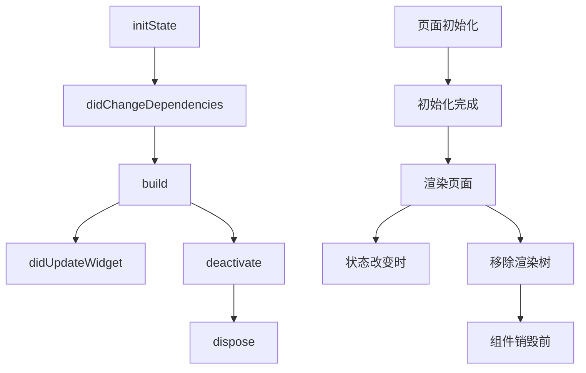

## Flutter

**[Flutter](https://flutter.dev/) 是Google开源的构建用户界面工具包，支持移动端、Web端、桌面端和嵌入式平台**

### 初始化

- **[下载FlutterSDK](https://docs.flutter.dev/get-started/install/windows)**
- **配置环境变量**
- **创建项目**

```shell
flutter create 项目名
```

- **运行项目**

```shell
flutter run
```

### 目录结构


| 文件或目录          | 说明                                          |
| ------------------- | --------------------------------------------- |
| **.dart_tool**      | 工具库所在的位置和信息目录                    |
| **android**         | Android项目目录                               |
| **build**           | 运行目录                                      |
| **ios**             | iOS项目目录                                   |
| **lib**             | 开发代码目录                                  |
| **test**            | 测试代码目录                                  |
| .**gitignore**      | git忽略配置文件                               |
| .**metadata**       | IDE 用来记录某个 Flutter 项目属性的的隐藏文件 |
| .**packages**       | pub 工具需要使用的                            |
| **flutter_app.iml** | 工程文件的本地路径配置                        |
| **pubspec.lock**    | 依赖生成的文件                                |
| **pubspec.yaml**    | 配置文件                                      |

### 生命周期



```dart
class MyApp extends StatelessWidget {
	@override
	void initState() {
		print('初始化');
	}

	@override
	void didChangeDependencies() {
		print('初始化完成');
	}

	@override
	Widget build(BuildContext context) {
        print('渲染页面');
		return MaterialApp(
	    	home: Scaffold(
	      		body: Home(),
	    	)
	  	);
	}
    
    @override
	void didUpdateWidget(covariant HomePage oldWidget) {
		print('状态改变时');
	}
    
    @override
  	void deactivate() {
    	print('移除渲染树');
  	}

  	@override
 	void dispose() {
    	print('组件销毁前');
  	}
}
```

### 组件

#### 基本组件

- **根组件**

```dart
MaterialApp(
	title, 	//单行描述
	home, 	//默认显示界面
    body,   //内容
	color, 	//界面主色
	theme, 	//应用程序小部件使用的颜色
)
```

- **视图组件**

```dart
Container(
	alignment,//对齐方式
	padding,  //内边距
	color,    //背景色
    decoration, //样式
	width,    //宽度
	height,   //高度
	margin,   //外边距
	child,    //内容
)
```

- **文本组件**

```dart
Text(
	"文本",
	style, 			//样式
	strutStyle，    //段落的间距样式
	textAlign, 		//文字对齐方式
	textDirection, 	//文字排列方向 ltr 左到右，rtl右到左
	locale, 		//语言
	softWrap, 		//文字是否应该在软断行出断行
	textScaleFactor,//文字的缩放比例
	maxLines, 		//文本最大行数
	semanticsLabel, //图像的语义描述
)
```

- **图片组件**

```yaml
#pubspec.yaml引入本地图片
flutter:
  assets:
    - images/img.jpeg
```

```dart
Image.asset('images/img.jpeg'); //加载本地图片
Images.network('http://img.png'); //加载网络图片
```

- **卡片组件**

```dart
Card(
    color,  //背景色
    shadowColor,  //阴影颜色
    elevation,  //阴影高度
    borderOnForeground,  //是否绘制边框
    margin,  //外边距
	child: Container(
    	children: [
      		ListTile(
        		title: Text('张三'),
        		subtitle: Text('工程师'),
      		),
      		ListTile(
       			title: Text('手机号'),
                subtitle: Text('13194573456'),
      		)
    	],
  	),
)
```

#### 布局组件

```dart
Padding( //内边距组件
    padding: EdgeInsets.fromLTRB(left, top, right, bottom)，
    child: Text('')
);
Center( //居中分布
    child
);
Row(  //水平分布
	mainAxisAlignment, //水平排列方式
    crossAxisAlignment, //垂直排列方式
    textDirection， //水平排列顺序
    verticalDirection, //垂直平排列顺序
 	children: [],
),
Column(  //垂直分布
	mainAxisAlignment, //水平排列方式
    crossAxisAlignment, //垂直排列方式
    textDirection， //水平排列顺序
    verticalDirection, //垂直平排列顺序
 	children: [],
),
Wrap({  //自动换行
	direction,   //排列方向
	alignment,  //对齐方式
	spacing,  //中间的间距
	runAlignment,  //在交叉轴上的对齐方式
	runSpacing,  //交叉轴上子控件之间的间距
	crossAxisAlignment,   //交叉轴上子控件的对齐方式
	textDirection,   //水平方向上的起始位置
	verticalDirection,  //垂直方向上起始位置
    children: [],   //要显示的子控件集合
})
```

| mainAxisAlignment值            | 作用                   |
| ------------------------------ | ---------------------- |
| MainAxisAlignment.start        | 靠左排列               |
| MainAxisAlignment.end          | 靠右排列               |
| MainAxisAlignment.center       | 居中排列               |
| MainAxisAlignment.spaceAround  | 每个子组件左右间隔相等 |
| MainAxisAlignment.spaceBetween | 两端对齐               |
| MainAxisAlignment.spaceEvenly  | 每个子组件平均分散排列 |

| crossAxisAlignment值       | 作用             |
| -------------------------- | ---------------- |
| crossAxisAlignment.start   | 顶部对齐         |
| crossAxisAlignment.end     | 底部对齐         |
| crossAxisAlignment.center  | 居中对齐         |
| crossAxisAlignment.stretch | 拉伸填充满父布局 |

#### 定位组件

```dart
Container(
	width: 300.0,
	height: 300.0,
	child: Stack(
    	alignment: Alignment(0.5, 0.5), //所有组件定位
        children: [
            Align( //单个组件定位
                alignment: Alignment(1, 1),
            	child: Icon(Icons.home)
            )，
            Positioned( //单个组件定位
                left: 10.0,
                right: 10.0,
                top: 10.0,
                bottom: 10.0,
            	child: Icon(Icons.send)
            )
        ]
    )
)
```

#### 导航组件

- **顶部导航**

```dart
AppBar(
    leading, 	//左侧区域
    automaticallyImplyLeading, //左侧区域配置
    title,		//标题
    bottom,		//底部区域
    elevation,	//阴影高度，默认为4
    shape,		//描边形状
    backgroundColor, //背景色 
    brightness,	//主题色调，dark和light
    textTheme,	//文本主题样式
    primary,	//是否显示状态栏
    centerTitle,//是否居中显示
    titleSpacing,//title区域内边距
    toolbarOpacity,//toolbar区域透明度
    bottomOpacity,//bottom区域透明度
)
PreferredSize(
	child: AppBar(
		title: Text('导航'),
	),
    preferredSize: Size.fromHeight(20), //导航栏高度
),
```

- **底部导航**

```dart
bottomNavigationBar: BottomNavigationBar(
	items: <BottomNavigationBarItem>[
	  	BottomNavigationBarItem(
	    	icon, //图标
	    	label,//标题
	    	backgroundColor, //背景色
	  	)
	],
	currentIndex: 0, //当前页
   	selectedItemColor,  //被选择item的颜色
   	unselectedItemColor,//未选择item的颜色
   	onTap: (){},   //item点击事件
   	type,          //风格
   	showSelectedLabels: true, //是否显示文字
),
```

#### 列表组件

- **列表布局**

```dart
ListView(
	ListTile(
		leading: Icon(Icons.alarm), //图标
        title: Text('文本')
    )
)
ListView.builder(
	itemCount: 10, //列表长度
	itemBuilder: (context, index) {} //列表内容
})
```

- **网格布局**

```dart
GridView.count(
	crossAxisCount: 2, //每行个数
    crossAxisSpacing: 10.0, //水平间距
    mainAxisSpacing: 30.0, //垂直间距
    padding,     //内边距
    resolve,   //反向排序
    childAspectRatio: 2.0, ////宽高比例
	children: [
        GridTile(
            child: Text('文本');
        );
    ]
)
```

#### 表单组件

- **按钮**

```dart
Container(
	width: 100, //宽度
  	height: 50, //高度
  	child: ElevatedButton( //普通按钮
    	child: Text('按钮'), //显示内容
    	onPressed: () {}, //点击事件
        onLongPress: () {}, //长按事件
        style: ButtonStyle(),//按钮样式
  	),
),
ElevatedButton.icon( //图片和文字按钮
  	icon: Icon(Icons.home),
  	label: Text('按钮'),
),
TextButton( //无交互效果按钮
  	child: Text('按钮'),
),
OutlinedButton( //带边框按钮
  	child: Text('按钮'),
),
IconButton( //图标按钮
  	icon: Icon(Icons.home),
)
```

- **输入框**

```dart
Container(
  	width: 200, //宽度
  	height: 50, //高度
  	child: TextField(
        controller: "默认值",
        maxLength: 11,//最大长度
        minLines: 1, //最小行数
    	maxLines: 3, //最大行数
        obscureText: true, //是否为密码
        enabled: true, //是否可用
        autofocus: false,  //是否自动聚焦
        autocorrect: true, //是否自动更正
        textAlign: TextAlign.start,//对齐方式
        cursorWidth: 2.0, //光标宽度
        cursorRadius: Radius.zero, //光标圆角
        cursorColor: Colors.blue, //光标颜色
    	onChanged: (val) { //文本改变事件
      		print(val);
    	},
        onTap: () { //点击事件
        	print('点击输入框');
        },
   		decoration: const InputDecoration(
      		hintText: '请输入', //为null时显示内容
      		labelText: '密码', //提示文本
            helperText: "帮助文字", //显示在左下方
            errorText: "错误提示",
      		border: OutlineInputBorder(), //边框
            icon: Icon(Icons.home), //左侧外图标
            prefixIcon: Icon(Icons.home), //左侧内图标
            suffixIcon: IconButton( //右侧内图标
            	icon: Icon(Icons.close),
                onPressed: () {
                	controller.clear();
                }
            )
    	),
        keyboardType: TextInputType.number,//键盘类型
        textInputAction: TextInputAction.done,//键盘按钮
        textCapitalization: TextCapitalization.words,//大小写
  	)
)
```

| keyboardType值 | 作用     |
| -------------- | -------- |
| text           | 文字     |
| multiline      |          |
| number         | 数字     |
| phone          | 电话号码 |
| datetime       | 时间     |
| emailAddress   | 电子邮箱 |
| url            | 网址     |

|textCapitalization值 | 作用     |
| -------------- | -------- |
|words|单词首字母大写|
|sentences|句子的首字母大写|
|characters|所有字母大写|
|none|默认, 无|

- **单选框**

```dart
class Home extends StatefulWidget {
  	Home({Key? key}) : super(key: key);
  	@override
  	HomeState createState() => HomeState();
}

class HomeState extends State<Home> {
	var sex; //单选值
	@override
	Widget build(BuildContext context) {
	  	return Container(
	    	child: Row(
	      		children: [
	        		Radio(
	          			value: 1, //按钮值
                        activeColor: Colors.red, //选中时颜色
	          			onChanged: (value) { 
	            			setState(() {
	              				sex = value; //改变状态
	            			});
	          			},
	          			groupValue: sex, //定义按钮组
	        		),
	        		Radio(
	          			value: 2,
	          			onChanged: (value) {
	            			setState(() {
	              				sex = value;
	            			});
	          			},
	          			groupValue: sex,
	        		),
	      		],
	    	),
	  	);
	}
}
```

- **多选框**

```dart
Checkbox( //多选框
  	value: flag, //是否选中
  	onChanged: (value) { //点击事件
    	setState(() {
      		flag = value!; //改变状态
    	});
  	},
),
CheckboxListTile( //多选框和文字
  	title: Text('标题'),
    subtitle: Text('副标题'),
  	value: flag, //是否选中
  	onChanged: (value) { //点击事件
    	setState(() {
      		flag = value!;
    	});
 	},
  	activeColor: Colors.red, //选中时颜色
    checkColor: Colors.red,//选中时用于图标颜色
  	secondary: Icon(Icons.home), //图标或者图片
  	selected: true, //图标和文字颜色是否改变
    contentPadding, //内边距
)
```

- **下拉框**

```yaml
dropdown_button2: ^1.2.2
```

```dart
import 'package:flutter/material.dart';
import 'package:dropdown_button2/dropdown_button2.dart';

class Good extends StatefulWidget {
  Good({Key? key}) : super(key: key);
  @override
  GoodState createState() => GoodState();
}

class GoodState extends State<Good> {
  String? selectedValue = 'Item1'; //下拉下标
  List<String> items = [ //下拉选项
    'Item1',
    'Item2',
    'Item3'
  ];
  Widget build(BuildContext context) {
    return Scaffold(
      body: Column(
        children: [
          Row(
            mainAxisAlignment: MainAxisAlignment.center,
            children: [
              DropdownButton2(
                buttonHeight: 40,  //按钮高度
                buttonWidth: MediaQuery.of(context).size.width * 0.45,  //按钮宽度
                dropdownMaxHeight: 200,  //下拉框最大高度
                dropdownDecoration: BoxDecoration(
                  borderRadius: BorderRadius.circular(10),
                ),
                items: items
                    .map((item) => DropdownMenuItem<String>(  //下拉框列表
                          value: item,
                          child: Text(
                            item,
                            style: const TextStyle(
                              fontSize: 14,
                              fontWeight: FontWeight.bold,
                              color: Colors.black,
                            ),
                            overflow: TextOverflow.ellipsis,
                          ),
                        ))
                    .toList(),
                value: selectedValue,  //下拉下标
                onChanged: (value) {  //选择事件
                  setState(() {
                    selectedValue = value as String;
                  });
                },
              ),
            ],
          ),
        ],
      ),
    );
  }
}
```

- **开关**

#### 时间组件

- **获取时间**

```dart
DateTime.now(); //获取当前时间
var timestamp = DateTime.now().microsecondsSinceEpoch;  //获取当前时间戳
DateTime.fromMicrosecondsSinceEpoch(timestamp);  //时间戳转时间
String time = "2020-08-15 18:00:00";
strtimes = DateTime.parse(time);  //字符串转DateTime
intendtime = strtimes.millisecondsSinceEpoch;  //时间转时间戳
```

- **时间选择器**

```dart
import 'package:flutter/material.dart';
import 'package:flutter_datetime_picker/flutter_datetime_picker.dart';
class MyApp extends StatelessWidget {
	@override
	Widget build(BuildContext context) {
	  	return MaterialApp(
	    	home: Scaffold(
	      		body: Container(
	        		child: [
	        			ElevatedButton(
          					onPressed: () => {
          					  	DatePicker.showDatePicker(
          					    	context,
          					    	showTitleActions: true, //是否展示顶部操作按钮
          					    	minTime: DateTime(2018, 3, 5), //最小时间
          					    	maxTime: DateTime(2099, 6, 7), //最大时间
          					    	onChanged: (date) { //change事件
          					    	  	print('$date');
          					    	},
          					    	onConfirm: (date) { //确定事件
          					    	  	print('$date');
          					    	},
          					    	currentTime: DateTime.now(), //当前时间
          					    	locale: LocaleType.zh, //语言
          					  	)
          					},
          					child: Text('选择日期')
          				),
          				ElevatedButton(
          					onPressed: () => {
          					  	DatePicker.showTimePicker(
          					    	context,
          					    	showTitleActions: true, //是否展示顶部操作按钮
          					    	onChanged: (date) { //change事件
          					    	  	print('$date');
          					    	},
          					    	onConfirm: (date) { //确定事件
          					    	  	print('$date');
          					    	},
          					    	currentTime: DateTime.now(), //当前时间
          					    	locale: LocaleType.zh, //语言
          					  	)
          					},
          					child: Text('选择时间')
          				)
	        		]
	      		),
	    	)
	  	);
	}
}
```

### Flutter组件库

- **[仓库地址](https://pub.dev/)**

| 组件名                      | 作用         | 仓库地址                                                     |
| --------------------------- | ------------ | ------------------------------------------------------------ |
| **expandable**              | **折叠面板** | **[链接](https://pub.dev/packages/expandable/example)**      |
| **dropdown_button2**        | **下拉选择** | **[链接](https://pub.dev/packages/dropdown_button2)**        |
| **flutter_datetime_picker** | **时间选择** | **[链接](https://pub.dev/packages/flutter_datetime_picker)** |
| **dio**                     | **网络请求** | **[链接](https://pub.dev/packages/dio)**                     |
| **flutter_swiper**          | **轮播图**   | **[链接](https://pub.dev/packages/flutter_swiper)**          |
| **flutter_slidable**        | **滑动操作** | **[链接](https://pub.dev/packages/flutter_slidable)**        |
| **table_calendar**          | **日历**     | **[链接](https://pub.dev/packages/table_calendar)**          |

### 列表渲染

```dart
class MyApp extends StatelessWidget {
	List datas = [
		{'id': '1', 'name': '张三'},
	  	{'id': '2', 'name': '李四'},
	  	{'id': '3', 'name': '王五'}
	];
	List<Widget> getData() {
	  	var list = datas.map((item) {
	    	return ListTile(
	      		title: Text(item!['name']),
	      		subtitle: Text(item['id']),
	    	);
	  	});
	  	return list.toList();
	}
	@override
	Widget build(BuildContext context) {
	  	return MaterialApp(
	    	home: Scaffold(
	      		body: ListView(
	        		children: this.getData(),
	      		),
	    	),
	  	);
	}
}

class MyApp extends StatelessWidget {
	List datas = [
		{'id': '1', 'name': '张三'},
	  	{'id': '2', 'name': '李四'},
	  	{'id': '3', 'name': '王五'}
	];
    List<Widget> getData(context, index) {
	  	return ListTile(
            title: Text(datas[index]['name']),
            subtitle: Text(datas[index]['id'])
        );
	}
	@override
	Widget build(BuildContext context) {
	  	return MaterialApp(
	    	home: Scaffold(
	      		body: ListView.builder(
            		itemCount: datas.length,
            		itemBuilder: this.getData(context, index)
            	})
	    	),
	  	);
	}
}
```

### 网格渲染

```dart
class MyApp extends StatelessWidget {
	List datas = [
	  	{'id': '1', 'name': '张三'},
	  	{'id': '2', 'name': '李四'},
	  	{'id': '3', 'name': '王五'},
	  	{'id': '4', 'name': '赵六'}
	];
	List<Widget> getData() {
	  	var list = datas.map((item) {
	    	return GridTile(
                child: Text(item!['name'])
            );
	  	});
		return list.toList();
	}
	@override
	Widget build(BuildContext context) {
	  	return MaterialApp(
	    	home: Scaffold(
	      		body: GridView.count(
	        		crossAxisCount: 2,
	        		children: getData(),
	      		),
	        ),
	  	);
	}
}

class MyApp extends StatelessWidget {
	List datas = [
		{'id': '1', 'name': '张三'},
		{'id': '2', 'name': '李四'},
		{'id': '3', 'name': '王五'},
		{'id': '4', 'name': '赵六'}
	];
	Widget getData(context, index) {
    	return ListTile(
	    	title: Text(datas[index]['name']),
	    	subtitle: Text(datas[index]['id']),
		);
	}
	@override
	Widget build(BuildContext context) {
		return MaterialApp(
	    	home: Scaffold(
	      		body: GridView.builder(
	          		gridDelegate:  SliverGridDelegateWithFixedCrossAxisCount(
                        crossAxisCount: 2,
                    ),
	          		itemCount: datas.length,
	          		itemBuilder: getData
                ),
	    	),
	  	);
	}
}
```

### 数据绑定

```dart
class Home extends StatefulWidget {
	Home({Key? key}) : super(key: key);
	@override
	HomeState createState() => HomeState();
}

class HomeState extends State<Home> {
	int count = 0; //定义数据
	@override
	Widget build(BuildContext context) {
		return Container(
	    	child: Column(
	      		children: [
	        		Text('${count}'), //数据渲染
	        		RaisedButton(
	          			child: Text('+1'),
	          			onPressed: () {
                            //点击改变数据
	            			setState(() {
	              				count++;
	            			});
	          			},
	        		),
	      		],
	    	),
	  	);
	}
}
```

### 动态改变列表数据

```dart
class Home extends StatefulWidget {
	Home({Key? key}) : super(key: key);
	@override
	HomeState createState() => HomeState();
}

class HomeState extends State<Home> {
	List list = []; //列表
    int count = 0; //数量
    bool isNull = true; //是否为空
	@override
	Widget build(BuildContext context) {
		return Container(
	    	child: ListView(children: [
	      		Column(
	          		children: list.map((item) {
	        			return ListTile(
	          				title: Text(item),
	        			);
	      			}).toList()),
	      		RaisedButton(  //点击添加数组
	        		child: Text('添加'),
	        		onPressed: () {
	          			setState(() {
                            count++;
	            			list.add('列表${count}');
                            isNull = false;
	          			});
	        		},
	     		),
                Offstage( //是否隐藏删除按钮
                    offstage: isNull,
                    child: RaisedButton(  //点击删除最后一位
	        			child: Text('删除列表${count}'),
	        			onPressed: () {
	         				setState(() {
	            				list.removeLast();
                                count--;
	          				});
                            if (list.isEmpty) { //判断数组是否为空
              					setState(() {
	            					isNull = true;
	          					});
            				}
	        			},
	      			),
                ),
	    	]),
	  	);
	}
}
```

### 条件渲染

```dart
Offstage(
    offstage: false, //是否隐藏
    child: Container()
);
Visibility(
    child: Container(),
    visible: true,		 //是否可见
    replacement， 		//不可见时显示的组件
    maintainAnimation， 	//不可见时，是否维持子组件中的动画 
    maintainSize， 		//不可见时是否留有空间
    maintainSemantics， 	//不可见时是否维持它的语义
    maintainInteractivity，//不可见时是否具有交互性
);
class Home extends StatefulWidget {
    Home({Key? key}) : super(key: key);
    @override
    HomeState createState() => HomeState();
};
class HomeState extends State<Home> {
    bool isNull = true;
    @override
    Widget build(BuildContext context) {
        if (isNull) {
            return Text('false');
        } else {
            return Text('false');
        }
    }
}
```

### 路由

#### 路由跳转

```dart
import 'package:flutter/material.dart';
//引入页面
import './pages/index.dart';

class Home extends StatefulWidget {
    Home({Key? key}) : super(key: key);
    @override
    HomeState createState() => HomeState();
}

class HomeState extends State<Home> {
    @override
    Widget build(BuildContext context) {
        return Container(
            child: Row(
                children: [
                    ElevatedButton(
                        onPressed: () => {
                            Navigator.of(context).push(
                                MaterialPageRoute(
                                    builder: (context) => index(title: '传值') //页面名
                                )
                            )
                        },
                        child: Text("跳转页面传值")
                    ),
                    ElevatedButton(
                        onPressed: () => {
                            Navigator.of(context).pop(context, '参数')
                        },
                        child: Text("返回上一页")
                    ),
                    ElevatedButton(
                        onPressed: () => {
                            Navigator.of(context).pushReplacementNamed(context, '/index')
                        },
                        child: Text("覆盖当前页跳转")
                    ),
                    ElevatedButton(
                        onPressed: () => {
                            Navigator.of(context).pushAndRemoveUntil(
                                MaterialPageRoute(builder: (context) => index()),
                                (route) => route == null
                            )
                        },
                        child: Text("返回根页面")
                    )
                ],
            ),
        );
    }
}

//index页面
class index extends StatelessWidget {
    String title;
    index(this.title); //接收传值
    @override
    Widget build(BuildContext context) {
        return Container(
            child: Row(
                children: [
                    Text(this.title) //赋值
                ],
            ),
        );
    }
}
```

#### 命名路由

```dart
import 'package:flutter/material.dart';
//引入页面
import './pages/index.dart';

//main.dart
void main() {
	runApp(MyApp());
}

class MyApp extends StatelessWidget {
    //路由表
	final routes = {
        '/': (context, { arguments }) => Home(),
    	'/index': (context, { arguments }) => index(arguments: arguments)
    };
	@override
	Widget build(BuildContext context) {
	  	return MaterialApp(
	    	home: Scaffold(
	      		body: Container(
	        		child: Home()
	      		),
	    	),
            //初始化路由
            initialRoute: '/',
            //配置命名路由
	    	routes: this.routes
	  	);
	}
}

class Home extends StatefulWidget {
	Home({Key? key}) : super(key: key);
	@override
	HomeState createState() => HomeState();
}

class HomeState extends State<Home> {
	@override
	Widget build(BuildContext context) {
		return Container(
	    	child: Row(
	      		children: [
	        		ElevatedButton(
	            		onPressed: () => {
                        	//跳转页面传值
	                 		Navigator.pushNamed(context, '/index', arguments: { title: '传值' })
	                	},
	            		child: Text("跳转页面")
                    )
	      		],
	    	),
	  	);
	}
}

//index页面
class index extends StatelessWidget {
    final arguments;
  	index(this.arguments); //接收传值
	@override
	Widget build(BuildContext context) {
		return Container(
	    	child: Row(
	      		children: [
	        		Text("${arguments['title']}") //赋值
	      		],
	    	),
	  	);
	}
}
```

#### 封装路由表

- **/lib/routes/routes.dart**

```dart
import 'package:flutter/material.dart';
//引入页面
import '../main.dart';
import '../pages/index.dart';

var routes = {
	//配置路由路径
	'/': (context, {arguments}) => main(arguments: arguments),
	'/index': (context, {arguments}) => index()
};

var onGenerateRoute = (RouteSettings settings) {
	//onGenerateRoute配置
	final String? name = settings.name;
	final Function pageContentBuilder = routes[name] as Function;
	if (pageContentBuilder != null) {
	  	if (settings.arguments != null) {
	    	final Route route = MaterialPageRoute(
	        	builder: (context) =>
	            	pageContentBuilder(context, arguments: settings.arguments));
	    	return route;
		} else {
	    	final Route route = MaterialPageRoute(
                builder: (context) => pageContentBuilder(context)
            );
	    	return route;
		}
  	}
};
```

- **/lib/main.dart**

```dart
import 'package:flutter/material.dart';
import './routes/routes.dart';

void main() {
	runApp(MyApp());
}

class MyApp extends StatelessWidget {rride
	Widget build(BuildContext context) {
	  	return MaterialApp(
	    	home: Scaffold(
	      		body: Container(
	        		child: Home()
	      		),
	    	),
            //初始化路由
            initialRoute: '/',
            //配置命名路由
	    	onGenerateRoute: onGenerateRoute
	  	);
	}
}
```

### 网络请求

#### 安装组件

```yaml
dio: ^4.0.4
```

#### 封装

- **/lib/api/request.dart**

```dart
import 'dart:convert';
import 'package:dio/dio.dart';

//请求地址
const baseUrl = "http://localhost";

class Request {
	static BaseOptions options = BaseOptions(
	  	baseUrl: baseUrl,
	  	connectTimeout: 15000, //请求时间
	  	receiveTimeout: 10000, //响应时间
	);
	static Dio dio = Dio(options);

	static Future request<T>(String url, String method, {Map? params, data}) async {
	  	if (params != null) {
      		url = url + '?';
      		params.forEach((key, value) {
        		url = url + '$key=' + '$value&';
      		});
      		url = url.substring(0, url.length - 1);
    	}

		try {
			Response res = await dio.request(baseUrl +url, data: data, options: Options(method: method));
		    if (res.statusCode == 200 || res.statusCode == 201) {
		    	try {
		        	if (res.data['status'] != 200) {
		          		return Future.error(res.data['msg']);
		        	} else {
		          		if (res.data is Map) {
		            		return res.data;
		          		} else {
		            		return json.decode(res.data);
		          		}
		        	}
		     	} catch (e) {
		        	return Future.error('解析响应数据异常');
		      	}
		    } else {
    	    	return Future.error('HTTP错误');
		    }
		} catch (e) {
            return Future.error('服务器无法连接');
        }
	}
	//封装GET请求
	static Future get<T>(String url, {Map? params}) {
	  	return request(url, 'get', params: params);
	}
	//封装POST请求
	static Future post<T>(String url, {Map? params, data}) {
	  	return request(url, 'post', params: params, data: data);
	}
}
```

- **/lib/api/api.dart**

```dart
import './request.dart';

class Api {
  	static test(params) {
    	return Request.get("/test", params: params);
  	}
    static test2(data) {
    	return Request.post("/test2", data: data);
  	}
}
```

#### 调用

```dart
import 'package:flutter/material.dart';
import './api/api.dart'; //引入

class MyApp extends StatelessWidget {
    void getinfo() {
        //调用接口
    	Api.test({
            'name': 'value' //参数
        }).then((res) => {
            print(res['data']) //打印 data 数据
        });
  	}
    
	@override
	Widget build(BuildContext context) {
		return Container(
	    	child: Column(
	      		children: [
	        		RaisedButton(
	          			child: Text('点击请求'),
	          			onPressed: () {
	            			getinfo()
	          			},
	        		),
	      		],
	    	),
	  	);
	}
}
```

### 屏幕适配

#### 安装

```yaml
flutter_screenutil: ^5.1.1
```

#### 调用

```dart
import 'package:flutter/material.dart';
import 'package:flutter_screenutil/flutter_screenutil.dart';

void main({arguments}) {
	runApp(MyApp());
}

class MyApp extends StatelessWidget {
  	@override
  	Widget build(BuildContext context) {
    	return MaterialApp(
      		home: Scaffold(
        		appBar: AppBar(title: Text('启动页'), centerTitle: true),
        		body: HomePage(),
      		),
    	);
  	}
}

class HomePage extends StatefulWidget {
  	_HomePageState createState() => _HomePageState();
}

class _HomePageState extends State<HomePage> {
	@override
	Widget build(BuildContext context) {
        //初始化
	  	ScreenUtil.init(
	  	  	BoxConstraints(
				maxWidth: MediaQuery.of(context).size.width, //获取屏幕宽度
	  	      	maxHeight: MediaQuery.of(context).size.height), //获取屏幕高度
	  	  	designSize: Size(360, 690),
	  	  	context: context,
	  	);
        printScreenInformation();
	  	return Container(
	    	child: Center(
	      		child:Row(
	      			children: [
	        			Text('设备宽度:${ScreenUtil.screenWidth}px'),
           				Text('设备高度:${ScreenUtil.screenHeight}px'),
                        Text('设备的像素密度:${ScreenUtil.pixelRatio}'),
            			Text('底部安全区距离:${ScreenUtil.bottomBarHeight}px'),
            			Text('状态栏高度:${ScreenUtil.statusBarHeight}px'),
	      			],
	    		),
	    	),
	  	);
	}
    void printScreenInformation() {
    	print('设备宽度:${1.sw}dp');
    	print('设备高度:${1.sh}dp');
    	print('设备的像素密度:${ScreenUtil().pixelRatio}');
    	print('底部安全区距离:${ScreenUtil().bottomBarHeight}dp');
    	print('状态栏高度:${ScreenUtil().statusBarHeight}dp');
    	print('实际宽度和字体(dp)与设计稿(dp)的比例:${ScreenUtil().scaleWidth}');
    	print('实际高度(dp)与设计稿(dp)的比例:${ScreenUtil().scaleHeight}');
    	print('高度相对于设计稿放大的比例:${ScreenUtil().scaleHeight}');
    	print('系统的字体缩放比例:${ScreenUtil().textScaleFactor}');
    	print('屏幕宽度的0.5:${0.5.sw}dp');
    	print('屏幕高度的0.5:${0.5.sh}dp');
    	print('屏幕方向:${ScreenUtil().orientation}');
  	}
}
```

### 修改软件信息

- **在 `android` > `app` > `src` > `main` > `AndroidManifest.xml` 中修改**

```xml
<manifest xmlns:android="http://schemas.android.com/apk/res/android"
    package="com.example.fluproject">
   <application
        android:label="fluproject" //应用名称
        android:name="${applicationName}"
        android:icon="@mipmap/ic_launcher" //应用图标,在res/mipmap文件夹里修改
    >
    </application>
</manifest>
```

