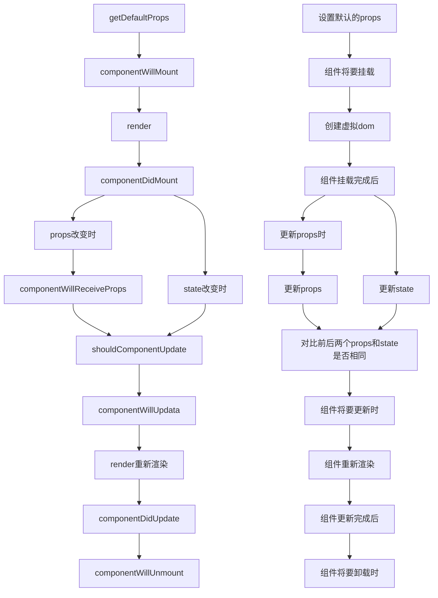

## 	React 框架


### React CDN引用

- **react.min.js** **核心库**
- **react-dom.min.js** **DOM**相关的功能
- **babel.min.js** 将 **ES6** 代码转为 **ES5** 代码

> **开发环境**

```html
<script crossorigin src="https://unpkg.com/react@18/umd/react.development.js"></script>
<script crossorigin src="https://unpkg.com/react-dom@18/umd/react-dom.development.js"></script>
<script src="https://unpkg.com/babel-standalone@6/babel.min.js"></script>
<script type="text/babel"></script>
```

> **生产环境**

```html
<script crossorigin src="https://unpkg.com/react@18/umd/react.production.min.js"></script>
<script crossorigin src="https://unpkg.com/react-dom@18/umd/react-dom.production.min.js"></script>
<script src="https://unpkg.com/babel-standalone@6/babel.min.js"></script>
<script type="text/babel"></script>
```

### React项目搭建

- **安装脚手架**

```shell
npm install -g create-react-app
```

- **创建React项目**

```shell
create-react-app 项目名
```

- **启动项目**

```shell
npm run start
```

- **项目打包**

```shell
npm run build
```

### 目录结构


| index.html        | 网页入口文件           |
| ----------------- | ---------------------- |
| **manifest.json** | **扩展配置文件**       |
| **robots.txt**    | **对特定网页进行屏蔽** |
| **api**           | **接口配置**           |
| **router**        | **路由配置**           |
| **App.js**        | **页面初始文件**       |
| **index.js**      | **项目入口文件**       |
| **setupProxy.js** | **跨域配置**           |

### 初始化

- **index.js**

```jsx
import React from "react";
import { createRoot } from "react-dom/client";
import { BrowserRouter } from 'react-router-dom';
import { AliveScope } from 'react-activation';
import "./index.css";
import App from "./App";
import api from "./api/api";

React.$api = api; //API接口

const root = createRoot(document.getElementById("root"));
root.render(
	<BrowserRouter>
    	<AliveScope>
      		<React.StrictMode>
        		<App />
      		</React.StrictMode>
    	</AliveScope>
  	</BrowserRouter>
);
```

- **index.css**

```css
body,
html {
    height: 100%;
}

* {
    padding: 0;
    margin: 0;
    list-style: none;
    box-sizing: border-box;
}
```

- **App.js**

```jsx
import { useNavigate, useRoutes } from 'react-router-dom';
import routes from './routes/routes';
import "./index.css";

function App() {
    const elements = useRoutes(routes); //
    const navigate = useNavigate();
    
    return (
        <div className="App">
            {elements}
        </div>
    );
}

export default App;
```

### JSX语法

- **注释**

    需要加**大括号**

```jsx
let name = <div>Text{/*注释*/}</div>;
```

- **多个标签**

    需要有一个**父元素**

```jsx
let num = (
  	<div>
  		<div>Text1</div>
    	<div>Text2</div>
  	</div>
);
```

- **插入变量**

```jsx
let text = "你好";
let num = 10;
let txt = (
  	<div>
  		<div>{text}</div>
  		<div>{num}</div>
  	</div>
);
```

- **引入图片**

```jsx
import imgUrl from '../assets/photo.png';

//或

```

- **插入样式**

> **CSS属性名采用==驼峰式==命名**
>
> **单位为 `px` 时可以忽略**

```react
import React from 'react';
import './css'; //外部引入CSS

class App extends React.Component {
    render() {
        let styles = { //CSS对象
            color: '#000000',
            backgroundColor: '#FFFFFF'
        }
        return (
            <div>
                <div style={styles}></div>
                <div style={{ color: '#FF0000', fontSize: 20 }}></div>
            </div>
        )
    }
}

export default App;
```

### `state` 状态

- **初始化state**

```jsx
constructor(props) {
	super(props);
	this.state={}
}
//或
state = {}
```

- **更新state**

```jsx
this.setState({ name: 'value' }, () => {
    //更新完成后执行的代码
});
```

- **更新对象属性**

```jsx
constructor(props) {
	super(props);
	this.state = {
        name: {
            value: '123'
        }
    }
}

let name = this.state.name;
name.value = '456';
this.setState({ name });
```

- **更新数组**

```jsx
constructor(props) {
	super(props);
	this.state = {
        array: [{
            id: 1,
            name: 'name1'
        }]
    }
}

let array = [...this.state.array];
array.push({id: 2, name: 'name2'});
this.setState({ array: array });
```

### 事件处理

#### 常用事件

| 事件名          | 作用                                   |
| --------------- | -------------------------------------- |
| **onClick**     | 鼠标点击事件                           |
| **onDblClick**  | 鼠标双击事件                           |
| **onMouseDown** | 鼠标上的按钮被按下了                   |
| **onMouseUp**   | 鼠标按下后，松开时                     |
| **onMouseOver** | 当鼠标移动到某对象范围的上方时         |
| **onMouseMove** | 鼠标移动时                             |
| **onMouseOut**  | 当鼠标离开某对象范围时                 |
| **onKeyPress**  | 当键盘上的某个键被按下并且释放时       |
| **onKeyDown**   | 当键盘上某个按键被按下时               |
| **onBlur**      | 当前元素失去焦点时                     |
| **onChange**    | 当前元素失去焦点并且元素的内容发生改变 |
| **onFocus**     | 当某个元素获得焦点时                   |
| **onReset**     | 重置表单时                             |
| **onSubmit**    | 提交表单时                             |

### 函数传参

- **使用 `bind` 传参**

```jsx
import React from 'react'
class App extends React.Component {
    constructor(props) {
        super(props)
        this.state = {
            index: 1
        }
    }
    
    render() {
        return (
            <div>
                <button onClick={this.getValue.bind(this, this.state.index)}>确定</button>
            </div>
        )
    }

    getValue(val) {
        console.log(val);
    }
}

export default App;
```

- **使用 `箭头函数` 传参**

```jsx
import React from 'react'
class App extends React.Component {
    constructor(props) {
        super(props)
        this.state = {
            index: 1
        }
    }
    
    getValue = (val) => console.log(val);
    
    render() {
        return (
            <div>
                <button onClick={() => this.getValue(this.state.index)}>确定</button>
            </div>
        )
    }
}

export default App;
```

### 条件渲染

#### `函数` 判断

```jsx
import React from 'react';
class App extends React.Component {
	constructor(props) {
        super(props);
        this.state = {
            flag: true
        }
    }

    IFFlag = () => {
        if (this.state.flag) return <div>True</div>;
        else return <div>False</div>;
    }

    render() {
        return (
            <div>
                {this.IFFlag()}
            </div>
        )
    }
}

export default App;
```

#### `元素变量` 判断

```jsx
import React from 'react';
class App extends React.Component {
	constructor(props) {
        super(props);
        this.state = {
            flag: true
        }
    }

    render() {
        let { flag } = this.state;
        let IFFlag;
        if (flag) IFFlag = <div>True</div>;
        else IFFlag = <div>False</div>;
        return (
            <div>
                {IFFlag}
            </div>
        )
    }
}

export default App;
```

#### `三元运算符 `判断

```jsx
import React from 'react';
class App extends React.Component {
	constructor(props) {
        super(props);
        this.state = {
            flag: true
        }
    }

    render() {
        let { flag } = this.state;
        return (
            <div>
                { flag ? <div>True</div> : <div>False</div> }
            </div>
        )
    }
}

export default App;
```

#### `逻辑运算符&&` 判断

```jsx
import React from 'react';
class App extends React.Component {
	constructor(props) {
        super(props);
        this.state = {
            flag: true
        }
    }

    render() {
        let { flag } = this.state;
        return (
            <div>
                { flag && <div>True</div> }
                { !flag && <div>False</div> }
            </div>
        )
    }
}

export default App;
```

#### `Switch` 判断

```jsx
import React from 'react';
class App extends React.Component {
	constructor(props) {
        super(props);
        this.state = {
            flag: true
        }
    }

    render() {
        let { flag } = this.state;
        switch (flag) {
        	case true:
      			return <div>True</div>;
    		case false:
      			return <div>False</div>;
    		default:
      			return null;
  		}
    }
}

export default App;
```

### 列表渲染

#### `html` 渲染

```jsx
import React from 'react';
class App extends React.Component {
    constructor(props) {
        super(props);
        this.state = {
            info: [{
                title: '第一个标题',
                key: '第一个key'
            }, {
                title: '第二个标题',
                key: '第二个key'
            }, {
                title: '第三个标题',
                key: '第三个key'
            }]
        }
    }

    render() {
        return (
			<ul>
			    {
			        this.state.info.map((item, key) => {
			            return (
			                <li key={key}>
			                    <p>{item.title}</p>
			                    <p>{item.key}</p>
			                </li>
			            )
			        })
			    }
			</ul>
        )
    }
}

export default App;
```

#### `参数`方式渲染

```jsx
import React from 'react'
class App extends React.Component {
    constructor(props) {
        super(props);
        this.state = {
            info: [{
                title: '第一个标题',
                key: '第一个key'
            }, {
                title: '第二个标题',
                key: '第二个key'
            }, {
                title: '第三个标题',
                key: '第三个key'
            }]
        }
    }

    render() {
        let ForList = this.state.info.map((item, key) => {
            return (
                <li key={key}>
                    <p>{item.title}</p>
                    <p>{item.key}</p>
                </li>
            )
        })
        return (
            <ul>
            	{ForList}
            </ul>
        )
    }
}

export default App;
```

#### `函数`方式渲染

```jsx
import React from 'react'
class App extends React.Component {
    constructor(props) {
        super(props);
        this.state = {
            info: [{
                title: '第一个标题',
                key: '第一个key'
            }, {
                title: '第二个标题',
                key: '第二个key'
            }, {
                title: '第三个标题',
                key: '第三个key'
            }]
        }
    }

    ForInfo(list) {
        let res = list.map((item, key) => {
            return (
                <li key={key}>
                    <p>{item.title}</p>
                    <p>{item.key}</p>
                </li>
            )
        })
        return res;
    }

    render() {
        return (
            <ul>{this.ForInfo(this.state.info)}</ul>
        )
    }
}

export default App;
```

#### `组件`方式渲染

```jsx
import React from 'react'
class ForList extends React.Component {
    constructor(props) {
        super(props);
    }

    render() {
        return (
            <li>
                <p>{this.props.info.title}</p>
                <p>{this.props.info.key}</p>
            </li>
        );
    }
}

class App extends React.Component {
    constructor(props) {
        super(props);
        this.state = {
            info: [{
                title: '第一个标题',
                key: '第一个key'
            }, {
                title: '第二个标题',
                key: '第二个key'
            }, {
                title: '第三个标题',
                key: '第三个key'
            }]
        }
    }

    render() {
        return (
            <ul>
            	{this.state.info.map((item, index) => (<ForList key={index} info={item} />))}
            </ul>
        )
    }
}

export default App;
```

####  `Array` 方式渲染

```jsx
import React from 'react';
class App extends React.Component {
    constructor(props) {
        super(props);
        this.state = {}
    }
    
    render() {
        return (
			<ul>
			    {[...Array(n)].map((item, key) => (<li key={key}>{key}</li>))}
			</ul>
        )
    }
}

export default App;
```

#### 更新列表

```jsx
import React, { Component } from 'react'

export class index extends Component {
    constructor(props) {
        super(props)
        this.state = {
            info: [{
                title: '第一个标题',
                key: '第一个key'
            }, {
                title: '第二个标题',
                key: '第二个key'
            }, {
                title: '第三个标题',
                key: '第三个key'
            }]
        }
    }
    //添加数组
    addVal = () => {
        let info = [...this.state.info];
        info.push({title: '第四个标题', key: '第四个key'});
        this.setState({ info: info });
    }
	//删除数组
    delVal = (index) => {
        let info = [...this.state.info];
        info.splice(index, 1);
        this.setState({ info: info });
    }

    render() {
        return (
            <div>
                <button onClick={this.addVal}>添加</button>
                <ul>
                    {
                        this.state.info.map((item, key) => {
                            return (
                                <li key={key}>
                                    <p>{item.title}</p>
                                    <p>{item.key}</p>
                                    <button onClick={() => this.delVal(key)}>删除</button>
                                </li>
                            )
                        })
                    }
                </ul>
            </div>
        )
    }
}

export default index;
```

### 表单处理

- **`name` 属性值与 `state` 值相同**

```jsx
import React from 'react';
class App extends React.Component {
    state = {
        txt: '',
        checkeds: ''
    }

    //获取单个输入值
    getVal = (e) => this.setState({txt: e.target.value});

    //获取多个输入值(表单数量过多时)
    getAllVal = (e) => {
        const target = e.target;
        const value = target.type === 'checkbox' ? target.checked : target.value;
        const name = target.name;
        this.setState({[name]: value});
    }

    render() {
        return (
            <div>
                <input type="text" name="txt" value={this.state.txt} onChange={this.getVal} />
                <input type="checkbox" name="checkeds" checked={this.state.checkeds} onChange={this.getAllVal} />
            </div>
        )
    }
}

export default App;
```

### React 组件

- **组件名称必须以大写字母开头**

#### 函数组件

```jsx
let App = () => {
    return (
        <div>函数组件</div>
    )
}
```

#### 类组件

```jsx
import React from 'react';
class App extends React.Component {
   	constructor(props) {
        super(props)
        this.state = {}
    }

    render() {
        return (
            <div>类组件</div>
        )
    }
}

export default App;
```

#### 函数组件和类组件的区别

| 区别                   | 函数组件 | 类组件 |
| ---------------------- | -------- | ------ |
| **是否有 `this`**      | **没有** | **有** |
| **是否有生命周期**     | **没有** | **有** |
| **是否有状态 `state`** | **没有** | **有** |

#### 生命周期



- **`componentWillMount` 和 `componentDidMount` 只执行一次**

```jsx
import React from 'react'
class App extends React.Component {
    constructor(props) {
        super(props)
        this.state = {
            msg: '一个msg数据'
        }
    }

    //组件将要挂载时
    componentWillMount() {
        console.log('组件将要挂载')
    }

    //组件挂载完成时
    componentDidMount() {
        console.log('组件挂载完成')
    }
	
    //更新数据函数
    setMsg = () => {
        this.setState({
            msg: '改变后的msg数据'
        })
    }

    //数据渲染
    render() {
        return (
            <div>
                {this.state.msg}
                <button onClick={this.setMsg}>更新数据</button>
            </div>
        )
    }

    //是否要更新数据 
    //nextProps: 父组件传给子组件的值, 没有显示空 
    //nextState: state 更新后的值
    shouldComponentUpdate(nextProps, nextState) {
        console.log('是否要更新数据')
        return true;
    }

    //将要更新数据时
    componentWillUpdate() {
        console.log('组件将要更新')
    }

    //数据更新完成时
    componentDidUpdate() {
        console.log('组件更新完成')
    }

    //改变props值时
    componentWillReceiveProps() {
        console.log('改变props值时')
    }

    //组件将要销毁时
    componentWillUnmount() {
        console.log('组件销毁')
    }
}

export default App;
```

#### 组件通信

- **子组件 调用 父组件中的方法**

```jsx
//父组件
fun() {
	console.log('父组件方法')；
}
<子组件 fun={this.fun} />

//子组件
this.props.fun();
```

- **子传父**

```jsx
//子组件
import React from 'react';
class Test extends React.Component {
    //点击向父组件传值
    setValue = (val) => this.props.setVal(val);

    render() {
        return (
            <div>
                <button onClick={this.setValue('子组件信息')}>点击</button>
            </div>
        )
    }
}
export default Test;

//父组件
import React from 'react';
import Test from './test';
class App extends React.Component {
    //接收子组件的值
    setVal(val) {
        console.log(val);
    }

    render() {
        return (
            <div>
                <Test setVal={this.setVal.bind(this)} />
            </div>
        )
    }
}
export default App;
```

- **父组件 调用 子组件的方法**

```jsx
<子组件 ref="fun" />

this.$refs.fun.方法名();
```

- **父传子**

```jsx
//父组件
import React from 'react';
import Test from './test';
class App extends React.Component {
    render() {
        return (
            <div>
                {/* 向子组件传值 */}
                <Test name="你好" />
            </div>
        )
    }
}
export default App;

//子组件
import React from 'react';
class Test extends React.Component {
    render() {
        //接收父组件的值
        return (
            <div>{this.props.name}</div>
        )
    }
}
export default Test;
```

- **跨组件通信**

```jsx
import React from 'react';
//父组件 给 孙组件 传值
const Context = React.createContext();
//孙组件
class Leaf extends React.Component {
    render() {
        return (
            <Context.Consumer>
                {(name) => <h1>{name}</h1>}
            </Context.Consumer>
        )
    }
}

// 子组件
class Middle extends React.Component {
    render() {
        return <Leaf />
    }
}

//父组件
class App extends React.Component {
    state = {
        name: 'name'
    }

    render() {
        const { name } = this.state;
        return (
            <div>
                <Context.Provider value={name}>
                    <Middle />
                </Context.Provider>
            </div>
        )
    }
}
export default App;
```

### 封装API

- **api.js**

```js
import { get, post } from "./request.js";

const api = {};

export default api;
```

- **request.js**

```js
import axios from 'axios';

// 请求超时时间
axios.defaults.timeout = 15000;
// 请求头
axios.defaults.headers.post['Content-Type'] = 'application/json;charset=utf-8';
// 请求拦截器
axios.interceptors.request.use(
    config => {
        // 每次发送请求之前判断是否存在token
        const token = localStorage.getItem('token');
        if (token) config.headers.Authorization = `Bearer ${token}`;
        return config;
    },
    error => (Promise.error(error)));
// 响应拦截器
axios.interceptors.response.use(
    response => {
        if (response.status === 200) return Promise.resolve(response);
        else return Promise.reject(response);
    },
    // 服务器状态码不是200的情况
    error => {
        if (error.response.status === 400) {
            localStorage.clear();
            location.reload();
        }
        return Promise.reject(error.response);
    }
);
// 封装get请求
export function get(url, params) {
    return new Promise((resolve, reject) => {
        axios.get(url, {params: params}).then(res => resolve(res.data)).catch(err => reject(err.data));
    });
}
// 封装post请求
export function post(url, params) {
    return new Promise((resolve, reject) => {
        axios.post(url, params).then(res => resolve(res.data)).catch(err => reject(err.data));
    });
}

export default axios;
```

- **index.js**

```jsx
import api from './api/api';

React.$api = api;  //全局引入

React.$api.函数名(params).then(res => {});  //调用API
```

### 跨域配置

- **安装依赖包**

```shell
npm install http-proxy-middleware
```

- **setupProxy.js**

```js
const proxy = require('http-proxy-middleware');
module.exports = (app) => {
    app.use(
        proxy('/api', {
        	target: 'http://xxx.xxx.xxx.xxx', //接口地址
            changeOrigin: true,
            pathRewrite: { 
                '^/api': '' 
            }
        })
    )
}
```

### styled-components

- **安装依赖包**

```shell
npm install styled-components
```

- **应用**

```jsx
import { keyframes, styled, injectGlobal } from 'styled-components';
//定义标签样式
const BOX = styled.div`
    display: flex;
    flex-direction: column;
`;
//定义动画
const Animation = keyframes`
    0% {
        opacity: 0;
    }
    100% {
        opacity: 1;
    }
`;
const Button = styled.div`
    animation: 1s ${Animation} ease-out;
`;
//二次定义标签样式
const myButton = styled(Button)`
    margin: 0;
`;
//定义全局样式
injectGlobal`
	body {
    	margin: 0;
    	padding: 0;
  	}
`;
//传参
const BOX = styled.div`
    color: ${props => props.boxColor};
`;
const box = <BOX boxColor="red">文字</BOX>;
//定义标签属性
const In = styled.input.attrs({
    type: 'password'
})``;
```

### react-router

#### 安装依赖包

```shell
npm install react-router-dom
npm install react-activation #路由缓存
```

#### router配置

- **routes.js**

```jsx
import KeepAlive from 'react-activation'; //配置缓存页面
//引入自定义组件
import Index from "../pages/index/index";

const routes = [{
	path: "/",
	element: <KeepAlive cacheKey="Index"><Index /></KeepAlive>,
	exact: true
}];

export default routes;
```

#### Router`跳转` 和 `传参`

- **路径传参  (参数显示在路径上, 刷新页面后参数不消失)**

```jsx
<Link to="/test2/${name}">test2</Link>
<Route path="/test2/:name" component={Test2} />

//js方式
this.props.history.push({
    pathname: '/test2/${name}'
})

//组件接收参数
{this.props.match.params.name}
```

- **`query`传参  (刷新页面后参数消失)**

```jsx
<Link to={{ pathname: '/test2', query: { name: 'name' } }}>test2</Link>
<Route path="/test2" component={Test2} />

//js方式
this.props.history.push({
    pathname: '/test2',
    query: {
        name: 'name'
    }
})

//组件接收参数
{this.props.location.query.name} 
```

- **`state`传参  (刷新页面后参数不消失)**

```jsx
<Link to={{ pathname: '/test2', state: { name: 'name' } }}>test2</Link>
<Route path="/test2" component={Test2} />

//js方式
this.props.history.push({
    pathname: '/test2',
    state: {
        name: 'name'
    }
})

//组件接收参数
{this.props.location.state.name}
```

### React Hooks

**在函数组件中可以使用 `生命周期函数` 和 `State状态`**

#### 跳转

```jsx
import React, { useNavigate } from 'react'
function Example() {
    const navigate = useNavigate();
    return (
        <div>
            <button onClick={() => navigate("/")}>跳转</button>
        </div>
    );
}
```

#### `useState`

- **定义state状态**

```jsx
import React, { useState } from 'react'
function Example() {
    const [num, setNum] = useState(0);
    const [str, setStr] = useState('String');
    
    return (
        <div>
            <p>{num}</p>
            <p>{str}</p>
            {/* 修改变量值 */}
            <button onClick={() => { setNum(num + 1) }}>{num}+1</button>
            <button onClick={() => { setStr('str') }}>{str}</button>
        </div>
    );
}
```

#### `useEffect`

- **类似于类组件的生命周期函数 (异步加载)**

```jsx
import React, { useState, useEffect } from 'react'
function Example() {
    const [num, setNum] = useState(0);
	
    useEffect(() => {
        console.log('组件渲染完成');
        return () => console.log('组件卸载完成');
    /**
     * 不传参数时，组件每次渲染时都执行
     * 为 [] 时，只调用一次
     * 有参数时，只在参数值变化时执行
     */
    }, [num]);

    return (
        <div>
            <p>{num}</p>
            <button onClick={() => { setNum(num + 1) }}>{num}+1</button>
        </div>
    );
}		
```

#### `useContext()`

- **共享状态**

```jsx
import React, { useContext } from 'react'
function Example1() {
    const AppContext = React.createContext({});
    const Example2 = () => {
        //获取参数
        const { name } = useContext(AppContext);
        return (
            <div>
                <p>Example2{name}</p>
            </div>
        );
    }

    const Example3 = () => {
        const {name} = useContext(AppContext);
        return (
            <div>
                <p>Example3{name}</p>
            </div>
        );
    }

    return (
        //父组件传参
        <AppContext.Provider value={{ name: 'value' }}>
            <Example2 />
            <Example3 />
        </AppContext.Provider>
    );
}
```

#### `userReducer()`

```jsx
import React, { useReducer } from 'react'
function Example() {
    /**
     * state 状态值
     * action dispatch传的参数
     */
    const [count, dispatch] = useReducer((state, action) => {
        switch (action) {
            case '+':
                return state + 1;
            case '-':
                return state - 1;
        }
    }, 0);

    return (
        <div>
            <span>{count}</span>
            <button onClick={() => { dispatch('+') }}>{count}+1</button>
            <button onClick={() => { dispatch('-') }}>{count}-1</button>
        </div>
    )
}
```

### Redux

#### 安装依赖包

```shell
npm install react-redux --save
```

#### index.js

```jsx
import React from 'react';
import ReactDOM from 'react-dom';
import { Provider } from "react-redux";
import store from "./redux/store"
import './index.css';
import App from './App';

ReactDOM.render(
    <Provider store={store}>
        <App />
    </Provider>,
    document.getElementById('root')
);
```

#### redux/store.js

```jsx
import { createStore } from "redux"

const State = {
    count: 0
}

const store = createStore((state = State, action) => {
    if (action.type == '+') {
        return {
            count: state.count + 1
        }
    }
});

export default store;
```

#### 页面

```jsx
import React, { Component } from 'react'
import { connect } from "react-redux"

class Index extends Component {
    constructor(props) {
        super(props);
        this.state = {}
    }

    add = () => {
        this.props.add();
    }

    render() {
        return (
            <div>
                <div>{this.props.count}</div>
                <button onClick={this.add}>+</button>
            </div>
        );
    }
}

//获取 state 状态
function getState(state) {
    return {
        count: state.count
    }
}

//获取 dispatch 的值
function getDispatch(dispatch) {
    return {
        add() {
            dispatch({type: "+"})
        }
    }
}

export default connect(getState, getDispatch)(Index);
```
