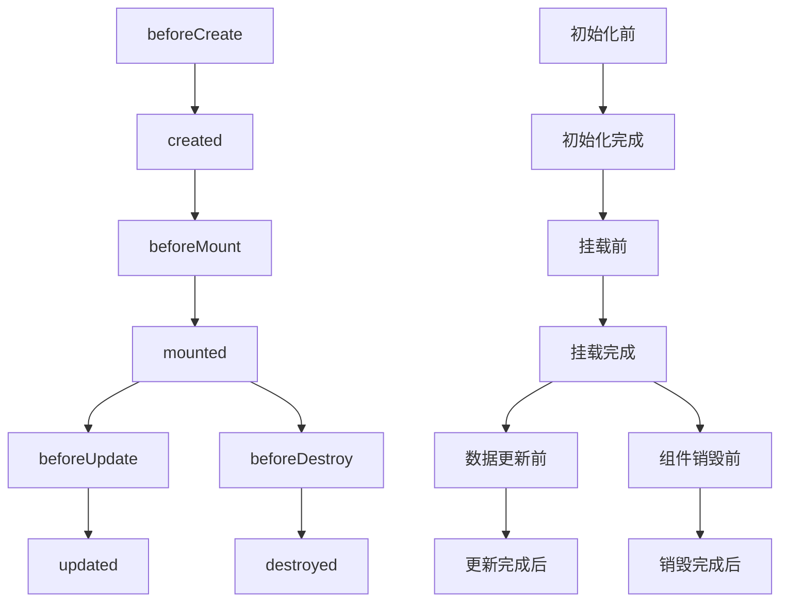
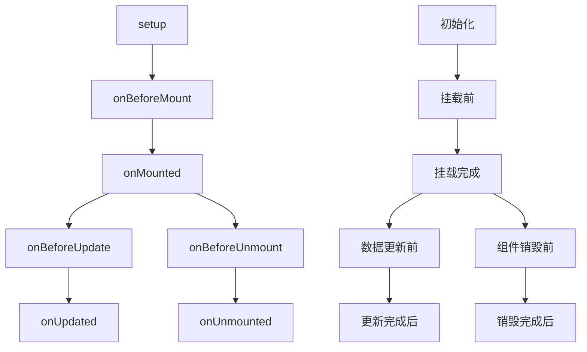

##  Vue

### CDN 引用

- **Vue2**

```html
<!DOCTYPE html>
<html>
	<head>
		<meta charset="utf-8" />
		<meta name="viewport" content="width=device-width, initial-scale=1">
		<script src="https://cdn.jsdelivr.net/npm/vue/dist/vue.js"></script>
		<title>Vue2</title>
	</head>
	<body>
		<div id="app">
            <button @click="app()">点击</button>
			{{name}}
		</div>
	</body>
	<script type="text/javascript">
		new Vue({
			el: '#app',
			data: {
				name: 'Hello Vue'
			},
			methods: {
				app() {
                    this.name = 'Hello Vue2';
                }
			}
		})
	</script>
</html>
```

- **Vue3**

```html
<!DOCTYPE html>
<html>
	<head>
		<meta charset="UTF-8">
		<meta name="viewport" content="width=device-width, initial-scale=1.0">
		<script src="https://unpkg.com/vue@next"></script>
		<title>Vue3</title>
	</head>
	<body>
		<div id="app">
            <button @click="app()">点击</button>
			{{name}}
		</div>
	</body>
	<script>
		const {createApp, reactive, toRefs} = Vue;
		const data = reactive({
			name: 'Hello Vue'
		})
		const app = createApp({
			setup() {
                let app = () => {
					data.state = 'Hello Vue3';
				}
				return {
					...toRefs(data),
                    app
				}
			}
		});
		app.mount("#app");
	</script>
</html>
```

### 搭建 Vue 项目

```shell
#Vue2
npm install @vue/cli -g  #安装脚手架
vue init webpack 项目名  #创建项目

#Vue3
npm create vite@latest
```

### Vue 生命周期

#### 生命周期函数

**Vue2**



```html
<template>
	<view id="app">
	</view>
</template>

<script>
	export default {
		beforeCreate() {
			console.log('初始化前');
		},
		created() {
			console.log('初始化完成');
		},
		beforeMount() {
			console.log('挂载前');
		},
		mounted() {
			console.log('挂载完成');
		},
		beforeUpdate() {
			console.log('数据修改前');
		},
		updated() {
			console.log('数据修改完成');
		},
		beforeUnmount() {
			console.log('组件销毁前');
		},
		destroyed() {
			console.log('组件销毁完成');
		}
	}
</script>
```

**Vue3**



```html
<template>
</template>

<script setup>
	import {
		onBeforeMount,
		onMounted,
		onBeforeUpdate,
		onUpdated,
		onBeforeUnmount,
		onUnmounted
	} from 'vue';
	onBeforeMount(() => {
		console.log('挂载前')
	})
	onMounted(() => {
		console.log('挂载完成')
	})
	onBeforeUpdate(() => {
		console.log('数据修改前')
	})
	onUpdated(() => {
		console.log('数据修改完成')
	})
	onBeforeUnmount(() => {
		console.log('组件销毁前')
	})
	onUnmounted(() => {
		console.log('组件销毁完成')
	})
</script>
```

#### Vue 项目目录结构


| 名称             | 作用                           |
| ---------------- | ------------------------------ |
| **build**        | **存放项目构建脚本**           |
| **config**       | **存放项目的一些基本配置信息** |
| **node_modules** | **存放项目的所有依赖**         |
| **src**          | **项目的源码**                 |
| **static**       | **静态资源**                   |
| **index.html**   | **项目的首页，入口页**         |
| **package.json** | **定义项目的所有依赖**         |

### 项目初始化

#### main.js

```js
//Vue2
import Vue from 'vue';
import App from './App.vue';

Vue.config.productionTip = false;

new Vue({
	render: h => h(App),
}).$mount('#app');

//Vue3
import {createApp} from 'vue';
import App from './App.vue';

const app = createApp(App);

app.mount('#app');
```

#### 页面

```html
<-- Vue2 -->
<template>
	<view id="app"></view>
</template>

<script>
	export default {
		data() {
			return {
			}
		},
		methods: {
		}
	}
</script>

<style scoped>
</style>

<-- Vue3 -->
<template>
</template>

<script setup>
	import {ref, reactive} from 'vue';
</script>

<style scoped>
</style>
```

### Vue 构造器

```html
<div id="id">
	<h1>{{name}}</h1> <!--你好-->
	<h1>{{age}}</h1> <!--20-->
	<h1>{{name()}}</h1> <!--Hello Vue-->
	<h1>{{str.name}}</h1> <!--Vue-->
	<h1>{{str.age}}</h1> <!--10-->
</div>
```

```javascript
//Vue2
export default {
	data() {
        return {
        	//定义属性
			name: "你好",
			age: 20,
			str: {
				//定义对象
				name: "Vue",
				age: 10,
			}
    	}
	},
	methods: {
		//定义函数
		name() {
			return "Hello Vue";
		}
	}
}

//Vue3
import {reactive} from 'vue';

let data = reactive({
	//定义属性
	name: "你好",
	age: 20,
	str: {
		//定义对象
		name: "Vue",
		age: 10,
	}
});

//定义函数
let name = () => ("Hello Vue");
```

### Vue 指令

#### **v-text 和 v-html**

> **文本渲染**

```html
<template>
	<div id="app">
		<div v-html="msg"></div> <!-- 渲染标签 -->
		<div v-text="msg"></div> <!-- 不渲染标签 -->
	</div>
</template>

<script>
	export default {
		data() {
        	return {
        		msg: '<div>msg</div>'
    		}
		},
	}
</script>
```

#### v-bind

> **属性绑定**

```html
<div v-bind:属性名=“” ></div>
<div :属性名=“” ></di>
```

#### v-model

> #### **双向数据绑定**

```html
<template>
    <div id="app">
        <p>{{ msg }}</p>
        <input v-model="msg" type="text" />
    </div>
</template>

<script>
    export default {
        data() {
            return {
                msg: 'Hello'
            }
        },
    }
</script>
```

#### **v-for**

> **循环语句**

```html
<div id="app">
	<ul>
		<li v-for="(item,index) in list" :key="index">
            <span>{{ index }}</span>
            <span>{{ item.id }}</span>
			<span>{{ item.name }}</span>
		</li>
	</ul>
</div>
<script>
	export default {
		data() {
        	return {
        		list: [{
                    id; 1,
                    name: 'FaceBook'
                }, {
                    id; 2,
                    name: 'Google'
                }]
    		}
		},
	}
</script>
```

#### **v-if 和 v-else**

> **条件语句**

```html
<div id="app">
	<div v-if="flag">
	  flag 为 true
	</div>
	<div v-else>
	  flag 为 false
	</div>
    
	<div v-show="flag">
	  flag 为 true
	</div>
	<div v-show="!flag">
	  flag 为 false
	</div>
</div>
```

#### **v-if 和 v-show 的区别**

- **v-if = "false" 从页面中移除该元素**
- **v-show = "false" 隐藏该元素(不移除)**

#### v-once

- **只被渲染一次, 首次渲染后, 即使数据发生变化, 也不会被重新渲染**

```html
<div v-once></div>
```

#### **v-on**

> **事件绑定**

```html
<div v-on:事件名=“” ></div>
<div @事件名=“” ></di>
```

> ###### 事件修饰符

- **`.stop`            阻止冒泡**
- **`.prevent`      阻止默认事件**
- **`.capture`      阻止捕获**
- **`.self`            只监听触发该元素的事件**
- **`.once`            只触发一次**
- **`.left`            左键事件**
- **`.right`          右键事件**
- **`.middle`        中间滚轮事件**

### Vue 事件

- **鼠标事件**

| 事件名          | 作用         |
| --------------- | ------------ |
| **@click**      | **单击**     |
| **@mousedown**  | **按下**     |
| **@mouseup**    | **抬起**     |
| **@dblclick**   | **双击**     |
| **@mousemove**  | **移动**     |
| **@mouseleave** | **离开**     |
| **@mouseout**   | **移出**     |
| **@mouseenter** | **进入**     |
| **@blur**       | **失去焦点** |
| **@focus**      | **获取焦点** |

### `transition` 过渡

```vue
<transition>
	<div v-if="flag" class="box"></div>
</transition>
```

| CSS 类名            | 作用                              |
| :----------------- | --------------------------------- |
| **v-enter**        | **元素显示/插入前的效果**         |
| **v-active-enter** | **元素显示/插入的过渡时间和函数** |
| **v-enter-to**     | **元素显示/插入后的效果**         |
| **v-leave**        | **元素隐藏/移除前的效果**         |
| **v-active-leave** | **元素隐藏/移除的过渡时间和函数** |
| **v-leave-to**     | **元素隐藏/移除后的效果**         |

### 监听属性

- **侦听器 `watch`**

```html
<template>
	<div>
		千米 :<input type="text" v-model="km">
		米 :<input type="text" v-model="m">
	</div>
</template>
<script>
    export default {
		data() {
			return {
				km: 0,
				m: 0
			}
		},
        //侦听器
		watch: {
			km: (val) => {
				this.km = val;
				this.m = this.km * 1000
			},
			m: (val)  {
				this.km = val / 1000;
				this.m = val;
			}
		}
	}
</script>
```

- **`$on` 和 `$emit`**

```html
<template>
	<div>
		<button @click="isClick">子传父</button>
	</div>
</template>
<script>
	export default {
		data() {
			return {
				value: "value"
			}
		},
        mounted() {
            //监听自定义事件
      		this.$on('isClick', (val) => {
        		console.log(val);
      		});
    	},
		methods: {
			isClick() {
                //触发实例上的事件
				this.$emit('isClick', this.value);
			}
		}
	}
</script>
```

### 全局变量和方法

```js
//Vue2
Vue.prototype.变量名 = '';
//Vue3
app.config.globalProperties.变量名 = "";

//Vue2
Vue.prototype.方法名 = () => {}
//Vue3
app.config.globalProperties.方法名 = () => {}
```

### 组件

#### 全局组件

```js
//Vue2
import index from './component/index.vue'
Vue.component(index);

//Vue3
import index from './component/index.vue'
app.component(index);
```

#### 局部组件

```js
//Vue2
import index from './component/index.vue'
export default {
    components: {index}
}

//Vue3 自动注册组件
import index from './component/index.vue'
```

#### 组件之间传值

##### 子组件 调用 父组件的方法

```js
//Vue2
this.$parent.方法名();
//Vue3
const emits = defineEmits(["方法名"]);
emits("方法名");
```

##### 子传父

- **子组件**

```html
<!-- Vue2 -->
<template>
	<div>
		<button @click="submit">子传父</button>
	</div>
</template>
<script>
	export default {
		data() {
			return {
				value: "value"
			}
		},
		methods: {
			submit() {
				//通过 $emit 向父组件传 value 值
				this.$emit('Parent', this.value);
			}
		}
	}
</script>

<!-- Vue3 -->
<template>
    <span @click="onClick">{{ title }}</span>
</template>
 
<script setup>
const emits = defineEmits(["click"]);
const onClick = () => emits("click",'value');
</script>
```

- **父组件**

```vue
<!-- Vue2 -->
<template>
	<div>
		<!-- 通过 自定义事件 接收子组件的 value 值 -->
		<子组件 @Parent="getValue" />
	</div>
</template>
<script>
	import 子组件 from '/子组件'
	export default {
		data() {
			return {
				value: ""
			}
		},
		components: {
			子组件
		},
		methods: {
			//自定义事件名
			getValue(value) {
				this.value = value;
			}
		}
	}
</script>

<!-- Vue3 -->
<template>
    <子组件 title="基本信息" @click="handleClick" />
</template>
 
<script setup>
import 子组件 from "/子组件";
 
const handleClick = (val) => console.log(val);
</script>
```

##### 父组件 调用 子组件的方法

```vue
<子组件 ref="name" ></子组件>

<!-- Vue2 -->
this.$refs.name.方法名();
<!-- Vue3 -->
<script setup>
import { ref } from "vue";

let name = ref();
name.value.方法名();
</script>
```

##### 父传子

- **父组件**

```vue
<!-- Vue2 -->
<template>
	<div>
		<!-- 通过 自定义属性 向子组件传值 -->
		<子组件 :child1="childValue1" />
	</div>
</template>
<script>
	import 子组件 from '/子组件'
	export default {
		data() {
			return {
				childValue: "value"
			}
		},
		components: {
			子组件
		}
	}
</script>

<!-- Vue3 -->
<template>
    <子组件 :title="value" />
</template>
 
<script setup>
import 子组件 from "/子组件";
</script>
```

- **子组件**

```vue
<!-- Vue2 -->
<template>
	<div>
		<span>{{ child1 }}</span>
	</div>
</template>
<script>
	export default {
		//通过 props 接收父组件的值
		props: {
            child1: {
                type: String, //数据类型
                default: "value", //默认值
                validator: (value) => {
                    //自定义验证函数
                    return value;
            	}
            },
            child2: [String, Number], //多类型
            child3: {
            	type: Object,
            	default: () => ({name: 'value'});//对象或数组默认值
        	}
        }
	}
</script>

<!-- Vue3 -->
<template>
    <span>{{ title }}</span>
</template>
 
<script setup>
const props = defineProps({
    title: {
        type: String,
        default: ""
    }
})
</script>
```

| type 值   | 解释   |
| -------- | ------ |
| String   | 字符串 |
| Number   | 数字   |
| Array    | 数组   |
| Object   | 对象   |
| Date     | 时间   |
| Function | 函数   |
| Symbol   |        |

##### 兄弟组件传值

- **父组件**

```html
<template>
	<div id="app">
		<A />
		<B />
	</div>
</template>
<script>
	import A from './a.vue'
	import B from './b.vue'
	export default {
		components: {A, B}
	}
</script>
```

- **A 组件**

```html
<template>
	<div id="app">
		<button @click="aValue">A按钮</button>
	</div>
</template>
<script>
	import eventVue from './event.js'
	export default {
		data() {
			return {
				msgA: "组件A"
			}
		},
		methods: {
			aValue() {
				//$emit 方法会触发一个事件
				this.$emit("myFun", this.msgA);
			}
		}
	}
</script>
```

- **B 组件**

```html
<template>
	<div id="app">
		<div>{{ msgB }}</div>
	</div>
</template>
<script>
	import eventVue from './event.js'
	export default {
		data() {
			return {
				msgB: "组件B"
			}
		},
		created() {
			this.bValue();
		},
		methods: {
			bValue() {
				//$on 接收A组件传的值
				this.$on("myFun", (msg) => this.msgB = msg);
			}
		}
	}
</script>
```

- **`event.js`**

```js
import Vue from 'vue';

export default new Vue;
```

### Vue3 Setup

#### 定义数据源

```html
<template>
	{{sum}}
    {{data.count}}
</template>

<script setup>
	import {
		ref, //定义基本数据类型
		reactive //定义对象,数组类型
	} from 'vue';
	
    //定义 ref 数据
	let num = ref(0);
    let str = ref('str');
    let flag = ref(true);
    //修改 ref 数据
    num.value = 1;

	//定义 reactive 对象
	let data = reactive({
		count: 0
	});
    //修改 reactive 对象
    data.count = 1;
    
    //定义 reactive 数组
	let arr = reactive([1, 2, 3]);
    //修改 reactive 数组
    arr[0] = 0;
</script>
```

#### watch 监听

```html
<template>
	{{count}}
</template>
<script setup>
	import {
		ref,
		reactive,
		watch //监听函数
	} from 'vue';
	
    //创建监听
	let stop = watch(() => {});
	//清除监听
	stop();
	// 监听 reactive 数据变化
	let state = reactive({
		count: 0
	});
	watch(() => state.count, (val, old) => {
		console.log(val); //新值
		console.log(old); //旧值
	})

	//监听多个 reactive 数据
	let state = reactive({
		count: 0,
		name: '张三'
	})
	watch([() => state.count, () => state.name],
		([newCount, newName], [oldCount, oldName]) => {
			console.log(newCount) //新 count 值
			console.log(newName) //新 name 值
			console.log(oldCount) //旧 count 值
			console.log(oldName) //新 name 值
		}, {
			lazy: true //watch被创建时不执行回调函数
		}
	)

	//监听 ref 数据
	let count = ref(0);
	watch(count, (val, old) => {
		console.log(val); //新值
		console.log(old); //旧值
	})

	//监听多个 ref 数据
	let count = ref(0)
	let name = ref('张三')
	watch([count, name],
		([newCount, newName], [oldCount, oldName]) => {
			console.log(newCount) //新 count 值
			console.log(newName) //新 name 值
			console.log(oldCount) //旧 count 值
			console.log(oldName) //新 name 值
		}, {
			lazy: true //watch被创建时不执行回调函数
		}
	)

	watch(count, (newCount, oldCount, onCleanup) => {
		const timer = setTimeout(() => {
			console.log(newCount);
		}, 1000);
		//watch 被重复监听,会先清除上次异步任务
		onCleanup(() => clearTimeout(timer));
	}, {
		lazy: true
	})
</script>
```

#### `Provide` & `Inject`

```js
//父组件
import Index from './components/index.vue';
import {provide} from 'vue';
//父组件向子级组件共享数据
provide('数据名称', '数据值')

//子组件
import {inject} from 'vue';
//调用 inject 函数通过指定的数据名称获取共享数据
let data = inject('数据名称');
```

### v-for 动态绑定 input 输入值

```vue
<template>
	<view>
		<view v-for="(item, index) in list" :key="index">
			<view>{{item.name}}</view>
			<input type="text" v-model="item.value" />
		</view>
	</view>
</template>
<script>
	export default {
		data() {
			return {
				list: [{
					name: '001',
					value: ''
				}, {
					name: '0002',
					value: ''
				}, {
					name: '0003',
					value: ''
				}]
			}
		}
	}
</script>
```

### 数据缓存

**`sessionStorage` : 浏览器关闭时自动删除**

**`localStorage`: 永久保存, 手动删除**

- **写入缓存**

```js
localStorage.setItem('key值', value);
sessionStorage.setItem('key值', value);
```

- **输出缓存**

```js
localStorage.getItem('key值');
sessionStorage.getItem('key值');
```

- **删除缓存**

```js
localStorage.removeItem('key值');
localStorage.clear(); //清空所有缓存
sessionStorage.removeItem('key值');
sessionStorage.clear(); //清空所有缓存
```

### js-cookie

- **下载依赖包**

 ```shell
 npm install js-cookie --save
 ```

- **导入依赖包**

```js
import cookie from 'js-cookie';
//定义全局方法
Vue.prototype.$cookie = cookie;
```

- **写入 `cookie`**

```js
this.$cookie.set('key', value);
this.$cookie.set('key', value, {
    expires: date,	//有效期,单位:天
    path: '/src',	//路径
    domain: '域名'   //指定域名
});
```

- **获取 `cookie`**

```js
this.$cookie.get('key');
```

- **删除 `cookie`**

```js
this.$cookie.remove('key');
```

### vue-router

- **安装依赖包**

```shell
npm install vue-router -S
```

- **routes/index.js**

```js
/* Vue2 */
import Vue from 'vue';
import Router from 'vue-router';
Vue.use(Router);
//页面路径
const routes = [{
	path: '/', //首页
	name: 'index',
	component: require("../components/index.vue")
}]
const router = new Router({
	mode: 'hash', //默认hash模式,hash模式有#;history模式，没有#符号;
	routes: routes
});

/* Vue3 */
import {
	createRouter,
	createWebHashHistory
} from "vue-router";

const index = () => import("../pages/index.vue");

const routes = [{
	path: "/",
	name: "index",
	component: index
}];

const router = createRouter({
	history: createWebHashHistory(),
	routes: routes
});

//路由守卫
router.beforeEach((to, from, next) => {
	// to	  下一页面
	// from	  当前页面
	next();
})
export default router;
```

- **main.js**

```js
import routes from './routes/index.js' //路由
/* Vue2 */
new Vue({
    routes,
    render: h => h(App),
}).$mount('#app');

/* Vue3 */
const app = createApp(App);
app.use(router);
```

- **App.vue**

```vue
<!-- Vue2 -->
<template>
    <div id="app">
        <router-view></router-view>
    </div>
</template>
<script>
    export default {
        name: "app",
    };
</script>

<!-- Vue3 -->
<template>
	<keep-alive> <!-- 跳转页面不刷新 -->
       <router-view></router-view>
    </keep-alive>
	<router-view></router-view>
</template>
```

### 路由跳转传值

- **声明式导航**

```vue
<router-link :to="{name:'home'}">
<router-link :to="{path:'/home'}">
```

- **`query` 传参(参数显示在 url 上)**
```js
this.$router.push({
	path: '/home',
	query: {
        val: 1
    }
})
//获取参数
this.$route.query.val;
```

- **`params` 传参(参数不显示在 url 上)**
```js
this.$router.push({
	name: 'home',
	params: {
		id: 1
	}
})
//获取参数
this.$route.params.id;
```

- **this.$router.replace()  关闭当前页面跳转**

### Vuex 状态管理工具

1. **安装 vuex 依赖包**

```shell
npm install vuex --save
```

2. **导入 vuex 包**

```javascript
import Vuex from 'vuex'
Vue.use(Vuex);
```

3. **创建 store 对象**

```javascript
const store = new Vuex.Store({});
```

#### State

- 定义了应用状态的数据结构，可以在这里设置默认的初始状态

#### Getter

- 允许组件从 Store 中获取数据

#### Mutation

- 是唯一更改 store 中状态的方法，必须是同步函数。

#### Action

- 用于提交 mutation，不是直接变更状态，可以包含任意异步操作。

#### Module

- 可以将 store 分割成模块

> **State 仓库**

```javascript
const store = new Vuex.Store({
    state:{
        conut: 0
    },
    //getters 是 store 的计算属性
    getters:{
    	newCount:state => state.count += 2
   	},
    //修改仓库状态
    mutations:{
        number(state，value){
            state.count += value;
        }
    }
})
```
> **组件**

```html
<div id='app'>
	<h1>{{ $store.state.count }}</h1>
</div>
```

```javascript
export default {
    computed: {
        //获取 newCount
		newCount(){
			return this.$store.getters.newCount;
		}
  	}，
    methods: {
		getVal() {
     		//通过 commit 提交一个名为 number 的 value
     		this.$store.commit("number", value);
   		}
 	}
}; 
```

> **mapState**

### 网络请求

#### 配置跨域代理

- **vue.config.js**

```js
//Vue2
module.exports = {
	publicPath: './',
	devServer: {
		host: 'localhost', //本地IP
		port: 8080, //端口号
		https: false, //是否启用 https
		hotOnly: false,
		proxy: { //配置跨域
			'/api': {
				target: "http://xxx.xxx.xxx.xxx", //接口地址
				changeOrigin: true, //是否跨域
				secure: false,
				pathRewrite: { //重写路径
					"^/api": ""
				}
			}
		}
	}
}

//Vue3
import {defineConfig} from 'vite';
import vue from '@vitejs/plugin-vue';

export default defineConfig({
	plugins: [vue()],
    base: './',
	server: {
		host: '0.0.0.0',
		port: 8080,
		proxy: {
			'/api': {
				target: "http://localhost:3000", //接口地址
				changeOrigin: true, //是否跨域
				rewrite: (path) => path.replace(/^\/api/, '')
			}
		}
	}
})
```

- **axios 引用**

```html
<script src="https://unpkg.com/axios/dist/axios.min.js"></script>
```

> **请求方法**

```javascript
axios({
  	method: '请求方式',
  	url: '请求地址',
    headers: {},//请求头
  	data: {
  	  	key: value,  //请求参数
  	}
}).then((res) => {}) //请求成功
.catch((err) => {}); //请求失败
```

#### 封装网络请求 API

- **request.js**

```javascript
import axios from 'axios';

// 请求超时时间
axios.defaults.timeout = 15000;
// 请求头
axios.defaults.headers.post['Content-Type'] = 'application/json;charset=utf-8';
// 请求拦截器
axios.interceptors.request.use(
    config => {
        // 每次发送请求之前判断是否存在token
        const token = localStorage.getItem('token');
        if (token) config.headers.Authorization = `Bearer ${token}`;
        return config;
    },
    error => (Promise.error(error)));
// 响应拦截器
axios.interceptors.response.use(
    response => {
        if (response.status === 200) return Promise.resolve(response);
        else return Promise.reject(response);
    },
    // 服务器状态码不是200的情况
    error => {
        if (error.response.status === 400) {
            localStorage.clear();
            location.reload();
        }
        return Promise.reject(error.response);
    }
);
// 封装get请求
export function get(url, params) {
    return new Promise((resolve, reject) => {
        axios.get(url, {params: params}).then(res => resolve(res.data)).catch(err => reject(err.data));
    });
}
// 封装post请求
export function post(url, params) {
    return new Promise((resolve, reject) => {
        axios.post(url, params).then(res => resolve(res.data)).catch(err => reject(err.data));
    });
}

export default axios;
```

- **api.js**

```javascript
import {get, post} from './request.js'

var baseUrl = "/api";
const api = {
	getInfo: (params) => (get(`${baseUrl}/getInfo`, params)),
    updateInfo: (params) => (post(`${baseUrl}/updateInfo`, params))
}
export default api;
```

- **main.js**

```javascript
//Vue2
import api from './api.js';
Vue.prototype.$api = api;

//Vue3
import {createApp} from 'vue';
import api from './api.js';
const {config} = createApp(App);
config.globalProperties.$api = api;
```

- **调用 API**

```javascript
//Vue2
let params = { //参数对象
    key: 'value'
};
this.$api.函数名(params).then(res => {});

//Vue3
import {getCurrentInstance} from "vue";
var {proxy} = getCurrentInstance();
let params = { //参数对象
    key: 'value'
};
proxy.$api.函数名(params).then(res => {});
```

### 移动端适配

- **安装依赖包**

```shell
npm install lib-flexible -S
npm install postcss-px2rem -S
```

- **main.js**

```js
import 'lib-flexible'
```

- **配置 `postcss-px2rem`**

    **`vue.config.js`**

```js
module.exports = {
    publicPath: './',
	css: {
		loaderOptions: {
			css: {},
			postcss: {
				plugins: [
					require('postcss-px2rem')({
						remUnit: 37.5
					})
				]
			}
		}
	}
}
```
